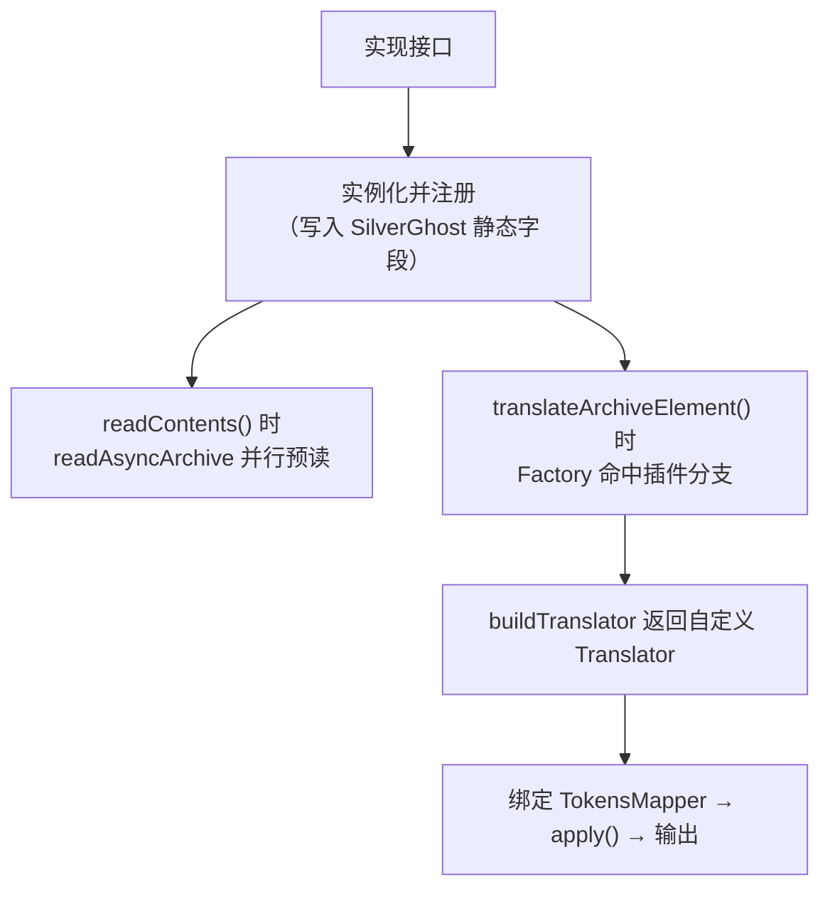

# 🔌 插件子系统架构

<Badge type="tip" text="架构" /> <Badge type="info" text="扩展点" />

> ClassyShark 的扩展能力由**两个 SPI 接口**支撑：`TokensMapper`（混淆映射接入）与 `FullArchiveReader`（整包预读 + 自定义元素翻译）。注册后经 [`SilverGhost`](/reference/architecture/silverghost) 的静态字段注入，GUI/CLI/API 三入口立即生效。

## 两个 SPI

| SPI | 方法 | 职责 | 默认实现 |
|-----|------|------|----------|
| [`TokensMapper`](/reference/modules/TokensMapper) | `readMappings(File)` / `getReverseClasses()` | 读入混淆映射，提供反混淆类名表 | `IdentityMapper`（原样透传） |
| [`FullArchiveReader`](/reference/modules/FullArchiveReader) | `readAsyncArchive(File)` / `buildTranslator(className, archiveFile)` | 整包异步预读 + 为未匹配扩展名的元素建自定义 Translator | `EmptyFullArchiveReader`（空操作） |

## 扩展生效流程



三步走：**实现接口 → 注册 → 生效**。注册点是 `SilverGhost` 的两个静态字段：

```java
static {
    tokensMapper = new IdentityMapper();          // 默认：原样透传
    fullArchiveReader = new EmptyFullArchiveReader(); // 默认：空操作
}
```

`setBinaryArchive(file)` 还会把 `tokensMapper` 重置回 `IdentityMapper`，保证换包后不带上次的映射状态。

## 挂点在哪里

| 挂点 | 调用链 |
|------|--------|
| 预读 | `SilverGhost.readContents()` 末尾 → `fullArchiveReader.readAsyncArchive(binaryArchive)` |
| 翻译 | `SilverGhost.translateArchiveElement(name)` → `TranslatorFactory.createTranslator(name, archive, names, fullArchiveReader)` |
| 工厂分支 | `TranslatorFactory` 在 `.xml/.dex/.jar/.apk/.so` 都不匹配时，且 `fullArchiveReader` **非 `EmptyFullArchiveReader`**，才调 `buildTranslator` |
| 映射绑定 | `translateArchiveElement` 内 `translator.addMapper(tokensMapper)` → 各 Translator 反混淆输出 |

> ⚠️ 工厂用 `instanceof EmptyFullArchiveReader` 判断"是否注册了插件"——注册了真实实现，未知元素走插件；没注册，回退到内置 `JavaTranslator`。

## 与 API 层的关系

插件子系统是纯 Java 接口，不依赖 GUI。构建工具链可在自己代码里实现、注册，再通过 [Shark API](/api/index) 触发——比如给 `FullArchiveReader` 塞入解析自定义二进制格式的实现，`getEntryContent(entryName, file)` 就能输出你定义的 Translator 结果。

## 设计要点

- 🎛️ **双 SPI 正交** — 映射（改名）与翻译（读法）解耦，可独立扩展。
- 🔇 **静默默认** — `IdentityMapper` / `EmptyFullArchiveReader` 让零配置也能跑，注册才有变化。
- 🧵 **预读异步** — `readAsyncArchive` 在内容读取阶段并行执行，不阻塞 GUI 首屏。
- 🔍 **白名单式接管** — 工厂只把"内置扩展名之外的元素"交给插件，内置格式始终内置。

## 进一步阅读

- 🧩 [TokensMapper](/reference/modules/TokensMapper) · [FullArchiveReader](/reference/modules/FullArchiveReader) · [IdentityMapper](/reference/modules/IdentityMapper) · [EmptyFullArchiveReader](/reference/modules/EmptyFullArchiveReader)
- 🏗️ [插件 SPI 纵深](/reference/architecture/plugins-spi) · [SilverGhost 编排](/reference/architecture/silverghost) · [TranslatorFactory](/reference/architecture/translator-factory)
- 📚 [Shark API](/api/index)