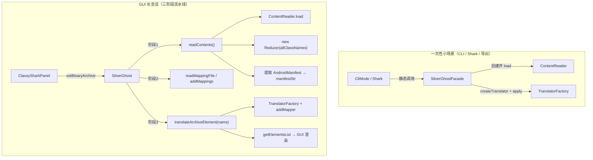
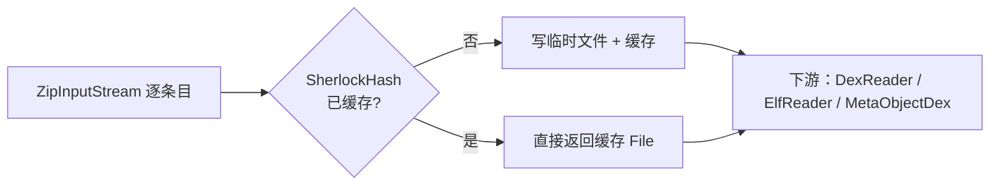

# 🦈 SilverGhost 引擎架构

<Badge type="tip" text="架构" /> <Badge type="info" text="silverghost 核心引擎" />

> `com.google.classyshark.silverghost` 包是 ClassyShark 的核心引擎：它把「二进制归档」变成「可读内容」，并以 [SilverGhostFacade](/reference/modules/SilverGhostFacade) 与 [SilverGhost](/reference/modules/SilverGhost) 两个门面，分别服务**小场景 API** 与 **GUI 长会话**。上层不再直接接触 ContentReader / Translator。

## 两个门面，两种工作模式

| 门面 | 类型 | 适用场景 | 特征 |
|------|------|----------|------|
| [SilverGhostFacade](/reference/modules/SilverGhostFacade) | 静态工具类 | CLI、Shark API 等一次性小场景 | 全部 `static` 方法，每次调用自建 `ContentReader`，无状态 |
| [SilverGhost](/reference/modules/SilverGhost) | 有状态实例 | GUI 长会话（面板复用、多次翻译） | 持有 `reducer`/`translator`/`contentReader` 字段，三阶段编排 |



> 🎯 **为什么拆两个门面？** 静态门面每次调用都重建 reader，换来的是零状态、可并发；实例门面保留解析结果，换来的是 GUI 里「过滤类名 → 点击 → 翻译」的连续性体验。二者共享同一套 ContentReader / TranslatorFactory，行为一致。

## 三阶段流水线（SilverGhost）

[SilverGhost](/reference/modules/SilverGhost) 的源码以注释显式标出三个阶段，是整个引擎的骨架：

### 1️⃣ 读内容（READ CONTENTS）

`readContents()` 创建 `ContentReader` 并 `load()`，随后：

- `new Reducer(allClassNames)` — 建立类名过滤索引（见 [Reducer](/reference/modules/Reducer) 与 `gui/panel/reducer`）。
- 若归档是 `.apk`，用 `TranslatorFactory.createTranslator("AndroidManifest.xml", ...)` 预提取 manifest，缓存在 `manifestStr`，供后续 `getManifestMatches` 做**内存子串搜索**（每次查询带上下文 2 行，用 `::::` 分隔线 + `SELECTION` 标记）。
- 触发 `fullArchiveReader.readAsyncArchive(binaryArchive)` 异步预读（插件槽）。

### 2️⃣ 读映射（READ MAPPINGS FILE）

- `readMappingFile(File)` → 让当前 `tokensMapper` 解析 ProGuard mapping 并返回自身（链式）。
- `addMappings(TokensMapper)` → 直接换入一个已构建好的映射器（GUI「反混淆」按钮入口）。

### 3️⃣ 翻译元素（BINARY ARCHIVE ELEMENT）

`translateArchiveElement(elementName)` 完成三连：

```java
translator = TranslatorFactory.createTranslator(
        elementName, getBinaryArchive(),
        reducer.getAllClassNames(), fullArchiveReader);  // ① 按扩展名/回退创建
translator.addMapper(tokensMapper);                      // ② 注入反混淆映射
translator.apply();                                      // ③ 执行翻译
```

之后 `getArchiveElementTokens()` / `getCurrentClassContent()` / `getImportsForCurrentClass()` 分别暴露 `ELEMENT` 列表、纯文本与依赖。

## 两个 SPI 插槽

引擎在静态块注入默认实现，保证「零插件也可跑」：

```java
static {
    tokensMapper = new IdentityMapper();          // 符号重映射：默认恒等
    fullArchiveReader = new EmptyFullArchiveReader(); // 归档读取：默认空对象
}
```

| 插槽 | 接口 | 默认实现 | 注入点 |
|------|------|----------|--------|
| 符号重映射 | [TokensMapper](/reference/modules/TokensMapper)（`readMappings` / `getReverseClasses`） | [IdentityMapper](/reference/modules/IdentityMapper) | `addMappings` / `readMappingFile` → `translator.addMapper` |
| 自定义归档 | [FullArchiveReader](/reference/modules/FullArchiveReader)（`readAsyncArchive` / `buildTranslator`） | [EmptyFullArchiveReader](/reference/modules/EmptyFullArchiveReader) | `readContents` 异步预读 + `TranslatorFactory` 回退分支 |

> ⚠️ `setBinaryArchive()` 会把 `tokensMapper` 重置回 `IdentityMapper`——防止上一个文件的映射污染新文件（源码注释即标注了这一 TODO：成员字段仍可能残留旧状态）。

## SherlockHash：提取缓存

[SherlockHash](/reference/modules/SherlockHash) 是位于 `silverghost/io` 的枚举单例，承担 APK 内嵌文件的**解压提取与缓存**：

- 以 `binaryFile.getCanonicalPath()` 为 key，`lastModified` 为失效判断——归档未变则复用缓存。
- `getFileFromZipStream(...)` 把 zip 流中的条目解压到临时文件（`deleteOnExit`），并将该临时文件按名字缓存。
- 被 `MultidexReader`（提取 dex / 内层 zip / 指定类所在 dex）、`ElfTranslator.extractElf`（提取 .so）大量复用，避免同一归档反复解压同一条目。



## 设计要点

- 🧭 **双门面分层** — 静态 `SilverGhostFacade`（无状态小场景）与实例 `SilverGhost`（有状态长会话）共享同一内核，行为天然一致。
- 🔢 **三阶段显式编排** — 读内容 → 读映射 → 翻译元素，阶段解耦，可在 GUI 各按钮间任意进入。
- 🧩 **双 SPI 默认可跑** — `IdentityMapper` 恒等 + `EmptyFullArchiveReader` 空对象，插件是纯增量。
- 🗂️ **提取缓存收敛到 SherlockHash** — 解压临时文件按归档 + 时间戳缓存，是引擎级 I/O 优化点。
- 📊 **Manifest 预提取** — 翻译一次缓存成字符串，后续搜索零 I/O。

## 进一步阅读

- 🧩 [SilverGhostFacade](/reference/modules/SilverGhostFacade) · [SilverGhost](/reference/modules/SilverGhost) · [SherlockHash](/reference/modules/SherlockHash) · [TokensMapper](/reference/modules/TokensMapper) · [FullArchiveReader](/reference/modules/FullArchiveReader)
- 🧩 [Plugins SPI 架构](/reference/architecture/plugins-spi) · [ContentReader 架构](/reference/architecture/contentreader) · [Translator 架构](/reference/architecture/translator)
- 🏗️ [架构总览](/guide/architecture-overview) · 🛠️ [CLI 参考](/cli/index) · 🖥️ [GUI 参考](/gui/index)
