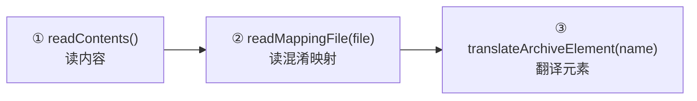

# 🎭 SilverGhost：GUI 导向核心门面

<Badge type="tip" text="架构" /> <Badge type="info" text="核心门面" />

> [`SilverGhost`](/reference/modules/SilverGhost) 是 **GUI 场景的三阶段编排器**：读内容 → 读映射 → 翻译元素。它与 [`SilverGhostFacade`](/reference/modules/SilverGhostFacade) 的差别在于——后者是**静态方法门面**，面向 CLI/Shark API 的一次性调用；前者持有实例状态（`Reducer` 自动补全、manifest 缓存、当前 Translator），面向 GUI 的持续交互。

## 三阶段编排

| 阶段 | 方法 | 做什么 | 状态落点 |
|------|------|--------|----------|
| 1️⃣ 读内容 | `readContents()` | `new ContentReader(file).load()`，类名喂给 `new Reducer(...)`；`.apk` 顺便翻译 manifest 缓存明文；最后 `fullArchiveReader.readAsyncArchive(file)` 异步让插件预读 | `contentReader` / `reducer` / `manifestStr` |
| 2️⃣ 读映射 | `readMappingFile(File)` / `addMappings(...)` | 把混淆映射（TokensMapper）读入并绑定到实例，供后续翻译使用 | `tokensMapper` |
| 3️⃣ 翻译元素 | `translateArchiveElement(name)` | `TranslatorFactory.createTranslator(name, archive, reducer.getAllClassNames(), fullArchiveReader)`，绑定 mapper 后 `apply()` | `translator` |

`readContents()` 耗时打印 `"Archive Reading X ms"`；类注释明确**不要在 UI 线程调用 readXXX 系列**——它是后端线程的活。

## 实例状态清单

| 字段 | 类型 | 作用 |
|------|------|------|
| `binaryArchive` | `File` | 当前归档（`setBinaryArchive` 换包时会重置 `tokensMapper` 回 `IdentityMapper`） |
| `contentReader` | `ContentReader` | 内容读取实例，缓存类名列表 |
| `reducer` | `Reducer` | **自动补全**：`filter(text)` / `getAutoCompleteClassName()` / `initClassNameFiltering()` 都委托它 |
| `translator` | `Translator` | 最近一次 `translateArchiveElement` 的结果，`getCurrentClassContent()` 等取之 |
| `manifestStr` | `String` | 明文 manifest 缓存，供 `getManifestMatches(text)` 做清单内搜索 |
| `tokensMapper` | `TokensMapper`（静态） | 默认 `IdentityMapper`，映射文件加载后替换 |
| `fullArchiveReader` | `FullArchiveReader`（静态） | 默认 `EmptyFullArchiveReader`，插件注册后替换 |

## 与 SilverGhostFacade 的分工

| | `SilverGhost`（实例） | `SilverGhostFacade`（静态） |
|--|----------------------|-----------------------------|
| 面向 | GUI 面板持续交互 | CLI 命令 / Shark API 一次性调用 |
| 状态 | 有（reducer、manifest、translator） | 无，每次自建内部实例 |
| 自动补全 | ✅ `Reducer` 全程持有 | ❌ 不涉及 |
| manifest 搜索 | ✅ `getManifestMatches` | ❌ 只返回整份明文 |
| 调用方式 | `panel.silverGhost.translateArchiveElement(...)` | `SilverGhostFacade.getManifest(file)` |

GUI 的 [`ClassySharkPanel`](/reference/modules/ClassySharkPanel) 持有 `silverGhost` 实例，搜索框路由、类树点击、manifest 搜索全部走它；CLI/API 的 `exportArchive` / `inspectApk` / `getManifest` 等则全部落在 facade 的静态方法上。

## 设计要点

- 🔄 **实例编排 + 静态门面双轨** — GUI 要状态、CLI 要纯净，一条核心逻辑两套入口。
- 🧠 **Reducer 内嵌** — 自动补全不进 Translator，而是基于类名列表的独立过滤，职责单一。
- 🔌 **插件挂点** — `fullArchiveReader` 静态字段即插件注册点，`readAsyncArchive` 让插件在阶段 1 并行预读。

## 进一步阅读

- 🧩 [SilverGhost](/reference/modules/SilverGhost) · [SilverGhostFacade](/reference/modules/SilverGhostFacade) · [Reducer](/reference/modules/Reducer)
- 🏗️ [SilverGhost 引擎纵深](/reference/architecture/silverghost-engine) · [翻译器架构](/reference/architecture/translator) · [内容读取子系统](/reference/architecture/content-reader)
- 🖥️ [ClassySharkPanel](/reference/modules/ClassySharkPanel)