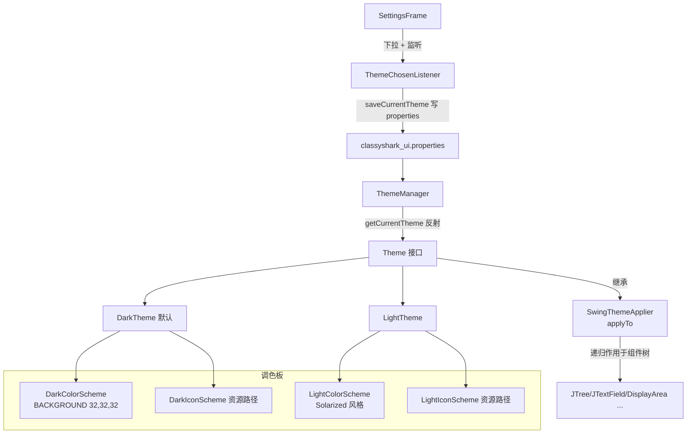

# 🎨 主题子系统架构

<Badge type="tip" text="架构" /> <Badge type="info" text="GUI 主题" />

> 主题子系统是 ClassyShark 的"皮肤引擎"：[`Theme`](/reference/modules/Theme) 定义 8 个图标 + 7 个语义颜色的契约，[`ThemeManager`](/reference/modules/ThemeManager) 按 `classyshark_ui.properties` 持久化并反射重组主题，而最关键的设计是**深色覆盖一切、浅色彻底放手**的非对称策略。

## 组件全景



## Theme 接口：契约

[`Theme`](/reference/modules/Theme) 继承自 `SwingThemeApplier<Component>`，因此每个主题既是**调色板提供者**也是**组件应用器**。契约分两类获取器：

### 8 个图标获取器

| 获取器 | 语义 |
|--------|------|
| `getToggleIcon` | 左树显隐切换（`JToggleButton`） |
| `getRecentIcon` | 最近归档按钮 |
| `getBackIcon` | 后退 |
| `getForwardIcon` | 前进/查看顶层类 |
| `getOpenIcon` | 打开文件 |
| `getExportIcon` | 导出 |
| `getMappingIcon` | 导入 ProGuard mapping |
| `getSettingsIcon` | 设置窗 |

### 7 个颜色获取器（语义角色）

| 获取器 | 角色 | DarkTheme (DarkColorScheme) | LightTheme (LightColorScheme) |
|--------|------|------|------|
| `getDefaultColor` | 普通代码/文档文本 | `0xd8d8d8` 灰白 | `#657B83` 青灰 |
| `getKeyWordsColor` | Java 关键字 | `#859900` 草绿 | `#B58900` 琥珀 |
| `getIdentifiersColor` | 标识符/类名 | `#FFFF80` 米黄 | `#859900` 草绿 |
| `getAnnotationsColor` | 注解 | `#6C71C4` 紫 | `#6C71C4` 紫 |
| `getSelectionBgColor` | 选中高亮背景 | `#073842` 蓝绿 | `#073842` 蓝绿（**共用**） |
| `getNamesColor` | 名称/次要文本 | `#586E75` 墨蓝 | `#93A1A1` 浅灰 |
| `getBackgroundColor` | 通用背景 | `#202020` 近黑 | `Color.WHITE` |

> 🎨 两个调色板都是 Solarized 家族：**关键字/标识符/注解/名称**四色在深浅间互相调换，`SELECTION_BG` 深浅共用同一 `#073842` 蓝绿——保证选中态观感一致。图标从 `DarkIconScheme`/`LightIconScheme` 的常量资源路径经 `getClass().getResource(...)` 加载。

## ThemeManager：持久化 + 反射重组

[`ThemeManager`](/reference/modules/ThemeManager) 把主题状态压进 `classyshark_ui.properties`：

| 方法 | 语义 |
|------|------|
| `saveCurrentTheme(Theme)` | 把 `theme.getClass().getName()` 写入 `Theme=` 键 |
| `getCurrentTheme()` | 读取类名 → `Class.forName` + `newInstance()` 反射构建；**异常一律回退 `new DarkTheme()`** |
| `getThemes()` | 返回 `{"Light", "Dark"}` 供下拉 |
| `getThemeIndexFrom` / `getThemeFrom` | 索引与主题互转（0=Light / 1=Dark） |

```java
public static Theme getCurrentTheme() {
    try {
        Properties properties = new Properties();
        properties.load(new FileReader(getPropertyFile()));
        Class<Theme> c = (Class<Theme>) Class.forName(properties.getProperty("Theme"));
        return c.newInstance();            // 反射按类名重组
    } catch (Exception e) {
        return new DarkTheme();            // 兜底默认
    }
}
```

> ⚠️ `getCurrentTheme` 用 `Class.forName(类名)` 反序列化——配置文件被篡改成不存在/非 Theme 类时抛异常并静默回退深色，不会崩溃。

## 设置与生效时机

[`SettingsFrame`](/reference/modules/SettingsFrame) 是主题切换入口：`JComboBox` 装 `ThemeManager.getThemes()`，初始选中 `getThemeIndexFrom(GuiMode.getTheme())`，变更由 [`ThemeChosenListener`](/reference/modules/ThemeChosenListener) 调 `saveCurrentTheme` 落盘。⚠️ 标签 tooltip 明示 **"It will be applied the next time ClassyShark is started"**——本会话不热切换，重启生效（LAF 与已构造组件需要重建，见 [GUI 主题](/gui/themes)）。

## 关键非对称：深色覆盖 vs 浅色放手

这是主题子系统最反直觉的一笔：

| | DarkTheme.applyTo | LightTheme.applyTo |
|---|---|---|
| 行为 | **覆盖**：`JTree`/`JTextField`/`JMenuItem`/`JPopupMenu` 设 `BACKGROUND_LIGHT`（`#2E3032`，提亮度分层），`JLabel` 设 `IDENTIFIERS` 前景，其余设 `BACKGROUND` | **空操作**：注释直言 "Do nothing as we don't want to override system defaults" |
| 缘由 | 系统无深色 LAF，必须逐组件手工着色 | 只有显式设 `UIManager.setLookAndFeel(getSystemLookAndFeelClassName())` 后原生浅色才透出 |
| 配套 | 构造器中 `UIManager.put("MenuItem.foreground", IDENTIFIERS)` 兜底 | 无 |

```java
// DarkTheme.applyTo —— 深色负责到底
public void applyTo(Component component) {
    if (shallBeLighter(component)) {            // JTree / JTextField / JMenuItem / JPopupMenu
        component.setBackground(BACKGROUND_LIGHT);
    } else if (component instanceof JLabel) {   // 前景用标识符色
        component.setForeground(IDENTIFIERS);
    } else {
        component.setBackground(BACKGROUND);    // 其余统一近黑
    }
}

// LightTheme.applyTo —— 浅色完全交由系统 LAF
public void applyTo(Component component) {
    /* Do nothing as we don't want to override system defaults for the light theme */
}
```

> 🧭 这条非对称在 [入口层架构](/reference/architecture/entry-layer) 与 [GUI 主题](/gui/themes) 中反复出现：`GuiMode` 里 `UIManager.setLookAndFeel(system)` 只对浅色有意义，深色靠 `applyTo` 逐个覆盖。

## 设计要点

- 📐 **契约先行** — `Theme` 接口把"主题"量化为 8 图标 + 7 色 + `applyTo`，三块可独立替换。
- 🔄 **反射持久化** — 主题名落盘、启动重组，新增主题无需改 `ThemeManager` 逻辑（枚举栏除外）。
- ⚖️ **刻意非对称** — 深色负责到底、浅色交给系统，避免浅色双份主题互相打架。
- 🏗️ **Solarized 血缘** — 两套调色板共基色系、共享 `SELECTION_BG`，深浅切换观感连续。

## 进一步阅读

- 🧩 [Theme](/reference/modules/Theme) · [ThemeManager](/reference/modules/ThemeManager) · [DarkTheme](/reference/modules/DarkTheme) · [LightTheme](/reference/modules/LightTheme) · [DarkColorScheme](/reference/modules/DarkColorScheme) · [LightColorScheme](/reference/modules/LightColorScheme) · [SwingThemeApplier](/reference/modules/SwingThemeApplier) · [SettingsFrame](/reference/modules/SettingsFrame)
- 🖥️ [GUI 主题](/gui/themes) · 🏗️ [GUI 层](/reference/architecture/gui-layer)