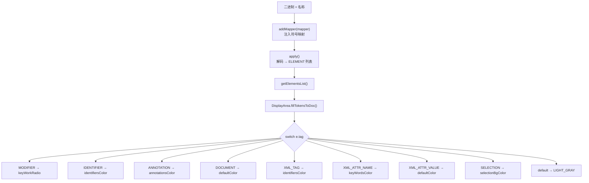

# 🧩 Translator 核心契约

<Badge type="tip" text="架构" /> <Badge type="info" text="翻译器公共契约" />

> [Translator](/reference/modules/Translator) 是**所有翻译器的根接口**。它把翻译抽象成一个纯函数：`(binary data, name) → List<ELEMENT>, with human readable semantics`。ELEMENT 是「词 + 语义标签」的不可变值对象，TAG 枚举统一承载 Java 与 XML 两类语义角色，让 GUI 的 [DisplayArea](/reference/modules/DisplayArea) 无需区分来源格式即可完成语法高亮。

## 接口契约全貌

```java
public interface Translator {
    enum TAG { MODIFIER, IDENTIFIER, ANNOTATION, DOCUMENT,
               XML_TAG, XML_ATTR_NAME, XML_ATTR_VALUE,
               XML_CDATA, XML_COMMENT, XML_DEFAULT, SELECTION }
    class ELEMENT { public final String text; public final TAG tag; }

    String getClassName();               // 当前条目名，如 classes.dex
    void addMapper(TokensMapper);        // 可选注入反混淆映射
    void apply();                        // 解码，填充内部元素列表
    List<ELEMENT> getElementsList();     // 供 UI 渲染
    List<String> getDependencies();      // 依赖的类/库
}
```

| 方法 | 语义 | 消费方 |
|------|------|--------|
| `getClassName()` | 当前翻译条目的名称 | 面板标题 / 树节点 |
| `addMapper(TokensMapper)` | 注入反向符号映射（混淆→原）；多为空操作 | 反混淆流程 |
| `apply()` | 实际解码二进制、填充元素列表 | 翻译调度 |
| `getElementsList()` | 返回带语义标签的元素 | [DisplayArea](/reference/modules/DisplayArea) |
| `getDependencies()` | 返回依赖的类/库 | 依赖图展示 |

## ELEMENT：通用货币

ELEMENT 是处处流动的**不可变值对象**（`text`/`tag` 均 `final`），全格式的输出都收敛到它。大到整行，小到一个关键字，都能用一个 ELEMENT 表达。

## TAG：语义角色枚举

`TAG` 枚举同时容纳 **Java 角色**、**XML 角色**与通用 **SELECTION**，三类角色共用一套着色器。

| 类别 | TAG 值 | 渲染意图 |
|------|--------|----------|
| Java 角色 | `MODIFIER` | 修饰符关键字（public/private/static…） |
| Java 角色 | `IDENTIFIER` | 标识符 / 类名 |
| Java 角色 | `ANNOTATION` | `@注解` |
| Java 角色 | `DOCUMENT` | 注释/Javadoc |
| XML 角色 | `XML_TAG` | `<tag>` 元素名 |
| XML 角色 | `XML_ATTR_NAME` | 属性名 |
| XML 角色 | `XML_ATTR_VALUE` | 属性值 |
| XML 角色 | `XML_CDATA` | CDATA 块 |
| XML 角色 | `XML_COMMENT` | `写注释` |
| XML 角色 | `XML_DEFAULT` | 其它 XML 文本 |
| 通用 | `SELECTION` | 命中/勾选标记 |



## GUI 显示层如何消费这个契约

[DisplayArea.fillTokenToDoc](/reference/modules/DisplayArea) 是契约的唯一下游消费者：它遍历 `getElementsList()` 的每个 ELEMENT，按其 `tag` 命中主题色板（见 [/gui/themes](/gui/themes)）给词条着色，从而把「二进制解码结果」直接渲染成彩色语法高亮文档。着色器不关心词条来自 Java、XML 还是 ELF——TAG 就是它们的统一语言。

## 契约约束

- **不可变 ELEMENT** — `text`/`tag` 构造后不可破坏，可在线程/模块间安全传递。
- **addMapper 可选** — XML、dex、elf、jar 的实现普遍空实现，仅 Java 字节码路径真正消费映射做反混淆。
- **apply 即执行** — 解码发生在 apply()，调用前元素列表为空、调用后可 get 到结果。

## 设计要点

- 🪙 **单一通用货币** — ELEMENT 一统纲，UI 高亮单一着色器。
- 🎨 **TAG 融合双语义** — Java 与 XML 角色共存一包，着色器零分支。
- 🔁 **纯函数视角** — `(二进制, 名称) → 带标注元素`，各实现服从契约。
- ⚡ **延迟执行** — apply 面执行解码，规避长会排入渲染。

## 进一步阅读

- 🧩 [Translator](/reference/modules/Translator) · [TranslatorFactory](/reference/modules/TranslatorFactory) · [DisplayArea](/reference/modules/DisplayArea) · [TokensMapper](/reference/modules/TokensMapper)
- 🏗️ [Translator 分发架构](/reference/architecture/translator) · [JavaTranslator 子系统](/reference/architecture/java-translator) · [Plugins SPI](/reference/architecture/plugins-spi)
- 🖥️ [GUI 显示层](/gui/display-area) · 🎨 [主题与着色](/gui/themes)