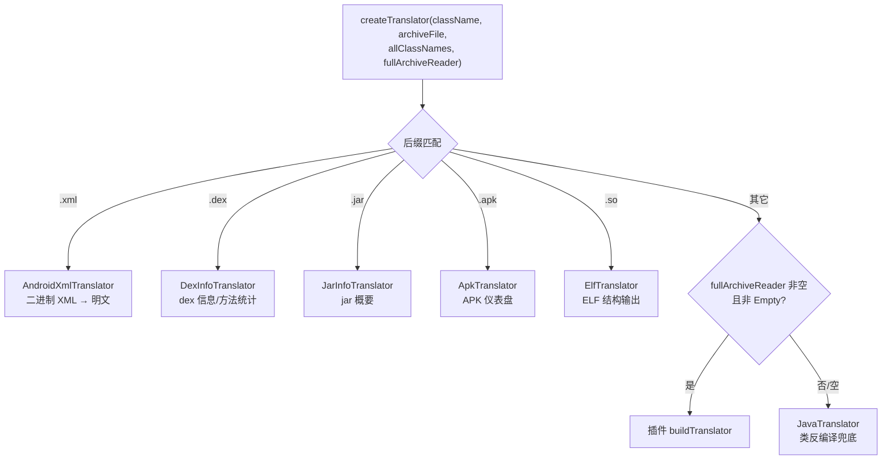

# 🏭 TranslatorFactory 架构

<Badge type="tip" text="架构" /> <Badge type="info" text="工厂分发" />

> [`TranslatorFactory.createTranslator`](/reference/modules/TranslatorFactory) 是翻译器分发的唯一入口：按目标元素**扩展名**从内置表中挑 Translator 实现；扩展名不匹配时先问插件的 `FullArchiveReader.buildTranslator`，无插件则回退到 [`JavaTranslator`](/reference/modules/JavaTranslator)。

## 扩展名 → Translator 分发表

| 扩展名 | Translator 实现 | 典型产物 |
|--------|----------------|----------|
| `.xml` | [`AndroidXmlTranslator`](/reference/modules/AndroidXmlTranslator) | 明文 manifest |
| `.dex` | [`DexInfoTranslator`](/reference/modules/DexInfoTranslator) | dex 头部信息、方法统计 |
| `.jar` | [`JarInfoTranslator`](/reference/modules/JarInfoTranslator) | jar 依赖与大小 |
| `.apk` | [`ApkTranslator`](/reference/modules/ApkTranslator) | APK 仪表盘（dashboard） |
| `.so` | [`ElfTranslator`](/reference/modules/ElfTranslator) | 文件大小、DT_NEEDED、动态符号 |
| 其它 | 插件回退 → `JavaTranslator` | 类源码/反编译 |

## 匹配优先级与回退

判定顺序严格、互斥、靠前优先：

1. **五类内置扩展名** — `.xml` / `.dex` / `.jar` / `.apk` / `.so`，各自 `endsWith` 命中即返回，不再看后续。
2. **插件接管** — 传入的 `fullArchiveReader` **非空且不是 [`EmptyFullArchiveReader`](/reference/modules/EmptyFullArchiveReader)** 时，调 `buildTranslator(className, archiveFile)` 让插件自定义未知元素。
3. **Java 兜底** — 默认 `new JavaTranslator(className, archiveFile)`。对 `.class` 与一切未匹配项走类反编译。

> ⚠️ [`EmptyFullArchiveReader`](/reference/modules/EmptyFullArchiveReader) 是插件接口的**空实现**（`buildTranslator` 返回吞掉一切的占位 Translator），工厂用 `instanceof` 判断它的存在以决定是否跳过插件分支——这是"默认无插件"与"注册了插件"的区分点。

## 调用方

| 调用方 | 场景 |
|--------|------|
| [`SilverGhost.readContents`](/reference/modules/SilverGhost) | 读内容后立即翻译 `AndroidManifest.xml` 缓存明文 |
| [`SilverGhost.translateArchiveElement`](/reference/modules/SilverGhost) | GUI 选中类/条目时的即时翻译 |
| [`SilverGhostFacade`](/reference/modules/SilverGhostFacade) | CLI/API 各静态方法的翻译路径 |

工厂是纯静态分发，不持状态——所有调用都从 `createTranslator` 的四个静态重载进入，最终收敛到同一个 4 参核心方法。

## 进一步阅读

- 🧩 [TranslatorFactory](/reference/modules/TranslatorFactory) · [Translator](/reference/modules/Translator) · [JavaTranslator](/reference/modules/JavaTranslator)
- 🏗️ [翻译器架构](/reference/architecture/translator) · [FullArchiveReader](/reference/modules/FullArchiveReader) · [EmptyFullArchiveReader](/reference/modules/EmptyFullArchiveReader)
- 🎯 [SilverGhost 编排](/reference/architecture/silverghost) · [入口层](/reference/architecture/entry-layer)