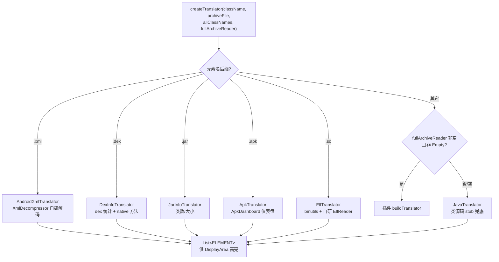

# 🏭 Translator 分发架构

<Badge type="tip" text="架构" /> <Badge type="info" text="翻译分发" />

> `com.google.classyshark.silverghost.translator` 包负责把**二进制条目解码成带语义标签的文本**。[TranslatorFactory](/reference/modules/TranslatorFactory) 是唯一分发入口，按元素**扩展名**从内置表挑实现；扩展名不匹配时先问插件 `FullArchiveReader`，无插件则回退到 [JavaTranslator](/reference/modules/JavaTranslator)。所有实现共享同一个 [Translator](/reference/modules/Translator) 契约与 [ELEMENT](/reference/modules/Translator) 通用货币。

## 扩展名 → Translator 分发



| 扩展名 | Translator 实现 | 底层技术 | 典型产物 |
|--------|----------------|----------|----------|
| `.xml` | [AndroidXmlTranslator](/reference/modules/AndroidXmlTranslator) | [XmlDecompressor](/reference/modules/XmlDecompressor) 自研二进制 XML 解码 + XmlHighlighter 正则高亮 | 明文 manifest |
| `.dex` | [DexInfoTranslator](/reference/modules/DexInfoTranslator) | dexlib2 | dex 概要、native 方法分布 |
| `.jar` | [JarInfoTranslator](/reference/modules/JarInfoTranslator) | 归档条目统计 | 类数与可读大小 |
| `.apk` | [ApkTranslator](/reference/modules/ApkTranslator) | ApkDashboard | 仪表盘式概览 |
| `.so` | [ElfTranslator](/reference/modules/ElfTranslator) | binutils + 自研 `ElfReader` | DT_NEEDED、动态符号 |
| 其它 | 插件回退 → `JavaTranslator` | MetaObject 三路策略 | 类源码 stub |

## 分发顺序与回退链

判定**严格、互斥、靠前优先**：

1. **五类内置扩展名** — `.xml` / `.dex` / `.jar` / `.apk` / `.so`，各自 `endsWith` 命中即返回。
2. **插件接管** — 传入的 `fullArchiveReader` **非空且不是** [EmptyFullArchiveReader](/reference/modules/EmptyFullArchiveReader) 时，调 `buildTranslator(className, archiveFile)`。
3. **Java 兜底** — `new JavaTranslator(className, archiveFile)`，`.class` 与一切未匹配项走类反编译。

```java
if (fullArchiveReader != null &&
        !(fullArchiveReader instanceof EmptyFullArchiveReader)) {
    return fullArchiveReader.buildTranslator(className, archiveFile);
}
return new JavaTranslator(className, archiveFile);
```

> ⚠️ `instanceof EmptyFullArchiveReader` 是「无插件」与「装了插件」的区分哨兵——空对象被显式排除，保证默认路径不被插件槽吞掉。

## 四个分支的实现要点

- **AndroidXmlTranslator** — `.apk/.zip/.aar` 走 `ZipFile` 按 entry 读，其他文件直接 `FileInputStream`；`.aar` 直接输出明文，其余路径经 `xmlDecompressor.decompressXml(...)` 解码二进制 XML；高亮由 `XmlHighlighter` 的 9 个正则 Pattern 负责（详见 [概念：binary-xml](/guide/concepts/binary-xml)）。
- **DexInfoTranslator** — 输出 classes / strings / types / protos / fields / methods 数量 + 文件大小，并按 dex 下标列出含 native 调用的类。
- **JarInfoTranslator** — 类数 + `readableFileSize` 的人读大小。
- **ApkTranslator** — `apply()` 内 `new ApkDashboard(...)` 生成仪表盘文本，GUI 里即「APK 仪表盘」面板。
- **ElfTranslator** — `extractElf` 用 SherlockHash 提取内嵌 .so，`ElfReader.read(...)` 自研解析 ELFCLASS32，输出共享依赖与动态符号（详见 [概念：elf-so](/guide/concepts/elf-so)）。

## 调用方

| 调用方 | 场景 |
|--------|------|
| [SilverGhost](/reference/modules/SilverGhost) 阶段 1 | 读内容后立即翻译 `AndroidManifest.xml` 缓存明文 |
| [SilverGhost](/reference/modules/SilverGhost) 阶段 3 | GUI 选中类/条目时的即时翻译 |
| [SilverGhostFacade](/reference/modules/SilverGhostFacade) | CLI/API 各静态方法的翻译路径 |

工厂是**纯静态分发、不持状态**——所有调用从 `createTranslator` 的静态重载进入，最终收敛到同一个 4 参核心方法。

## 设计要点

- 🎯 **单入口分发** — 所有翻译一律过 `TranslatorFactory`，调用方零 `if`。
- 🧩 **双回退** — 未知元素先问插件、再落 Java 兜底，保证「什么都能翻」。
- 🪙 **ELEMENT 通用货币** — 各格式最终都产出 `{text, TAG}` 列表，UI 着色无需区分来源（见 [Translator 核心](/reference/architecture/translator-core)）。
- 🛡️ **空对象哨兵** — `instanceof` 排除默认实现，插件注册语义清晰。

## 进一步阅读

- 🧩 [TranslatorFactory](/reference/modules/TranslatorFactory) · [Translator](/reference/modules/Translator) · [AndroidXmlTranslator](/reference/modules/AndroidXmlTranslator) · [JavaTranslator](/reference/modules/JavaTranslator) · [ApkTranslator](/reference/modules/ApkTranslator) · [ElfTranslator](/reference/modules/ElfTranslator)
- 🏗️ [Translator 核心契约](/reference/architecture/translator-core) · [JavaTranslator 子系统](/reference/architecture/java-translator) · [ContentReader 解析引擎](/reference/architecture/contentreader) · [Plugins SPI](/reference/architecture/plugins-spi)
- 🖥️ [GUI 显示层](/gui/display-area) · 🎨 [主题与着色](/gui/themes) · 📚 [Translator SPI API](/api/translator-spi)
