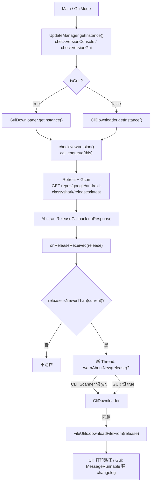

# 🔄 Updater 架构

<Badge type="tip" text="架构" /> <Badge type="info" text="自更新" />

> 自更新子系统让 ClassyShark 查询 GitHub Releases、比对版本并下载新版 jar。[`UpdateManager`](/reference/modules/UpdateManager) 是单例门面，按 `isGui` 二选一挑 [`CliDownloader`](/reference/modules/CliDownloader) 或 [`GuiDownloader`](/reference/modules/GuiDownloader)；两者共享同一套模板方法骨架与 Retrofit 网络栈。

## 整体流程



## UpdateManager：单例门面

[`UpdateManager`](/reference/modules/UpdateManager) 静态持有唯一实例（`private static final UpdateManager instance = new UpdateManager()`），构造器私有。对外暴露两个语义化方法，内部收敛到一个布尔参：

| 方法 | 调用方 | isGui | 委托下载器 |
|------|--------|:-----:|-----------|
| `checkVersionConsole()` | `CliMode -update` | `false` | `CliDownloader.getInstance()` |
| `checkVersionGui()` | `GuiMode.with` | `true` | `GuiDownloader.getInstance()` |

> 🎯 门面只做"选下载器"一件事，下载器自身持有版本比较、询问、下载的全部逻辑。

## 网络层：Retrofit + Gson

[`NetworkManager`](/reference/modules/NetworkManager) 惰性构建 `Retrofit`（`baseUrl(GitHubApi.ENDPOINT)` + `GsonConverterFactory`），[`GitHubApi`](/reference/modules/GitHubApi) 是唯一接口，一个 GET 注解声明远端：

```java
@GET("repos/google/android-classyshark/releases/latest")
Call<Release> getLatestRelease();
```

`ENDPOINT = "https://api.github.com/"` 是接口内常量；解析出的 JSON 由 Gson 反序列化进 [`Release`](/reference/modules/Release) 模型。

## Release 模型

[`Release`](/reference/modules/Release) 只保留用到的字段，`@SerializedName` 把下划线 JSON 名映射到 Java 字段：

| 字段 | JSON 名 | 用途 |
|------|---------|------|
| `name` | `name` | `major.minor` 版本串，如 `9.0` |
| `preRelease` | `prerelease` | 预发布标记（当前未使用） |
| `body` | `body` | changelog |
| `assets` | `assets` | 下载资源数组 |
| `createdAt` | `created_at` | 发布时间，用于文件名时间戳 |

三个关键方法：

- **`isNewerThan(Release)`** — 把 `name` 按 `.` 切分，先比 `major` 再比 `minor`（无 `patch` 维度，走 `major > || (major == && minor >)`）。
- **`getDownloadURL()`** — `assets.length > 0` 时取 `assets[0]` 的 `browser_download_url`（`ReleaseDownloadData` 字段经 `@SerializedName` 映射），否则返回 `null`。
- **`toString()`** — 输出 `REL:\t<name>\nCHANGELOG:\n<body>`，直接喂给 CLI 的询问文案。

## AbstractDownloader：模板方法

[`AbstractDownloader`](/reference/modules/AbstractDownloader) 继承 [`AbstractReleaseCallback`](/reference/modules/AbstractReleaseCallback)（后者实现 Retrofit `Callback<Release>`，把 `onResponse` 解包成 `onReleaseReceived(body)`、失败时 `System.err.println`），构成模板方法骨架：

```java
public void checkNewVersion() {
    Call<Release> call = NetworkManager.getGitHubApi().getLatestRelease();
    call.enqueue(this);                      // 异步，非阻塞
}

public void onReleaseReceived(final Release release) {
    if (release.isNewerThan(current)) {
        new Thread(() -> {
            if (warnAboutNew(release)) {     // 钩子，子类决定"是否询问"
                obtainNew(release);          // 下载
            }
        }).start();
    }
}
```

**模板流程**：`enqueue` 异步 → 回调解包 → 版本比较 → 开新线程 → `warnAboutNew`（抽象钩子）→ `obtainNew` → `FileUtils.downloadFileFrom` → `onReleaseDownloaded`（第二个抽象钩子，通知产物）。两个钩子正是 CLI 与 GUI 的差异点。

> ⚠️ `onReleaseReceived` 的 `warnAboutNew` 调用包在裸 `new Thread` 里，CLI 的 `Scanner` 阻塞读不会卡住 EDT；但 GUI 的 `warnAboutNew` 恒 `true`，下载完成后才经 `invokeLater` 切回 EDT。

## CliDownloader vs GuiDownloader

| 维度 | [`CliDownloader`](/reference/modules/CliDownloader) | [`GuiDownloader`](/reference/modules/GuiDownloader) |
|------|---------------------------------------------------|---------------------------------------------------|
| `warnAboutNew` | 打印版本+changelog，`Scanner.next()` 读 `y/N` | 恒 `true`，直接下载 |
| `onReleaseDownloaded` | 打印"已下载到 `<绝对路径>`" | `SwingUtilities.invokeLater(new MessageRunnable(name, changelog))` 弹窗 |
| 实例 | 同为 `getInstance()` 单例 | 同为 `getInstance()` 单例 |

> 💡 [`MessageRunnable`](/reference/modules/MessageRunnable) 是 `Runnable` 实现，在 EDT 上弹 `JOptionPane` 展示新版本名与 changelog——GUI 路径的"线程安全"就靠这一跳。

## FileUtils / NamingUtils：幂等下载

[`FileUtils`](/reference/modules/FileUtils) 的 `downloadFileFrom(release)` 是**幂等**的：目标文件已存在则跳过下载直接返回。真实下载 `obtainNewJarFrom` 用 NIO 通道一次搬运：

```java
ReadableByteChannel rbc = Channels.newChannel(url.openStream());
FileOutputStream fos = new FileOutputStream(file);
fos.getChannel().transferFrom(rbc, 0, Long.MAX_VALUE);
```

[`NamingUtils`](/reference/modules/NamingUtils) 生成目标文件名：`buildNameFrom` 取 `createdAt` 的 `T` 前日期，拼成 `ClassyShark_<YYYY-MM-DD>.jar`，落在 `extractCurrentPath()`（当前工作目录绝对路径）下。

| 工具 | 职责 | 幂等点 |
|------|------|--------|
| `FileUtils.downloadFileFrom` | 下载 + 幂等判断 | `file.exists()` 命中即返回 |
| `NamingUtils.buildNameFrom` | 生成 `ClassyShark_<date>.jar` 路径 | 同名文件天然去重 |
| `FileUtils.overwriteOld` | 用新版替换当前 jar | `REPLACE_EXISTING`（未接入流程） |

> 📁 `overwriteOld` 已实现但当前未调用，替换旧 jar 的"原地升级"仍是预留能力。

## 设计要点

- 🧩 **单例门面** — `UpdateManager` 全进程唯一，两个下载器也各自单例。
- 🏭 **模板方法** — 骨架固定，`warnAboutNew` / `onReleaseDownloaded` 两个钩子决定交互差异。
- 🔁 **幂等下载** — 文件名含发布日期 + 存在性判断，重复检查零成本。
- 🧵 **异步与线程安全** — Retrofit `enqueue` 非阻塞；CLI 用新线程隔离 `Scanner`，GUI 用 `invokeLater` 回 EDT。
- 🤐 **静默失败** — 网络失败仅 `stderr` 一行，升级失败不影响主程序。

## 进一步阅读

- 🧩 [UpdateManager](/reference/modules/UpdateManager) · [GitHubApi](/reference/modules/GitHubApi) · [Release](/reference/modules/Release) · [AbstractDownloader](/reference/modules/AbstractDownloader) · [CliDownloader](/reference/modules/CliDownloader) · [GuiDownloader](/reference/modules/GuiDownloader) · [FileUtils](/reference/modules/FileUtils) · [NamingUtils](/reference/modules/NamingUtils)
- 🛠️ [CLI 更新](/cli/update) · [从源码构建](/tutorials/build-from-source)
- 🏗️ [架构总览](/guide/architecture-overview) · [入口层](/reference/architecture/entry-layer)