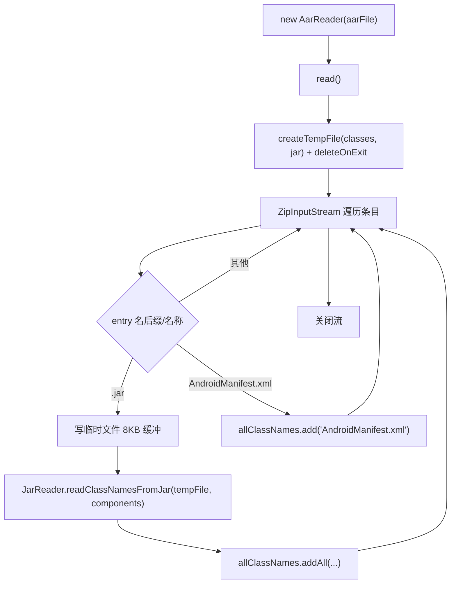

# 🧩 AarReader

<Badge type="tip" text="内容读取子系统" /> <Badge type="info" text="策略实现" />

> AAR 读取器：解压 AAR 找内嵌 classes.jar，写临时文件后委托 JarReader，并把 AndroidManifest.xml 当作"类名"加入列表。

📁 源码：<code>ClassySharkWS/src/com/google/classyshark/silverghost/contentreader/aar/AarReader.java</code> &nbsp; 📦 包：<code>com.google.classyshark.silverghost.contentreader.aar</code>

## 职责

`AarReader` 处理 Android Archive（AAR）。AAR 本质是 zip，内含 `classes.jar`、`AndroidManifest.xml`、资源等。`read()` 用 `ZipInputStream` 遍历条目：遇到以 `.jar` 结尾的条目，先把其内容写到临时文件 `classes*.jar`，再调用 `JarReader.readClassNamesFromJar` 解析类名（components 共享）；遇到名为 `AndroidManifest.xml` 的条目，直接把字符串 `"AndroidManifest.xml"` 当作"类名"加入列表。临时文件标记 `deleteOnExit()`。

## 关键方法 / 字段

| 名称 | 类型 | 说明 |
|------|------|------|
| `binaryArchive` | private File | 待读取的 .aar 文件 |
| `allClassNames` | private List&lt;String&gt; | 类名 + manifest 名 |
| `components` | private List&lt;Component&gt; | 附加成分（与 JarReader 共享） |
| `AarReader(File)` | ctor | 保存 binaryArchive |
| `read()` | void | 解压 AAR，临时文件桥接 JarReader，捕获 manifest |
| `getClassNames()` | List&lt;String&gt; | 返回 allClassNames |
| `getComponents()` | List&lt;Component&gt; | 返回 components |

## 工作流程

## 设计要点

- **临时文件桥接** — AAR 内嵌的是 `classes.jar`，而 `JarReader.readClassNamesFromJar` 需要 `File`，故先把 zip 条目内容写到 `File.createTempFile("classes","jar")` 再解析，标记 `deleteOnExit` 防泄漏。
- **8KB 缓冲拷贝** — `byte[8192]` + `zin.read`/`out.write` 循环，标准的流拷贝模式。
- **复用 JarReader** — 不重写 jar 解析，直接调静态方法，components 列表共享以保留 native lib 成分。
- **manifest 当类名** — 把 `AndroidManifest.xml` 字符串塞进 `allClassNames`，让上层 UI 能像类一样列出它（hack 式建模）。

## 协作关系

- 实现 → [[BinaryContentReader]]
- 被 [[ContentReader]] 在 `.aar` 分支实例化
- 依赖 → [[JarReader]]（`readClassNamesFromJar`）

## 已知问题 / TODO

- `read()` 的 `catch (Exception e) {}` 完全吞异常（空 catch 块），AAR 解析失败时既无日志也无错误反馈。
- 把 `AndroidManifest.xml` 混入类名列表属于语义混淆，调用方需自行区分真实类名与 manifest 串。
- 临时文件仅在 JVM 退出时删除，长时间运行或崩溃会残留文件。

## 相关文档

- [内容读取子系统](/reference/architecture/content-reader)
