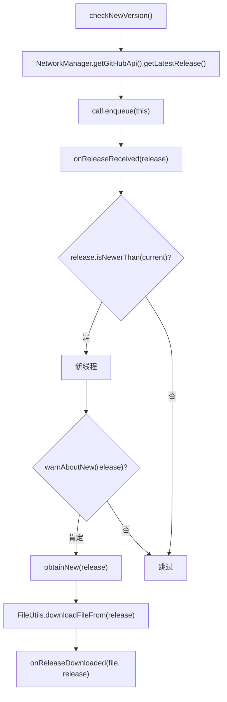

# 🧩 AbstractDownloader

<Badge type="tip" text="更新子系统" /> <Badge type="info" text="模板方法骨架" />

> GuiDownloader/CliDownloader 的骨架：经 Retrofit 异步检查新版本，命中后在新线程询问再下载，交互钩子由子类决定。

📁 源码：<code>ClassySharkWS/src/com/google/classyshark/updater/networking/AbstractDownloader.java</code> &nbsp; 📦 包：<code>com.google.classyshark.updater.networking</code>

## 职责

`AbstractDownloader` 是 `GuiDownloader` 与 `CliDownloader` 的共同骨架，继承 `AbstractReleaseCallback`。`checkNewVersion()` 经 Retrofit 异步 `enqueue` 发起 GitHub latest release 请求；回调 `onReleaseReceived(Release)` 在远端比本地新时（`release.isNewerThan(current)`），启动新线程先调抽象钩子 `warnAboutNew(release)` 询问用户是否更新，得到肯定后再 `obtainNew` 下载并调 `onReleaseDownloaded`。`warnAboutNew` 与 `onReleaseDownloaded` 是模板方法钩子，由子类决定具体交互方式（CLI 问 stdin / GUI 直接下载并弹窗）。

## 关键方法 / 字段

| 名称 | 类型 | 说明 |
|------|------|------|
| `current` | private final Release | 本地版本基准（`new Release()`） |
| `checkNewVersion()` | void | Retrofit enqueue 异步发起请求 |
| `onReleaseReceived(Release)` | void | 命中新版本→新线程 warn→下载 |
| `warnAboutNew(Release)` | abstract boolean | 询问是否更新（子类实现） |
| `obtainNew(Release)` | private void | 下载文件并回调 onReleaseDownloaded |
| `onReleaseDownloaded(File, Release)` | abstract void | 下载完成钩子（子类实现） |

## 工作流程

## 设计要点

- 🧩 **模板方法模式** — 公共流程（检查→比对→下载）在基类，交互细节（询问/完成回调）由子类钩子决定。
- 🔗 **继承 AbstractReleaseCallback** — 把 Retrofit 回调语义转为业务回调 `onReleaseReceived`。
- 🧵 **下载在独立线程** — `onReleaseReceived` 内 `new Thread(...)` 跑 warn+下载，避免阻塞 Retrofit 回调线程。
- 🏠 **本地基准 `new Release()`** — 无参构造 Release 作自身版本，比较靠 `isNewerThan`。
- 🤐 **IO 异常静默** — `obtainNew` 捕获 `IOException` 只 `System.err.println`，不抛。

## 协作关系

- 继承：[[AbstractReleaseCallback]]
- 依赖：[[Release]]（基准与远端）、[[NetworkManager]]（获取 GitHubApi）、[[FileUtils]]（下载）
- 子类：[[GuiDownloader]]、[[CliDownloader]]
- 被调用：[[UpdateManager]]（checkNewVersion 入口）

## 已知问题 / TODO

- 下载线程为裸 `new Thread`，无线程池与取消机制。
- `obtainNew` 的 `IOException` 仅打印错误，用户无感知下载失败。

## 相关文档

- [更新子系统架构](/reference/architecture/updater)
