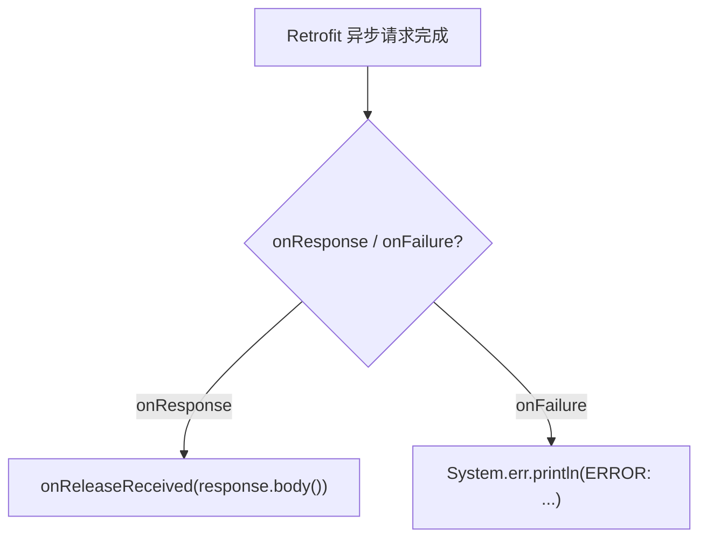

# 🧩 AbstractReleaseCallback

<Badge type="tip" text="更新子系统" /> <Badge type="info" text="回调适配器" />

> Retrofit `Callback<Release>` 抽象适配：把 Retrofit 回调简化为业务语义的 `onReleaseReceived`，onFailure 打错误。

📁 源码：<code>ClassySharkWS/src/com/google/classyshark/updater/networking/AbstractReleaseCallback.java</code> &nbsp; 📦 包：<code>com.google.classyshark.updater.networking</code>

## 职责

`AbstractReleaseCallback` 实现 Retrofit 的 `Callback<Release>`，作为下载器与 Retrofit 回调之间的抽象适配层。`onResponse` 把响应体 `response.body()` 转发给抽象方法 `onReleaseReceived(Release)`，`onFailure` 直接 `System.err.println` 打印错误。它把 Retrofit 的回调协议（成功/失败两分支 + Call/Response 包装）简化为单一的业务语义回调，让子类只需关心"收到一个 Release 后做什么"。

## 关键方法 / 字段

| 名称 | 类型 | 说明 |
|------|------|------|
| `onResponse(Call, Response)` | void | 转发 `response.body()` 到 onReleaseReceived |
| `onReleaseReceived(Release)` | abstract void | 业务回调：收到 release |
| `onFailure(Call, Throwable)` | void | 打印错误到 stderr |

## 工作流程

## 设计要点

- 🧩 **适配器模式** — 把 Retrofit `Callback` 协议适配为业务回调，屏蔽 Call/Response 包装。
- 🪶 **单业务方法** — 子类只实现 `onReleaseReceived`，关注业务而非协议。
- 🤐 **失败静默** — `onFailure` 仅打 stderr，不抛、不重试、不通知用户。

## 协作关系

- 实现：`retrofit2.Callback<Release>`
- 子类：[[AbstractDownloader]]（间接被 GuiDownloader/CliDownloader 继承）
- 依赖：[[Release]]（回调载荷类型）

## 已知问题 / TODO

- `onResponse` 未检查 `response.isSuccessful()` 或 body 是否为 null，HTTP 非 2xx 或空 body 会传 null 给业务回调。
- `onFailure` 仅打日志，无重试机制。

## 相关文档

- [更新子系统架构](/reference/architecture/updater)
