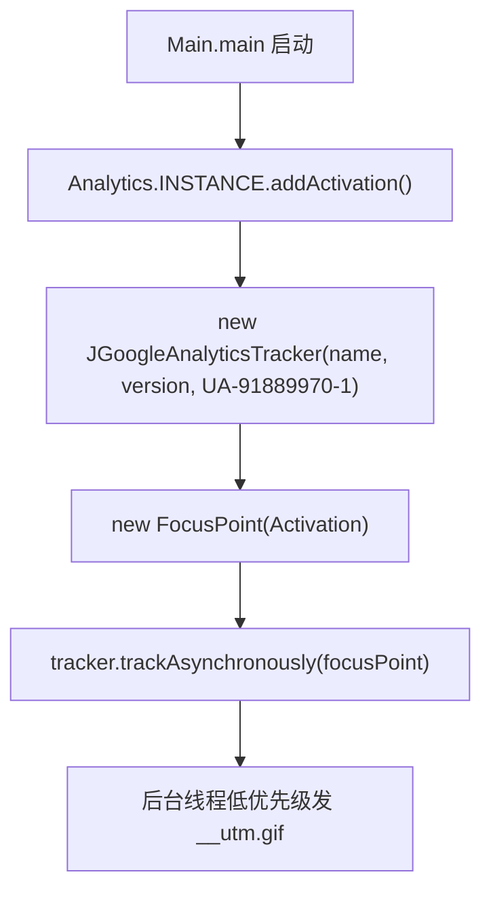

# 🧩 Analytics

<Badge type="tip" text="分析子系统" /> <Badge type="info" text="单例枚举门面" />

> 单例枚举门面：封装一次 Activation 事件的异步上报，把跟踪细节全藏在内部。

📁 源码：<code>ClassySharkWS/src/com/google/classyshark/analytics/Analytics.java</code> &nbsp; 📦 包：<code>com.google.classyshark.analytics</code>

## 职责

`Analytics` 是使用统计子系统的极简入口，以单例枚举（`enum Analytics { INSTANCE; }`）形式提供全局访问点。`addActivation()` 内部创建一个 `JGoogleAnalyticsTracker`，传入应用名 `ClassyShark-Activation`、版本（来自 `Version`）、Google Analytics 跟踪码 `UA-91889970-1`，构造一个名为 `Activation` 的 `FocusPoint`，然后异步上报一次。它把跟踪器的构造、URL 构建、HTTP 发送等细节全部封装，调用方只需一行。`Main.main` 在启动时调用它。

## 关键方法 / 字段

| 名称 | 类型 | 说明 |
|------|------|------|
| `INSTANCE` | enum 单例 | 全局唯一实例 |
| `addActivation()` | void | 异步上报一次 Activation 事件 |

## 工作流程

## 设计要点

- 🧩 **单例枚举** — `enum Analytics { INSTANCE; }` 是线程安全的单例惯用法，且序列化安全。
- 🪶 **极简入口** — 把跟踪码、应用名、版本组装全封装，调用方零认知。
- 🔗 **版本来自 `Version`** — `Version.MAJOR + "." + Version.MINOR` 作为应用版本上报。
- 📜 **基于第三方 jgoogleanalytics** — 源码注释 `// based on https://github.com/siddii/jgoogleanalytics`。

## 协作关系

- 依赖：[[JGoogleAnalyticsTracker]]（核心跟踪器）、[[FocusPoint]]（事件模型）、[[Version]]（版本号）
- 被调用：[[Main]]（启动上报）

## 已知问题 / TODO

- 跟踪码与 UA 硬编码在源码中。
- 上报依赖网络与外部 Google 服务，离线静默失败。

## 相关文档

- [分析子系统架构](/reference/architecture/analytics)
- [入口层](/reference/architecture/entry-layer)
