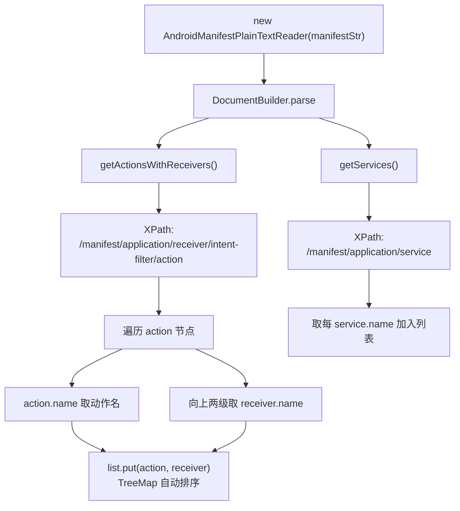

# 🧩 AndroidManifestPlainTextReader

<Badge type="tip" text="APK Dashboard" /> <Badge type="info" text="解析器" />

> 用 JAXP DocumentBuilder + XPath 解析解压后的 AndroidManifest，提取 action→receiver 与 service 列表。

📁 源码：<code>ClassySharkWS/src/com/google/classyshark/silverghost/translator/apk/dashboard/manifest/AndroidManifestPlainTextReader.java</code> &nbsp; 📦 包：<code>com.google.classyshark.silverghost.translator.apk.dashboard.manifest</code>

## 职责

`AndroidManifestPlainTextReader` 接收解压后的 AndroidManifest（`File` 或 `String`），用 JAXP `DocumentBuilder` 解析为 DOM，再用 XPath 查询。`getActionsWithReceivers()` 用 `/manifest/application/receiver/intent-filter/action` 取 action 节点，向上遍历两级到 receiver 取其 name 属性，产出 action→receiver 的 `TreeMap`（按 action 名排序）。`getServices()` 用 `/manifest/application/service` 取服务名列表。所有 XML 异常均静默 `printStackTrace` 后返回空集合。

## 关键方法 / 字段

| 名称 | 类型 | 说明 |
|------|------|------|
| `doc` | Document | 解析后的 DOM 文档 |
| `AndroidManifestPlainTextReader(File)` | 构造器 | namespaceAware 解析文件 |
| `AndroidManifestPlainTextReader(String)` | 构造器 | 从 UTF-8 字符串字节流解析 |
| `getActionsWithReceivers()` | Map&lt;String,String&gt; | action 名 → receiver 名，TreeMap 排序 |
| `getServices()` | List&lt;String&gt; | service name 列表 |

## 工作流程

## 设计要点

- 🔍 **XPath 绝对路径** — 用 `/manifest/application/receiver/intent-filter/action` 与 `/manifest/application/service`，假设固定结构，简洁但脆弱（任意层级变动即失效）。
- 🔗 **祖父节点取 receiver** — `getParentNode().getParentNode()` 从 action 上溯两级到 receiver，取其 `name` 属性。
- 🌳 **TreeMap 排序** — action→receiver 用 `TreeMap`，按 action 名天然有序，便于下游稳定输出。
- 📦 **双构造器** — 文件与字符串两入口，字符串走 `ByteArrayInputStream`（UTF-8），适配「内存文本」场景（如 facade 解压后的明文）。
- ⚠️ **静默失败** — `ParserConfigurationException`/`SAXException`/`IOException`/`XPathExpressionException` 均 `printStackTrace` 后继续，`doc` 为 null 时后续 XPath 返回空。

## 协作关系

- 被 [[ManifestInspector]] 的 `getInspections()` 调用
- 输入 manifest 文本来自 `SilverGhostFacade.getManifest`（解压二进制 XML）

## 已知问题 / TODO

- XPath 绝对路径脆弱：manifest 结构稍有不同（如多 application、嵌套不同）即取不到节点。
- 解析异常静默失败：`doc` 为 null 时方法返回空集合，调用方无法区分「真无节点」与「解析失败」。

## 相关文档

- [APK Dashboard 架构](/reference/architecture/apk-dashboard)
- [Manifest 检查](/reference/architecture/apk-dashboard)
