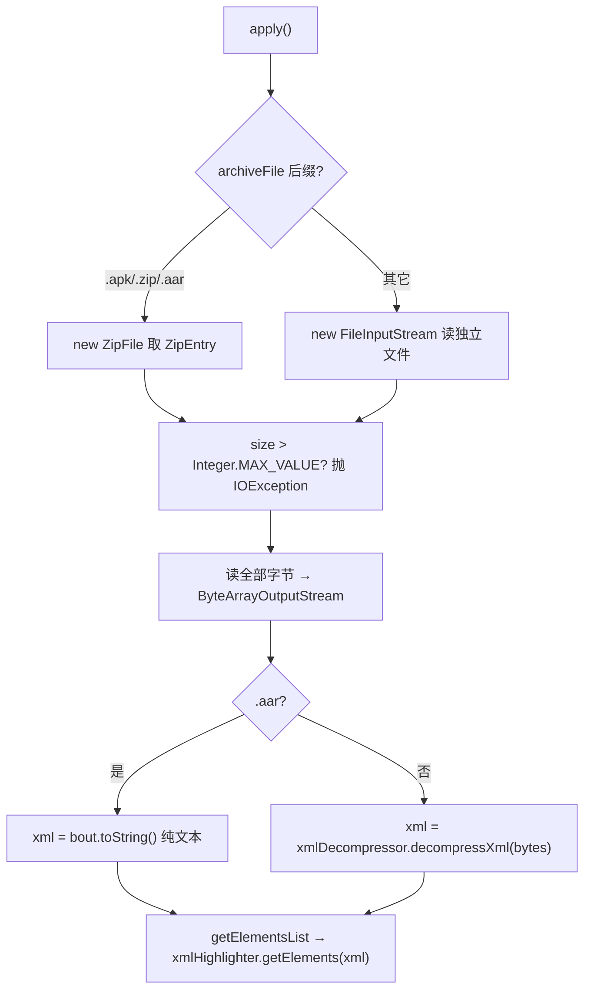

# 🧩 AndroidXmlTranslator

<Badge type="tip" text="Translator 核心" /> <Badge type="info" text="Translator 实现" />

> 从 APK/ZIP/AAR 提取二进制 `AndroidManifest.xml`，解压为纯文本并分词着色。

📁 源码：<code>ClassySharkWS/src/com/google/classyshark/silverghost/translator/xml/AndroidXmlTranslator.java</code> &nbsp; 📦 包：<code>com.google.classyshark.silverghost.translator.xml</code>

## 职责

`AndroidXmlTranslator` 实现 `Translator` 接口，专门处理 Android 二进制 XML（典型为 `AndroidManifest.xml`）。它判断归档类型：对 `.apk`/`.zip` 用 `ZipFile` 取出指定条目，对 `.aar` 直接按纯文本处理（`toString()`，因为 aar 内 XML 未二进制化），其余情况回退到 `FileInputStream` 读独立文件。读取字节后，`.aar` 走 `toString()`，其余走 `XmlDecompressor.decompressXml` 解压二进制 XML；最后由 `XmlHighlighter.getElements` 把纯文本切成带标签的 `ELEMENT` 列表。源码基于 Ribo 在 StackOverflow 的答案。

## 关键方法 / 字段

| 名称 | 类型 | 说明 |
|------|------|------|
| `DEFAULT_CLASS_NAME` | static final String | `"AndroidManifest.xml"`，单参构造器的默认条目名 |
| `archiveFile` | final File | 归档文件（apk/zip/aar）或独立 xml 文件 |
| `xmlName` | final String | 待提取的条目名 |
| `xml` | String | 解压后的纯文本 XML |
| `xmlHighlighter` | XmlHighlighter | 负责把纯文本切成带标签元素 |
| `xmlDecompressor` | XmlDecompressor | 负责把二进制 XML 解码为文本 |
| `getClassName()` | String | 返回 `xmlName` |
| `addMapper(TokensMapper)` | void | 空操作 |
| `apply()` | void | 读字节、解压（aar 除外）、存入 `xml` |
| `getElementsList()` | List&lt;ELEMENT&gt; | 委托 `xmlHighlighter.getElements(xml)` |
| `getDependencies()` | List&lt;String&gt; | 返回空列表，注释留有 fuzzy permissions TODO |
| `closeResource(Closeable)` | private void | 静默关闭资源，吞掉关闭异常 |

## 工作流程

## 设计要点

- 📦 **归档与独立文件双模式** — 用文件名后缀区分：apk/zip/aar 走 `ZipFile` + `ZipEntry`，其余走 `FileInputStream`，兼容「从归档取条目」与「直接打开单文件」两种用法。
- 📄 **aar 特例** — `.aar` 内的 XML 是纯文本而非二进制，故直接 `toString()`，绕过 `XmlDecompressor`。
- 🚧 **大文件保护** — `size > Integer.MAX_VALUE` 时抛 `IOException`，避免 `ByteArrayOutputStream` 缓冲区溢出。
- 🧹 **资源关闭容错** — `closeResource` 对 null 与关闭异常都静默处理，`finally` 块保证三资源都被尝试关闭。
- 📝 **基于 Ribo 的 SO 答案** — 类注释标注源自 `http://stackoverflow.com/a/4761689/496992`，并提到「some manifests can't be shown」的已知缺陷及兜底显示全部字符串的注释。

## 协作关系

- 依赖：[[Translator]]（实现接口）
- 依赖：[[XmlDecompressor]]（二进制 XML 解压）
- 依赖：[[XmlHighlighter]]（纯文本 XML 分词）
- 被创建：[[TranslatorFactory]]（`.xml` 分支）
- 被调用：[[DisplayArea]]（消费 `getElementsList()`）

## 已知问题 / TODO

- ⚠️ 类注释自述：存在「某些 manifest 无法显示」的 bug，已加显示全部字符串的兜底。
- ⚠️ `getDependencies` 注释留有 `TODO fuzzy logic for permissions etc`，权限依赖提取未实现。
- ⚠️ `apply` 异常仅 `System.err` 打印，不抛出，调用方无法感知失败。

## 相关文档

- [Translator 核心架构](/reference/architecture/translator-core)
- [模块索引](/reference/modules/Main)
