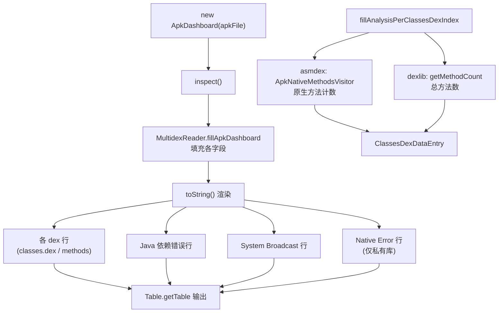

# 🧩 ApkDashboard

<Badge type="tip" text="APK Dashboard" /> <Badge type="info" text="聚合根 / 编排器" />

> APK 检查编排器与聚合根，汇总各 dex 数据、原生库、Java 依赖与清单建议，输出双列表格。

📁 源码：<code>ClassySharkWS/src/com/google/classyshark/silverghost/translator/apk/dashboard/ApkDashboard.java</code> &nbsp; 📦 包：<code>com.google.classyshark.silverghost.translator.apk.dashboard</code>

## 职责

`ApkDashboard` 是 APK 仪表板的聚合根与编排器。它持有 `classesDexEntries`、`customClassesDexEntries`、`nativeLibs`、`nativeDependencies`、`nativeErrors`、`allClasses` 等可变状态，由 `MultidexReader.fillApkDashboard` 填充。`inspect()` 委派 `MultidexReader` 完成实际扫描；随后对外提供各维度的查询方法，并通过 `toString()` 把所有结果拼成一张 `Table` 双列表格。

## 关键方法 / 字段

| 名称 | 类型 | 说明 |
|------|------|------|
| `classesDexEntries` | ArrayList&lt;ClassesDexDataEntry&gt; | 标准 dex 检查结果 |
| `customClassesDexEntries` | ArrayList&lt;ClassesDexDataEntry&gt; | 自定义/内部 zip dex 结果 |
| `nativeLibs` / `nativeDependencies` / `nativeErrors` | List&lt;String&gt; | 原生库全路径/依赖名/错误 |
| `allClasses` | List&lt;String&gt; | 所有类名，喂给 Java 依赖检查 |
| `inspect()` | void | 委派 `MultidexReader.fillApkDashboard` |
| `getAllDexEntries()` | List&lt;ClassesDexDataEntry&gt; | 合并标准 + 自定义 dex 条目 |
| `getNativeLibNamesSorted()` | List&lt;String&gt; | 去重（LinkedHashSet）+ 排序的库名 |
| `getPrivateLibErrorTag(String)` | String | 调 `PrivateNativeLibsInspector.isPrivate`，私有则返回 ` -- private api!` |
| `getClassesWithNativeMethodsPerDexIndex(int, File)` | static Set&lt;String&gt; | 供 `DexInfoTranslator` 用，跑分析取原生方法类集合 |
| `getJavaDependenciesErrors()` | List&lt;String&gt; | 用 `JavaDependenciesInspector` 扫描 allClasses |
| `getManifestRecommendations()` | List&lt;String&gt; | 用 `ManifestInspector` 取后台广播建议 |
| `fillAnalysisPerClassesDexIndex(int, File)` | static ClassesDexDataEntry | 跑 asmdex + dexlib 填充单 dex 数据 |
| `toString()` | String | 用 `NEW_LINE` 分隔行块，`Table.getTable` 渲染 |
| `NEW_LINE` | static String[] | `{" "," "}` 空行哨兵行 |

## 工作流程

## 设计要点

- 📊 **聚合根** — 所有 dex/原生库/依赖/清单状态集中于此，外部检查器都从它取数据或被它驱动。
- 🔀 **双 dex 列表** — `classesDexEntries`（标准）与 `customClassesDexEntries`（自定义/zip 内 dex）分离，`getAllDexEntries` 再合并，区分主包与附属 dex。
- 🧹 **去重排序** — `getNativeLibNamesSorted` 用 `LinkedHashSet` 去重再 `Collections.sort`，避免重复库噪声。
- 🔍 **私有库标记** — `getPrivateLibErrorTag` 对每个库询问 `PrivateNativeLibsInspector`，命中才在 `toString` 输出 ` -- private api!` 行。
- ⚠️ **SyntheticAccessorsInspector 未接线** — `fillAnalysisPerClassesDexIndex` 中连接 `syntheticAccessors` 的两行被注释掉，检查器存在但当前不产出数据。

## 协作关系

- 依赖：[[MultidexReader]]（填充仪表板）
- 依赖：[[ClassesDexDataEntry]]（每 dex 数据载体）
- 依赖：[[ApkNativeMethodsVisitor]]（asmdex 原生方法扫描）
- 依赖：[[PrivateNativeLibsInspector]]、[[JavaDependenciesInspector]]、[[ManifestInspector]]
- 依赖：[[Table]]（表格渲染）
- 被 [[ApkTranslator]] 调用
- 静态方法被 [[DexInfoTranslator]] 使用

## 已知问题 / TODO

- `inspect()` 含 TODO：`// TODO add exception for not calling inspect`，未防止先访问后 inspect。
- `SyntheticAccessorsInspector` 的连接被注释，`classesDexDataEntry.syntheticAccessors` 始终为 null。
- `fillAnalysisPerClassesDexIndex` 的两个 try 块均 `printStackTrace` 后继续，错误 dex 数据会被静默带过。

## 相关文档

- [APK Dashboard 架构](/reference/architecture/apk-dashboard)
- [Translator 机制](/reference/architecture/translator)
