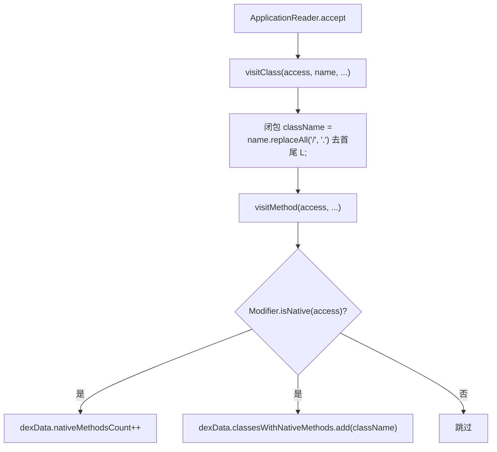

# 🧩 ApkNativeMethodsVisitor

<Badge type="tip" text="APK Dashboard" /> <Badge type="info" text="Visitor" />

> asmdex 的 ApplicationVisitor/ClassVisitor/MethodVisitor，扫描每个方法统计原生方法并写入 dexData。

📁 源码：<code>ClassySharkWS/src/com/google/classyshark/silverghost/translator/apk/dashboard/ApkNativeMethodsVisitor.java</code> &nbsp; 📦 包：<code>com.google.classyshark.silverghost.translator.apk.dashboard</code>

## 职责

`ApkNativeMethodsVisitor` 继承 asmdex 的 `ApplicationVisitor`，在遍历 dex 时为每个类创建 `ClassVisitor`，再在每个方法上检查 `Modifier.isNative(access)`。命中原生方法则递增 `dexData.nativeMethodsCount` 并把点分类名加入 `dexData.classesWithNativeMethods`。它无字段无返回——纯写 `dexData`。由 `ApkDashboard.fillAnalysisPerClassesDexIndex` 通过 `ApplicationReader.accept` 驱动。

## 关键方法 / 字段

| 名称 | 类型 | 说明 |
|------|------|------|
| `dexData` | ClassesDexDataEntry | 被写入结果的值对象 |
| `ApkNativeMethodsVisitor(ClassesDexDataEntry)` | 构造器 | `super(Opcodes.ASM4)`，保存 dexData |
| `visitClass(...)` | ClassVisitor | 返回匿名 ClassVisitor，闭包持有类名 |
| `className`（匿名内部） | String | 把 dex 型 `Lfoo/bar/Baz;` 转为点分名 |
| `visitMethod(...)`（匿名内部） | MethodVisitor | `Modifier.isNative(access)` 命中则写 dexData |

## 工作流程

## 设计要点

- 🔍 **纯写副作用** — visitor 不返回数据，所有结果直接累加到传入的 `ClassesDexDataEntry`，无中间状态。
- 🎨 **类名转换** — 匿名 `ClassVisitor` 中 `name.replaceAll("\\/", "\\.").substring(1, len-1)` 把 asmdex 的 `Lfoo/bar/Baz;` 形态转为 `foo.bar.Baz`。
- 📦 **闭包捕获** — `visitClass` 用匿名内部类闭包捕获 `mName`，使 `visitMethod` 能拿到当前类名，符合 visitor API 单次回调的限制。
- 🧩 **ASM4 版本** — 构造统一传 `Opcodes.ASM4`，与 `ApkDashboard` 中 `ApplicationReader` 创建时一致。

## 协作关系

- 被调用：[[ApkDashboard]]（`fillAnalysisPerClassesDexIndex` 中 `ar.accept(av, 0)`）
- 写入：[[ClassesDexDataEntry]]

## 已知问题 / TODO

- 无明显已知问题（职责清晰，纯遍历写值对象）。

## 相关文档

- [APK Dashboard 架构](/reference/architecture/apk-dashboard)
- [Translator 机制](/reference/architecture/translator)
