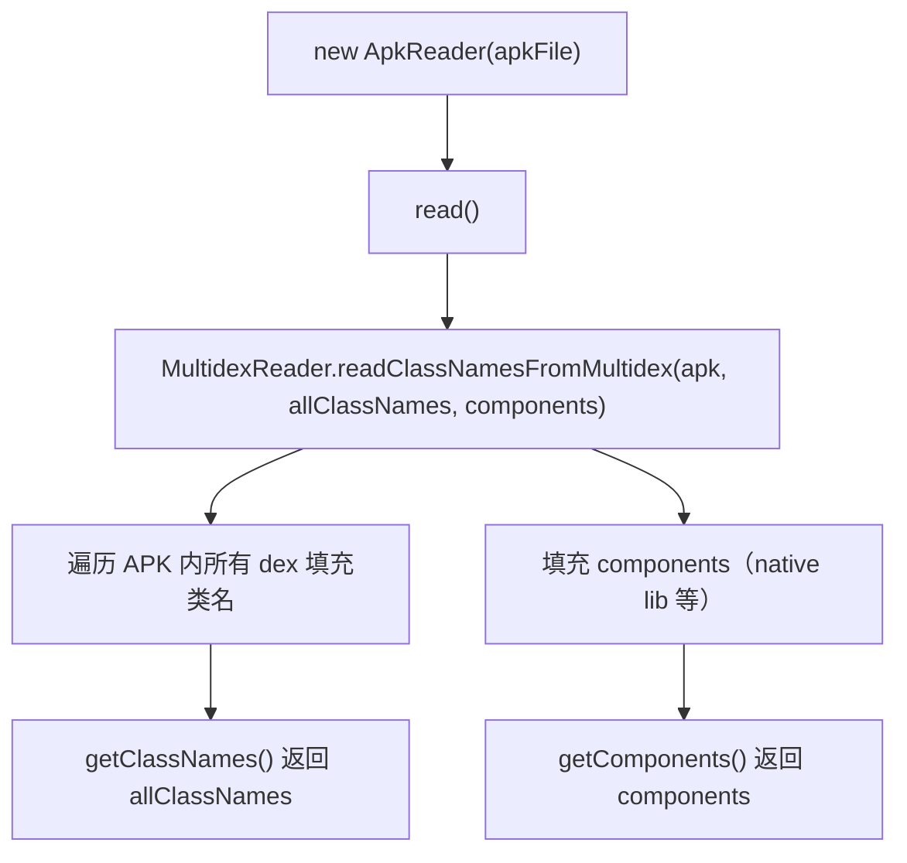

# 🧩 ApkReader

<Badge type="tip" text="内容读取子系统" /> <Badge type="info" text="策略实现" />

> APK 读取器：委托 `MultidexReader` 处理多 dex 并填充类名与 components 列表。

📁 源码：<code>ClassySharkWS/src/com/google/classyshark/silverghost/contentreader/apk/ApkReader.java</code> &nbsp; 📦 包：<code>com.google.classyshark.silverghost.contentreader.apk</code>

## 职责

`ApkReader` 是 APK 文件的内容读取策略实现。它本身不做 dex 解析，而是把 `binaryArchive`、`allClassNames`、`components` 三个可变集合交给静态方法 `MultidexReader.readClassNamesFromMultidex`，由后者遍历 APK 内所有 dex（含 multidex）填充。源码注释里有两处 TODO：把 `AndroidManifest.xml` 注入类名列表、把 manifest 作为 component，目前均被注释掉。

## 关键方法 / 字段

| 名称 | 类型 | 说明 |
|------|------|------|
| `binaryArchive` | private File | 待读取的 APK 文件 |
| `allClassNames` | private List&lt;String&gt; | 类名结果，由 MultidexReader 填充 |
| `components` | private List&lt;Component&gt; | 附加成分，由 MultidexReader 填充 |
| `ApkReader(File)` | ctor | 保存 binaryArchive |
| `read()` | void | 静态导入调用 `readClassNamesFromMultidex(...)` |
| `getClassNames()` | List&lt;String&gt; | 返回 allClassNames |
| `getComponents()` | List&lt;Component&gt; | 返回 components（含 TODO：应加 manifest） |

## 工作流程

## 设计要点

- **静态导入委托** — `import static ...MultidexReader.readClassNamesFromMultidex` 直接调用静态方法，APK 自身不持有解析逻辑，复用 multidex 支持。
- **可变集合外泄填充** — 把内部 `allClassNames` / `components` 列表直接传给被委托方就地填充，避免拷贝。
- **multidex 感知** — 通过 MultidexReader 自动覆盖 `classes.dex`、`classes2.dex`…，而非只读首个 dex。

## 协作关系

- 实现 → [[BinaryContentReader]]
- 被 [[ContentReader]] 在 `.apk` 分支实例化
- 委托 → MultidexReader（`readClassNamesFromMultidex`，位于 translator.java.dex 包）

## 已知问题 / TODO

- `read()` 中注释掉 `allClassNames.add(6, "AndroidManifest.xml")`，并标 `// TODO add isPrivate for manifest`——manifest 暂未进类名列表。
- `getComponents()` 标 `// TODO add manifest here`——manifest 也未进 components，APK 的 manifest 当前完全不可见。

## 相关文档

- [内容读取子系统](/reference/architecture/content-reader)
