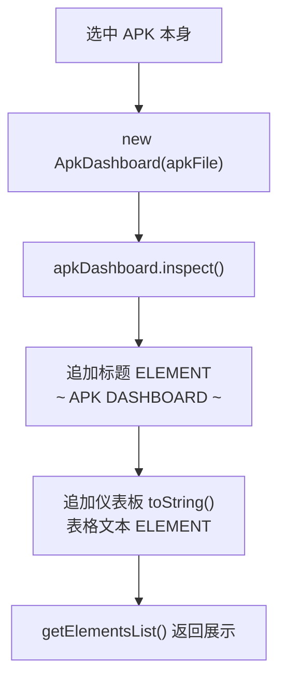

# 🧩 ApkTranslator

<Badge type="tip" text="APK Dashboard" /> <Badge type="info" text="Translator" />

> 整个 APK 条目的 Translator，在树中选中 APK 本身（而非单个类）时显示仪表板。

📁 源码：<code>ClassySharkWS/src/com/google/classyshark/silverghost/translator/apk/ApkTranslator.java</code> &nbsp; 📦 包：<code>com.google.classyshark.silverghost.translator.apk</code>

## 职责

`ApkTranslator` 实现 `Translator` 接口，是用户在类树中选中 APK 本身（非单个类）时的展示入口。它在 `apply()` 中构建一个 `ApkDashboard`，调用其 `inspect()`，然后把「标题 + 仪表板 `toString()` 表格文本」作为两个 `ELEMENT` 放入元素列表。它本身是一个轻量包装器——真正的检查与编排逻辑全部在 `ApkDashboard` 中。

## 关键方法 / 字段

| 名称 | 类型 | 说明 |
|------|------|------|
| `apkFile` | File | 待分析的 APK 文件 |
| `apkDashboard` | ApkDashboard | 真正的检查编排器，`apply()` 中创建 |
| `elements` | List&lt;ELEMENT&gt; | 输出元素列表（标题 + 仪表板文本） |
| `ApkTranslator(File)` | 构造器 | 保存 apkFile，TODO 注释提到需校验非 APK 文件 |
| `apply()` | void | 构建仪表板、`inspect()`、追加标题与文档两个 ELEMENT |
| `getElementsList()` | List&lt;ELEMENT&gt; | 返回输出元素 |
| `getClassName()` | String | 固定返回空串（APK 整体无单一类名） |
| `getDependencies()` | List&lt;String&gt; | 返回空 LinkedList |
| `toString()` | String | 拼接所有元素文本 |

## 工作流程

## 设计要点

- 🔍 **薄包装器模式** — `ApkTranslator` 几乎不承载逻辑，仅做 `Translator` 接口到 `ApkDashboard` 的桥接，职责单一。
- 🎨 **双元素输出** — `apply()` 产出两个 `ELEMENT`：一个是 `TAG.IDENTIFIER` 的标题，一个是 `TAG.DOCUMENT` 的表格正文，由上层按 tag 着色/区分。
- ⚠️ **空类名与空依赖** — `getClassName()` 返回 `""`、`getDependencies()` 返回空列表，反映 APK 整体而非单个类的语义。
- 📦 **复用 Translator 契约** — 让 APK 仪表板能像单个类翻译一样被统一调度，无需为「整体视图」开辟新通道。

## 协作关系

- 依赖：[[ApkDashboard]]
- 实现 → `Translator` 接口

## 已知问题 / TODO

- 构造函数含 TODO：`// TODO add checks for file that is not an APK`，未校验传入文件是否真的是 APK。

## 相关文档

- [APK Dashboard 架构](/reference/architecture/apk-dashboard)
- [Translator 机制](/reference/architecture/translator)
