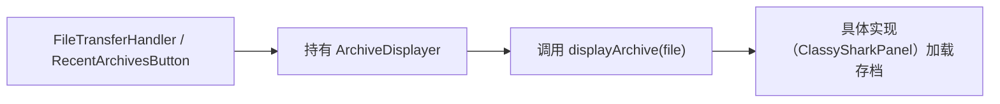

# 🧩 ArchiveDisplayer

<Badge type="tip" text="GUI 契约层" /> <Badge type="info" text="接口" />

> 单方法接口，表示「能显示一个存档文件」的最低公约数。

📁 源码：<code>ClassySharkWS/src/com/google/classyshark/gui/panel/ArchiveDisplayer.java</code> &nbsp; 📦 包：<code>com.google.classyshark.gui.panel</code>

## 职责

`ArchiveDisplayer` 是仅含一个方法 `displayArchive(File file)` 的接口。它是 `ToolbarController` 与 `ViewerController` 共同扩展的最低公约数，使得文件打开/拖放处理程序可以把目标当作「一个能显示存档的东西」来编程，而不必依赖整个 `ClassySharkPanel`。

## 关键方法 / 字段

| 名称 | 类型 | 说明 |
|------|------|------|
| `displayArchive(File file)` | void | 显示指定存档文件 |

## 工作流程

## 设计要点

- 🎯 **最小接口** — 只一个方法，是「能显示存档」这一能力的最小抽象。
- 🔗 **被多接口继承** — `ToolbarController` 与 `ViewerController` 均 `extends ArchiveDisplayer`，让拖放与最近存档按钮可针对最小接口编程。
- 🧩 **依赖倒置** — [[FileTransferHandler]] 与 [[RecentArchivesButton]] 注入的是本接口而非整个面板，这是拖放能在三个放置区（树/显示区/环形图）统一生效的根因。

## 协作关系

- 实现 ← [[ClassySharkPanel]]（通过实现 `ToolbarController`/`ViewerController` 间接实现）
- 被扩展 ← [[ToolbarController]]、[[ViewerController]]
- 被调用 ← [[FileTransferHandler]]、[[RecentArchivesButton]]

## 已知问题 / TODO

- 无明显已知问题；最小接口设计稳定。

## 相关文档

- [GUI 架构](/reference/architecture/gui-layer)
- [[ViewerController]]
- [[ToolbarController]]
