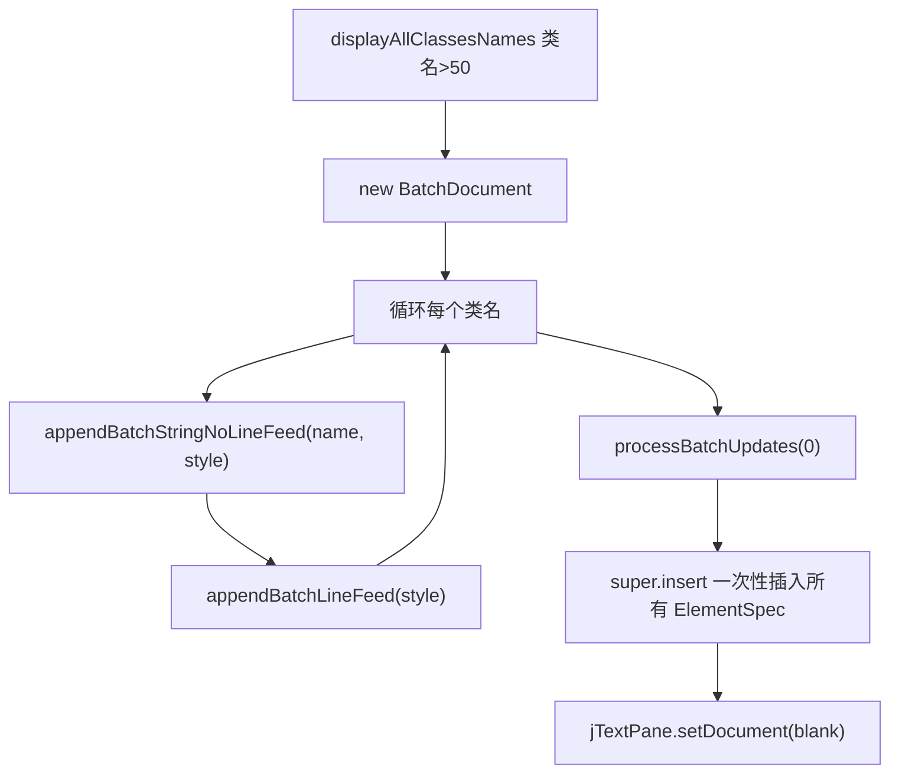

# 🧩 BatchDocument

<Badge type="tip" text="GUI 性能层" /> <Badge type="info" text="批处理模式" />

> DefaultStyledDocument 子类，积累 ElementSpec 条目一次性批量插入。

📁 源码：<code>ClassySharkWS/src/com/google/classyshark/gui/panel/displayarea/BatchDocument.java</code> &nbsp; 📦 包：<code>com.google.classyshark.gui.panel.displayarea</code>

## 职责

`BatchDocument` 是包私有的性能工具，继承 `DefaultStyledDocument`。它把多次字符串插入累积成 `ElementSpec` 条目，最后一次 `insert` 批量提交。由 `DisplayArea.displayAllClassesNames` 在类名计数超 50 时使用——标准 Swing 每次单独 `insertString` 都触发独立更新事件导致 UI 卡顿，此批文档合并为单次结构化插入。

## 关键方法 / 字段

| 名称 | 类型 | 说明 |
|------|------|------|
| `batch` | ArrayList | 累积的 ElementSpec 列表 |
| `EOL_ARRAY` | static char[] | 换行符 `{ '\n' }` |
| `appendBatchStringNoLineFeed(String, AttributeSet)` | void | 追加一段无换行的文本规格 |
| `appendBatchLineFeed(AttributeSet)` | void | 追加换行并闭合/开启段落 |
| `processBatchUpdates(int offs)` | void | 把 batch 转数组一次性 `super.insert` |

## 工作流程

## 设计要点

- ⚡ **单次结构化插入** — 把 N 次 `insertString` 合并为 1 次 `insert(ElementSpec[])`，避免逐条更新事件。
- 📦 **包私有** — 仅 `displayarea` 包内可见，纯内部性能工具。
- 🔤 **段落维护** — `appendBatchLineFeed` 用 `EndTagType`/`StartTagType` 规格正确闭合并开启段落元素，保持文档结构合法。

## 协作关系

- 被使用 ← [[DisplayArea]]（`displayAllClassesNames`）
- 继承 → `DefaultStyledDocument`

## 已知问题 / TODO

- 🐛 使用原始 `ArrayList`（无泛型），需强转 `ElementSpec[]`。
- 🐛 `processBatchUpdates` 的 `offs` 参数实际只用 0，未支持任意偏移。
- 🐛 无并发保护，仅限 EDT 内使用。

## 相关文档

- [GUI 架构](/reference/architecture/gui-layer)
- [[DisplayArea]]
