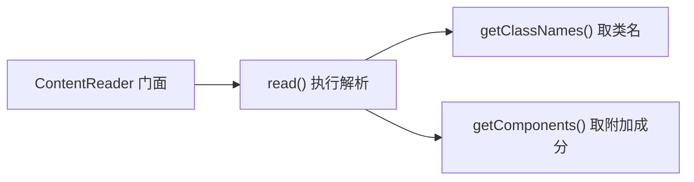

# 🧩 BinaryContentReader

<Badge type="tip" text="内容读取子系统" /> <Badge type="info" text="策略接口" />

> 统一的二进制内容读取契约：所有具体 reader（Apk/Dex/Jar/Aar/Clazz）实现此接口。

📁 源码：<code>ClassySharkWS/src/com/google/classyshark/silverghost/contentreader/BinaryContentReader.java</code> &nbsp; 📦 包：<code>com.google.classyshark.silverghost.contentreader</code>

## 职责

`BinaryContentReader` 是内容读取子系统的策略接口，定义了从任意二进制归档中提取「类名 + 附加成分」的三步契约：先 `read()` 执行实际 I/O 与解析，再 `getClassNames()` 取类名列表，最后 `getComponents()` 取附加成分（manifest、native lib 等）。`ContentReader` 门面只依赖此接口，具体 reader 实现可独立演进与替换。

## 关键方法 / 字段

| 名称 | 类型 | 说明 |
|------|------|------|
| `read()` | void | 执行实际读取/解析，填充实现内部状态 |
| `getClassNames()` | List&lt;String&gt; | 返回读取到的类名列表 |
| `getComponents()` | List&lt;ContentReader.Component&gt; | 返回附加成分（manifest/native lib），无则空列表 |

## 工作流程

## 设计要点

- **极简三方法** — 接口只有 `read()` / `getClassNames()` / `getComponents()`，职责单一、易实现。
- **策略模式落点** — 所有具体 reader 共同实现同一契约，门面以接口类型持有，符合依赖倒置。
- **Component 类型复用** — `getComponents()` 返回 `ContentReader.Component`，让附加成分模型在所有 reader 间统一。
- **无异常声明** — 接口方法不声明受检异常，由各实现自行决定是否吞异常。

## 协作关系

- 被 [[ContentReader]] 以 `formatReader` 字段持有并调用
- 实现类：[[ApkReader]]、[[DexReader]]、[[JarReader]]、[[AarReader]]、[[ClazzReader]]

## 已知问题 / TODO

- 接口未约定 `read()` 的前置/后置状态契约，`ContentReader` 用 `isEmpty()` 判断是否已读属于隐式约定，易出错。

## 相关文档

- [内容读取子系统](/reference/architecture/content-reader)
