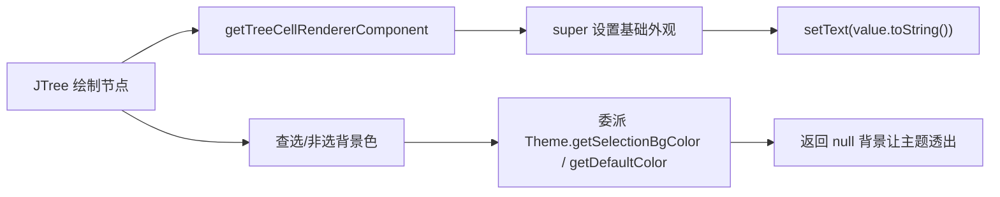

# 🧩 CellRenderer

<Badge type="tip" text="GUI 渲染层" /> <Badge type="info" text="装饰器模式" />

> 主题感知的树单元格渲染器，颜色委派活动 Theme。

📁 源码：<code>ClassySharkWS/src/com/google/classyshark/gui/panel/tree/CellRenderer.java</code> &nbsp; 📦 包：<code>com.google.classyshark.gui.panel.tree</code>

## 职责

`CellRenderer` 继承 `DefaultTreeCellRenderer`，把树的颜色决策委派给活动 `Theme`。它显式返回 `null` 背景以禁用默认非选背景，让主题背景透出。`FilesTree` 与 `MethodsCountPanel` 共享同一渲染器实例类型，实现深/浅主题切换时的统一重绘。

## 关键方法 / 字段

| 名称 | 类型 | 说明 |
|------|------|------|
| `getBackgroundNonSelectionColor()` | Color | 返回 null，禁用默认非选背景 |
| `getBackgroundSelectionColor()` | Color | 委派 `theme.getSelectionBgColor()` |
| `getBackground()` | Color | 返回 null |
| `getTextNonSelectionColor()` | Color | 委派 `theme.getDefaultColor()` |
| `getTreeCellRendererComponent(...)` | Component | 设节点文本后返回 |

## 工作流程

## 设计要点

- 🎨 **主题委派** — 选/非选颜色全部从 `GuiMode.getTheme()` 读取，主题切换后自动生效。
- 🚫 **null 背景** — `getBackgroundNonSelectionColor` 与 `getBackground` 返回 null，禁用 Swing 默认背景，让父容器主题背景透出。
- 🔁 **双树共享** — 类树与方法计数树共用，保证两棵树主题一致。

## 协作关系

- 依赖 → [[GuiMode]]（取主题）
- 被使用 ← [[FilesTree]]、[[MethodsCountPanel]]

## 已知问题 / TODO

- 🐛 每次绘制都调用 `GuiMode.getTheme()`，虽无性能问题但可缓存主题引用；主题热切换时依赖 Swing 重绘触发，运行时切换主题不会自动重绘这些树。

## 相关文档

- [GUI 架构](/reference/architecture/gui-layer)
- [[FilesTree]]
- [[MethodsCountPanel]]
