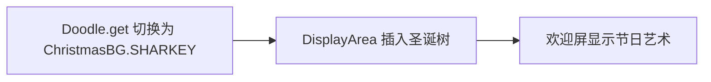

# 🧩 ChristmasBG

<Badge type="tip" text="GUI 涂鸦层" /> <Badge type="info" text="常量持有" />

> 圣诞树 ASCII 艺术常量，归因 angelfire，标 Christmas Edition。

📁 源码：<code>ClassySharkWS/src/com/google/classyshark/gui/panel/displayarea/doodles/ChristmasBG.java</code> &nbsp; 📦 包：<code>com.google.classyshark.gui.panel.displayarea.doodles</code>

## 职责

`ChristmasBG` 是包私有类，仅持有一个公共静态常量 `SHARKEY`，内容为一棵圣诞树 ASCII 艺术。它归属 `angelfire.com`，并标注 `ClassyShark ver. 4.3 Christmas Edition`。作为可插拔涂鸦集的一员，可被 [[Doodle]] 门面选中以呈现节日欢迎屏。

## 关键方法 / 字段

| 名称 | 类型 | 说明 |
|------|------|------|
| `SHARKEY` | public static final String | 圣诞树 ASCII 艺术 + 归因 + 版本串 |

## 工作流程

## 设计要点

- 🎄 **常量持有者** — 类本身只承载一段静态 ASCII 艺术常量。
- 📝 **归属标注** — 串尾附 `angelfire.com` 来源与 Christmas Edition 版本标记。
- 🔒 **包私有类** — 仅 doodles 包内可见，需经 [[Doodle]] 暴露。

## 协作关系

- 被引用 ← [[Doodle]]（可选涂鸦）

## 已知问题 / TODO

- 无明显已知问题；纯常量类，版本号硬编码 `4.3` 不随 `Version` 派生。

## 相关文档

- [GUI 架构](/reference/architecture/gui-layer)
- [[Doodle]]
- [[SharkBG]]
