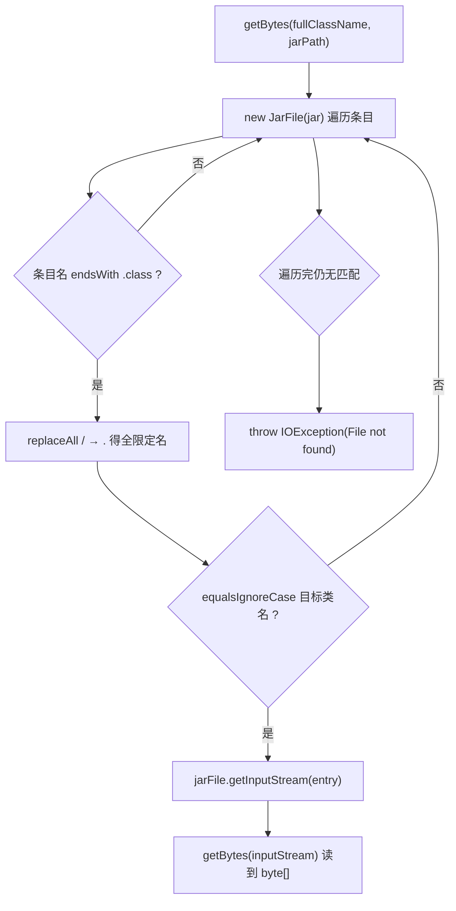

# 🧩 ClassBytesFromJarExtractor

<Badge type="tip" text="Java Translator" /> <Badge type="info" text="工具类" />

> 从 jar 中按类名提取 .class 条目原始字节，供 ASM 解析使用。

📁 源码：<code>ClassySharkWS/src/com/google/classyshark/silverghost/translator/java/clazz/asm/ClassBytesFromJarExtractor.java</code> &nbsp; 📦 包：<code>com.google.classyshark.silverghost.translator.java.clazz.asm</code>

## 职责

`ClassBytesFromJarExtractor` 是一个静态工具类，负责从 jar 文件中按全限定类名定位对应的 `.class` 条目，并把其原始字节读入 `byte[]`。它被 `MetaObjectAsmClass` 的 jar 构造重载使用——当反射加载失败、回退到 ASM 路径时，需要先把类字节取出来才能交给 `ClassReader` 解析。它还提供一个通用的 `InputStream → byte[]` 读取方法和一个十六进制调试辅助。

## 关键方法 / 字段

| 名称 | 类型 | 说明 |
|------|------|------|
| `getBytes(String fullClassName, String jar)` | static byte[] | 按"全限定名.class"在 jar 条目中匹配，读字节到数组 |
| `getBytes(InputStream)` | static byte[] | 通用流→字节数组，0xFFFF 缓冲 |
| `bytesToHex(byte[])` | static String | 调试辅助：字节转十六进制串 |
| `hexArray` | private static char[] | 十六进制字符表 `0123456789ABCDEF` |
| `main(String[])` | static void | 测试入口：打印某类字节十六进制 |

## 工作流程

## 设计要点

- **路径分隔符归一** — jar 条目名用 `/`，全限定类名用 `.`，`getBytes` 用 `replaceAll("/", "\\.")` 归一后再 `equalsIgnoreCase` 比较，匹配容错大小写。
- **0xFFFF 缓冲** — `getBytes(InputStream)` 用 64KB 缓冲区循环读，适合 class 文件尺寸量级。
- **try-with-resources** — `JarFile` 与 `InputStream` 均用 try-with-resources 确保关闭，IO 异常向上抛（`getBytes` 声明 `throws IOException`）。
- **未找到显式抛** — 遍历完无匹配时抛 `IOException("File not found")`，调用方据此回退。

## 协作关系

- 被 [[MetaObjectAsmClass]] 的 `(className, jarFile)` 构造器调用
- 被 [[MetaObjectFactory]] 间接使用（jar 回退 ASM 路径）

## 已知问题 / TODO

- 源码注释 `// ... inputs check omitted ...` 承认输入校验被省略，`fullClassName`/`jar` 为 null 或空时会直接抛底层异常而非友好报错。
- `main` 硬编码桌面测试路径（`BytecodeViewer.jar`），属测试残留。

## 相关文档

- [Java Translator 子系统](/reference/architecture/java-translator)
- [ASM 元对象](/reference/modules/MetaObjectAsmClass)
