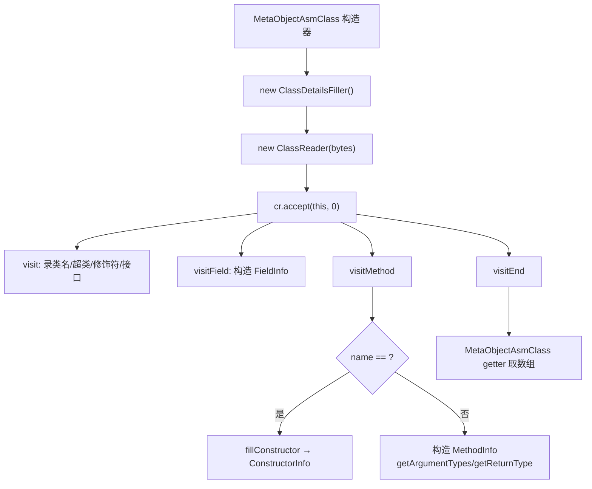

# 🧩 ClassDetailsFiller

<Badge type="tip" text="Java Translator" /> <Badge type="info" text="ASM 访问者" />

> ASM ClassVisitor，扫描类字节填充电反射 MetaObject API 期望的字段/方法/构造器/接口列表。

📁 源码：<code>ClassySharkWS/src/com/google/classyshark/silverghost/translator/java/clazz/asm/ClassDetailsFiller.java</code> &nbsp; 📦 包：<code>com.google.classyshark.silverghost.translator.java.clazz.asm</code>

## 职责

`ClassDetailsFiller` 继承 ASM 的 `ClassVisitor`（目标 `Opcodes.ASM5`）。它接收 `ClassReader.accept` 的回调，在 `visit`/`visitField`/`visitMethod` 中把类字节里的结构信息翻译成 `MetaObject.InterfaceInfo`/`FieldInfo`/`ConstructorInfo`/`MethodInfo` 数据类并累积到内部列表，最后以数组形式暴露给 `MetaObjectAsmClass` 的各 getter。它是 ASM 侧的「结构采集器」，把 ASM 的事件式访问模型适配为 `MetaObject` 的查询式数据模型。

## 关键方法 / 字段

| 名称 | 类型 | 说明 |
|------|------|------|
| `name` | String | 类全限定名（`/` 已转 `.`） |
| `modifiers` | int | 类访问标志 |
| `superClass` | String | 超类名（`/` 转 `.`） |
| `superclassGenerics` | String | 超类泛型（硬编码空串，ASM 不解签名） |
| `interfaces` | List&lt;InterfaceInfo&gt; | 实现的接口列表 |
| `declaredFields` | List&lt;FieldInfo&gt; | 字段列表 |
| `declaredConstructors` | List&lt;ConstructorInfo&gt; | 构造器列表 |
| `declaredMethods` | List&lt;MethodInfo&gt; | 方法列表 |
| `visit(version, access, name, signature, superName, interfaces)` | void | 录入类名/超类/修饰符/接口 |
| `visitField(access, name, desc, signature, value)` | FieldVisitor | 构造 `FieldInfo`（类型经 `DexlibAdapter.getTypeName`） |
| `visitMethod(access, name, desc, signature, exceptions)` | MethodVisitor | `<init>` 拆构造器，其余拆 `MethodInfo`（参数/返回经 ASM `Type`） |
| `fillConstructor(access, desc)` | private void | 构造器参数经 `Type.getArgumentTypes` 解码 |
| `visitSource/visitOuterClass/visitAttribute/visitInnerClass` | void | 空操作（不采集这些信息） |
| `getDeclaredFields()` / `getDeclaredMethods()` / ... | ...Info[] | 列表转数组暴露 |

## 工作流程

## 设计要点

- **类型描述符解码委派 dexlib 适配器** — `visitField`/`visitMethod` 中类型描述符（`Ljava/util/Map;`、`I`）统一经 `DexlibAdapter.getTypeName`/`getClassStringFromDex` 解码，使 ASM 与 dex 两路复用同一套类型串规范化逻辑。
- **构造器靠方法名拆分** — `visitMethod` 用 `name.equals("<init>")` 区分构造器与普通方法，与 `MetaObjectDex.isConstructor` 的判定方式一致（约定符号 `<init>`）。
- **不发出注解与异常** — `visitAnnotation` 返回 null、`visitMethod` 中 `mi.exceptionTypes` 硬编码空数组，源码留有 `// TODO fill exceptions`；`visitAttribute`/`visitInnerClass`/`visitSource`/`visitOuterClass` 均为空实现。
- **泛型全空** — `getClassGenerics` 固定返回 `""`，ASM 路径不解析 `signature`（泛型签名），与反射路径的泛型支持形成差异。
- **目标 ASM5** — 构造调 `super(Opcodes.ASM5)`，对应当时支持的字节码版本。

## 协作关系

- 被 [[MetaObjectAsmClass]] 持有与驱动（所有 getter 委派本类）
- 依赖 → [[DexlibAdapter]]（类型描述符解码）
- 使用 ASM `ClassReader`/`ClassVisitor`/`Type`

## 已知问题 / TODO

- `// TODO fill exceptions` — 方法异常类型未采集，`exceptionTypes` 硬编码空数组，ASM 存根不显示 `throws`。
- 注解完全未采集（`visitAnnotation` 返回 null），ASM 存根不含类/字段/方法注解。
- `signature`（泛型签名）参数被忽略，ASM 存根无泛型信息。

## 相关文档

- [Java Translator 子系统](/reference/architecture/java-translator)
- [ASM 元对象](/reference/modules/MetaObjectAsmClass)
