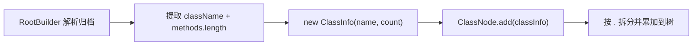

# 🧩 ClassInfo

<Badge type="tip" text="方法计数" /> <Badge type="info" text="值对象" />

> 方法计数子系统的最小数据载体，记录一个类的全限定名与其方法数量。

📁 源码：<code>ClassySharkWS/src/com/google/classyshark/silverghost/methodscounter/ClassInfo.java</code> &nbsp; 📦 包：<code>com.google.classyshark.silverghost.methodscounter</code>

## 职责

`ClassInfo` 是方法计数子系统的原子数据单元。它把"一个类的包名 + 该类的方法数"这对信息封装成不可变的值对象，供 `RootBuilder` 在解析归档后构造，再交给 `ClassNode` 累加到包层级树中。它本身不含任何逻辑，纯粹是数据搬运工。

## 关键方法 / 字段

| 名称 | 类型 | 说明 |
|------|------|------|
| `packageName` | private String | 类的全限定名（点分形式，如 `com.foo.Bar`） |
| `methodCount` | private int | 该类的方法数量 |
| `ClassInfo(String, int)` | 构造器 | 注入包名与方法数 |
| `getPackageName()` | String | 返回全限定类名 |
| `getMethodCount()` | int | 返回方法数 |

## 工作流程

## 设计要点

- 📦 **不可变值对象** — 两个字段在构造时赋值，无 setter，天然线程安全。
- 🎯 **职责单一** — 不做拆分、不做累加，只携带数据；拆分与聚合逻辑全部下沉到 `ClassNode`。
- 🔗 **点分约定** — `packageName` 实际存的是全限定类名（如 `com.foo.Bar`），后续由 `ClassNode.add` 用 `split("\\.")` 拆分出包层级。
- 🧱 **桥接点** — 它是 `RootBuilder`（解析器）与 `ClassNode`（聚合器）之间的数据契约，解耦两端。

## 协作关系

- 构造方 → [[RootBuilder]]（创建 `ClassInfo` 实例）
- 消费方 → [[ClassNode]]（`add(ClassInfo)` 读取其包名与方法数）

## 已知问题 / TODO

- 命名略微误导：字段叫 `packageName` 但存的是全限定类名（含类名本身），而非纯包名。

## 相关文档

- [方法计数子系统](/reference/architecture/methodscounter)
- [导出器](/reference/architecture/exporter)
