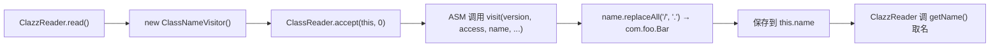

# 🧩 ClassNameVisitor

<Badge type="tip" text="内容读取子系统" /> <Badge type="info" text="访问者 / ASM" />

> ASM ClassVisitor（ASM5）实现：仅重写 `visit` 捕获类名，把 `/` 替换为 `.`。

📁 源码：<code>ClassySharkWS/src/com/google/classyshark/silverghost/contentreader/clazz/ClassNameVisitor.java</code> &nbsp; 📦 包：<code>com.google.classyshark.silverghost.contentreader.clazz</code>

## 职责

`ClassNameVisitor` 是一个极简的 ASM `ClassVisitor` 实现，专门为 `ClazzReader` 服务。它继承 `ClassVisitor`（构造时指定 `Opcodes.ASM5`），只重写 `visit` 方法：从字节码访问回调中拿到内部类名（形如 `com/foo/Bar`），把 `/` 全部替换为 `.` 得到 `com.foo.Bar` 并保存。其余访问方法（字段、方法、注解等）均不重写，保持默认空实现，职责单一。

## 关键方法 / 字段

| 名称 | 类型 | 说明 |
|------|------|------|
| `name` | private String | 捕获到的类名（已替换 `/` 为 `.`） |
| `ClassNameVisitor()` | ctor | `super(Opcodes.ASM5)` |
| `visit(int,int,String,String,String,String[])` | void | 重写：保存 `name.replaceAll("/", ".")` |
| `getName()` | String | 返回捕获到的类名 |

## 工作流程

## 设计要点

- **ASM5 版本固定** — 构造传 `Opcodes.ASM5`，匹配 ASM 5.x 的字节码访问契约。
- **只重写 visit** — 仅捕获类名，字段/方法/注解等回调走默认空实现，开销极小。
- **路径分隔符转换** — `replaceAll("/", "\\.")` 把 JVM 内部类名分隔符转成 Java 全限定名的点分形式。
- **职责单一** — 一个 visitor 只做一件事：取出类名，便于未来派生更丰富的 visitor 而不影响它。

## 协作关系

- 被 [[ClazzReader]] 实例化并通过 `ClassReader.accept` 驱动
- 继承自 `org.objectweb.asm.ClassVisitor`

## 已知问题 / TODO

- `visit` 未加 `@Override` 注解，且未重写 `visitSource`/`visitInnerClass` 等；若上游 ASM 版本变更方法签名，编译期不易察觉。
- `name` 在 `visit` 未被调用前为 `null`，`ClazzReader` 直接 `getName()` 不判空，坏字节码时会塞入 null。

## 相关文档

- [内容读取子系统](/reference/architecture/content-reader)
