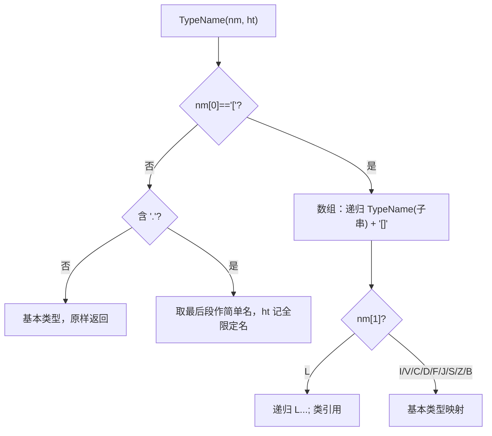

# 🧩 ClassTypeAlgorithm

<Badge type="tip" text="Android 子系统" /> <Badge type="info" text="类型翻译算法" />

> 递归解析 JVM 类型签名（数组前缀 `[` + 基本类型描述符 + `L...;`）为 Java 源码形式，传 Hashtable 时记录引用类型用于 imports。

📁 源码：<code>ClassySharkAndroid/app/src/main/java/com/google/classysharkandroid/reflector/ClassTypeAlgorithm.java</code> &nbsp; 📦 包：<code>com.google.classysharkandroid.reflector</code>

## 职责

`ClassTypeAlgorithm` 是 `Reflector` 的类型翻译核心。静态方法 `TypeName(String nm, Hashtable ht)` 递归解析反射返回的 JNI 风格类型名：若不以 `[` 开头则按 `.` 取最后段（基本类型或类简单名），传 ht 时记录全限定名用于 imports；若以 `[` 开头为数组，递归处理子类型并在末尾追加 `[]`，子类型按 `L/I/V/C/D/F/J/S/Z/B` 等描述符映射到 `int`/`void`/`char`/`double`/`float`/`long`/`short`/`boolean`/`byte` 或递归 `L...;` 类引用。处理反射返回的 JNI 风格类型名，是 Reflector 生成 imports 与类型文本的关键依赖。

## 关键方法 / 字段

| 名称 | 类型 | 说明 |
|------|------|------|
| `TypeName(String, Hashtable)` | public static String | 递归解析 JNI 类型名为 Java 源码形式 |

## 工作流程

## 设计要点

- 🔁 **递归解析数组** — `[` 前缀触发递归处理嵌套数组（如 `[[I` → `int[][]`）。
- 🏷️ **JNI 描述符映射** — 单字母描述符 I/V/C/D/F/J/S/Z/B 映射到 Java 基本类型关键字。
- 📦 **imports 收集副作用** — 传非 null Hashtable 时把全限定类名写入，供 Reflector 生成 import 列表；传 null 则只翻译不记录。
- 🧩 **纯静态工具** — 私有构造，单静态方法。
- ⚠️ **未知描述符容错** — default 分支返回 `"BOGUS:" + nm`，标记无法识别的类型。

## 协作关系

- 依赖：无
- 被调用：[[Reflector]]（generateDependencies + fillTaggedText 多处调用）

## 已知问题 / TODO

- `nm.charAt(0)` 等未做空串保护，空类型名会 `StringIndexOutOfBoundsException`。
- `ht.put(nm, yy)` 只记录简单名 `yy` 作 value，但 Reflector 用 keys 作 import，value 似乎未充分使用。
- 未处理 `Ljava/lang/String;` 中含 `/` 的内部类/嵌套签名分隔符（JVM 用 `/` 分包，此处按 `.` 取段可能不准）。

## 相关文档

- [Android 子系统架构](/reference/architecture/android)
