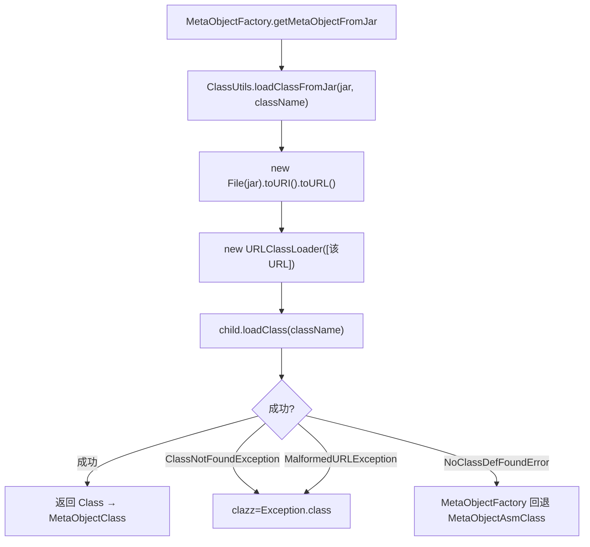

# 🧩 ClassUtils

<Badge type="tip" text="Java Translator" /> <Badge type="info" text="静态工具类" />

> 用指向 jar 的 URLClassLoader 反射加载类的单方法工具，是 SPI 与反射元对象路径的边界。

📁 源码：<code>ClassySharkWS/src/com/google/classyshark/silverghost/translator/java/clazz/reflect/ClassUtils.java</code> &nbsp; 📦 包：<code>com.google.classyshark.silverghost.translator.java.clazz.reflect</code>

## 职责

`ClassUtils` 是一个静态工具类，仅含一个静态方法 `loadClassFromJar`。它为给定 jar 路径创建一个独立的 `URLClassLoader`（唯一 URL 指向该 jar），并用它反射加载指定类名，返回 `Class` 对象。它被 `MetaObjectFactory.getMetaObjectFromJar` 调用——成功则交给 `MetaObjectClass`（反射元对象，泛型信息最全），失败（`ClassNotFoundException`/`MalformedURLException`/`NoClassDefFoundError`）则触发 ASM 回退。

## 关键方法 / 字段

| 名称 | 类型 | 说明 |
|------|------|------|
| `loadClassFromJar(String jarAbsolutePath, String className)` | static Class | 用唯一 URL 指向 jar 的 `URLClassLoader` 加载类 |
| `ClassUtils()` | private | 构造器私有，防实例化 |

## 工作流程

## 设计要点

- **独立 ClassLoader 隔离** — 每次调用新建 `URLClassLoader` 子实例，唯一 URL 为目标 jar，使被加载类只「看见」该 jar 的类，避免污染应用主 classpath，也避免重复加载冲突。
- **单方法职责** — 类只做「从 jar 反射加载类」一件事，加载后的元数据提取交给 `MetaObjectClass`，职责边界清晰。
- **SPI 边界标记** — 它是「反射元对象路径」与外部 jar 之间的桥梁，异常类型直接决定 `MetaObjectFactory` 的回退策略（`NoClassDefFoundError` → ASM）。
- **私有构造** — `private ClassUtils()` 纯静态工具类风格。

## 协作关系

- 被 [[MetaObjectFactory]] 的 `getMetaObjectFromJar` 调用
- 成功结果交给 [[MetaObjectClass]] 构造反射元对象
- 失败异常触发 [[MetaObjectAsmClass]] 回退

## 已知问题 / TODO

- 新建的 `URLClassLoader` 未显式关闭（无 try-with-resources），长期扫描大量 jar 时可能泄漏文件描述符。
- 抛 `MalformedURLException`/`ClassNotFoundException` 上层用同一 `clazz = Exception.class` 兜底，丢失原始异常上下文。

## 相关文档

- [Java Translator 子系统](/reference/architecture/java-translator)
- [反射元对象](/reference/modules/MetaObjectClass)
- [元对象工厂](/reference/modules/MetaObjectFactory)
