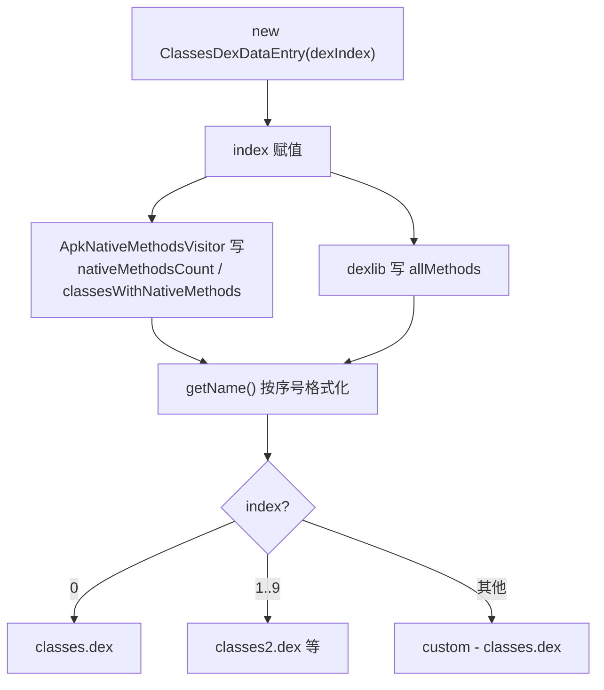

# 🧩 ClassesDexDataEntry

<Badge type="tip" text="APK Dashboard" /> <Badge type="info" text="值对象" />

> 单个 dex 的检查结果值对象，承载原生方法计数、含原生方法的类集合与总方法数。

📁 源码：<code>ClassySharkWS/src/com/google/classyshark/silverghost/translator/apk/dashboard/ClassesDexDataEntry.java</code> &nbsp; 📦 包：<code>com.google.classyshark.silverghost.translator.apk.dashboard</code>

## 职责

`ClassesDexDataEntry` 是每个 dex 的检查结果载体：`index`（dex 序号）、`nativeMethodsCount`（原生方法数）、`classesWithNativeMethods`（TreeSet 排序的类名集合）、`allMethods`（总方法数）以及 `syntheticAccessors`（未来状态，当前未填充）。它实现 `Comparable`，按 index 反转排序使 `classes.dex` 排在最前；`getName()` 按 index 格式化出 `classes.dex` / `classesN.dex` / `custom - classes.dex` 等显示名。

## 关键方法 / 字段

| 名称 | 类型 | 说明 |
|------|------|------|
| `index` | int | dex 序号 |
| `nativeMethodsCount` | int | 原生方法计数，初值 0 |
| `classesWithNativeMethods` | TreeSet&lt;String&gt; | 含原生方法的类名，自动排序去重 |
| `allMethods` | int | dex 总方法数 |
| `syntheticAccessors` | List&lt;String&gt; | 合成访问器列表，**当前从未被填充** |
| `ClassesDexDataEntry(int)` | 构造器 | 仅保存 index |
| `compareTo(Object)` | int | `-1 * index 比较`，反转序使 classes.dex 在前 |
| `getName()` | String | 按 index 产出 classes.dex / classesN.dex / custom - classes.dex |
| `toString()` | String | 调试用原生方法摘要文本 |

## 工作流程

## 设计要点

- 🔢 **反转 Comparable** — `compareTo` 返回 `-1 * index 比较`，使小的 index（classes.dex）排在集合前部。
- 🌳 **TreeSet 自动排序去重** — `classesWithNativeMethods` 用 `TreeSet`，类名天然有序且去重，免去后续排序。
- 🏷️ **序号→名称映射** — `getName` 三段逻辑：`0`→`classes.dex`、`<10`→`classesN.dex`、其余→`custom - classes.dex`，自定义/内部 zip dex 走第三档。
- 🧪 **未启用字段** — `syntheticAccessors` 是为未来合成访问器检查预留的状态，当前代码路径从不赋值。

## 协作关系

- 被 [[ApkDashboard]] 聚合（`classesDexEntries` / `customClassesDexEntries`）
- 被 [[ApkNativeMethodsVisitor]] 写入
- 被 [[DexInfoTranslator]] 间接读取（经 `ApkDashboard.getClassesWithNativeMethodsPerDexIndex`）

## 已知问题 / TODO

- `syntheticAccessors` 字段从未被填充（`ApkDashboard` 中对应赋值行被注释），属预留死状态。
- `toString` 字符串中 `classes with native methods` 与集合直接拼接，缺少冒号分隔，仅作调试用。

## 相关文档

- [APK Dashboard 架构](/reference/architecture/apk-dashboard)
- [Translator 机制](/reference/architecture/translator)
