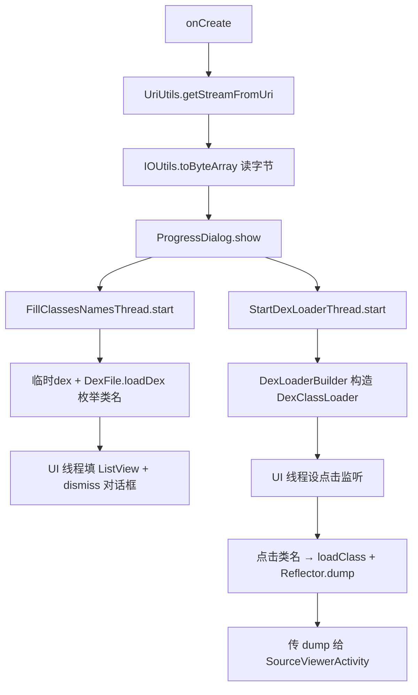

# 🧩 ClassesListActivity

<Badge type="tip" text="Android 子系统" /> <Badge type="info" text="核心 Activity" />

> 核心 Activity：双并发线程——一个用 DexFile.loadDex 枚举类名填列表，一个用 DexClassLoader 加载可反射类，点击类名 dump 源码传 SourceViewerActivity。

📁 源码：<code>ClassySharkAndroid/app/src/main/java/com/google/classysharkandroid/activities/ClassesListActivity.java</code> &nbsp; 📦 包：<code>com.google.classysharkandroid.activities</code>

## 职责

`ClassesListActivity` 是 ClassySharkAndroid 的核心 Activity。`onCreate` 从 Intent 取 APK 的 Uri，经 `UriUtils.getStreamFromUri` 开输入流、`IOUtils.toByteArray` 读全部字节，显示 `ProgressDialog` 加载状态，然后启动两个并发线程：`FillClassesNamesThread` 把字节写临时 dex 文件后用 `DexFile.loadDex` 枚举所有类名填入 `ClassesNamesList` 与 ListView；`StartDexLoaderThread` 用 `DexLoaderBuilder` 构造 `DexClassLoader`，加载完成后在 UI 线程为列表设点击监听——点击类名时用 `loader.loadClass` 加载类、`Reflector` 生成类源码 dump，传给 `SourceViewerActivity`。双线程分离"列出类名"与"加载可反射类"两个不同耗时段。ODEX 不支持时 Toast 提示。

## 关键方法 / 字段

| 名称 | 类型 | 说明 |
|------|------|------|
| `SELECTED_CLASS_NAME` | public static final String | Intent extra 键 |
| `SELECTED_CLASS_DUMP` | public static final String | Intent extra 键 |
| `uriFromIntent` | private Uri | APK Uri |
| `classesList` | private ClassesNamesList | 类名集合 |
| `mProgressDialog` | private ProgressDialog | 加载状态框 |
| `onCreate(Bundle)` | protected void | 取字节 + 起 2 线程 |
| `setActionBar()` | private void | 标题用 APP_NAME |
| `FillClassesNamesThread` | 内部类 | DexFile.loadDex 枚举类名 |
| `StartDexLoaderThread` | 内部类 | DexClassLoader 加载 + 设点击 |

## 工作流程

## 设计要点

- 🧵 **双线程分工** — `FillClassesNamesThread` 只列类名（快，供浏览），`StartDexLoaderThread` 加载可反射类（慢，供点击后反射），并发提速。
- 📊 **DexFile vs DexClassLoader** — 前者只枚举类名不需加载，后者加载类供反射，按需选择。
- 🗂️ **临时 dex 文件** — `File.createTempFile` 写入字节再 loadDex，因 API 需文件路径。
- 🪞 **ODEX 容错** — loadDex 失败（ODEX 场景）时类名列表为空，Toast 提示"Sorry don't support ODEX"。
- 🎨 **标题高亮** — `setActionBar` 用 `Html.fromHtml` 给标题着黄色。

## 协作关系

- 依赖：[[UriUtils]]、[[IOUtils]]、[[ClassesNamesList]]、[[DexLoaderBuilder]]、[[Reflector]]、[[StableArrayAdapter]]、[[SourceViewerActivity]]
- 被调用：[[MainActivity]]（点击 app 后启动）

## 已知问题 / TODO

- 两线程均设 `MAX_PRIORITY`，可能影响主线程响应。
- `StartDexLoaderThread` 与 `FillClassesNamesThread` 写不同临时文件但都用 cacheDir，无协调。
- 异常仅 `printStackTrace`，无用户提示。
- ProgressDialog（已废弃 API）。

## 相关文档

- [Android 子系统架构](/reference/architecture/android)
