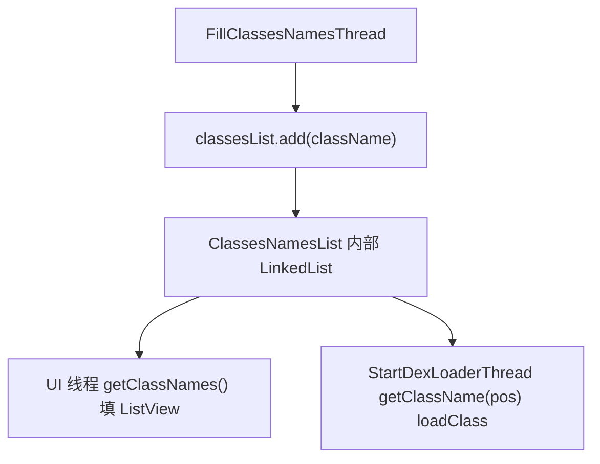

# 🧩 ClassesNamesList

<Badge type="tip" text="Android 子系统" /> <Badge type="info" text="数据容器" />

> 简单 LinkedList 包装：持类名列表，提供按位置获取与整体访问——纯数据容器。

📁 源码：<code>ClassySharkAndroid/app/src/main/java/com/google/classysharkandroid/reflector/ClassesNamesList.java</code> &nbsp; 📦 包：<code>com.google.classysharkandroid.reflector</code>

## 职责

`ClassesNamesList` 是类名列表的薄包装容器，内部持一个 `LinkedList<String>`，提供 `add(String)` 追加、`getClassNames()` 返回整个列表、`getClassName(int)` 按位置获取单个类名。它是纯数据容器，无业务逻辑，在 `ClassesListActivity` 中作为 `FillClassesNamesThread`（生产类名）与 UI 线程/`StartDexLoaderThread`（消费类名）之间的共享存储。

## 关键方法 / 字段

| 名称 | 类型 | 说明 |
|------|------|------|
| `list` | private List&lt;String&gt; | 内部 LinkedList |
| `ClassesNamesList()` | 构造器 | 初始化 LinkedList |
| `add(String)` | void | 追加类名 |
| `getClassNames()` | List&lt;String&gt; | 返回整个列表 |
| `getClassName(int)` | String | 按位置取类名 |

## 工作流程

## 设计要点

- 📦 **纯数据容器** — 无逻辑，仅 LinkedList 包装。
- 🔗 **跨线程共享存储** — 生产者（枚举类名线程）与消费者（UI/加载线程）间的桥梁。
- 🔢 **按位置访问** — `getClassName(int)` 配合 ListView 的 position。

## 协作关系

- 依赖：无
- 被调用：[[ClassesListActivity]]（持实例，双线程读写）

## 已知问题 / TODO

- 无同步保护——`LinkedList` 非线程安全，双线程并发读写可能导致 `ConcurrentModificationException` 或数据不一致。
- 无封装，`getClassNames` 直接返回内部 list 引用，外部可修改。

## 相关文档

- [Android 子系统架构](/reference/architecture/android)
