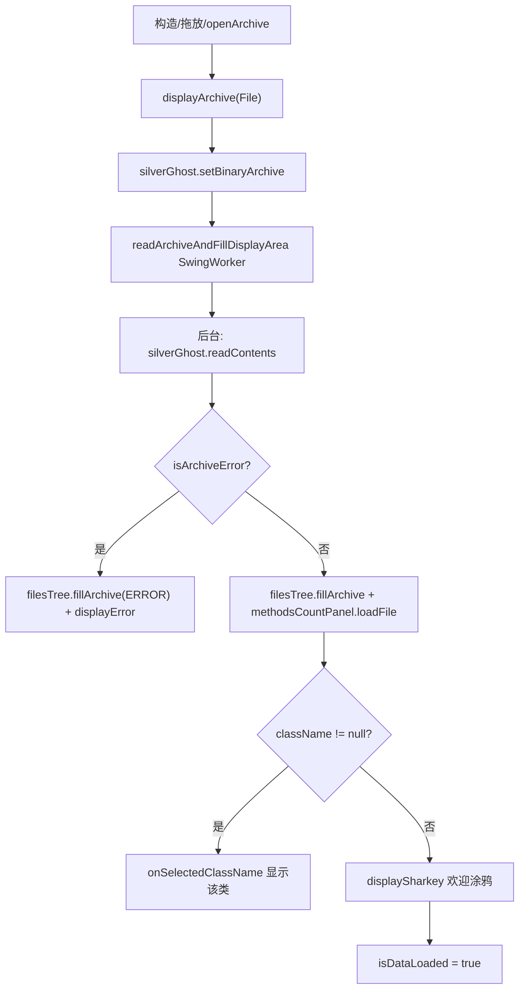

# 🧩 ClassySharkPanel

<Badge type="tip" text="GUI 中央层" /> <Badge type="info" text="中介者模式" />

> 中央中介者，组装工具栏/类树/显示区/方法计数/环形图，并委派 SilverGhost 模型完成所有重活。

📁 源码：<code>ClassySharkWS/src/com/google/classyshark/gui/panel/ClassySharkPanel.java</code> &nbsp; 📦 包：<code>com.google.classyshark.gui.panel</code>

## 职责

`ClassySharkPanel` 是整个 GUI 的中央控制器，类头注释明确标注 `MVM ==> Model - View - Mediator (this class)`。它同时实现 `ToolbarController`、`ViewerController`、`KeyListener` 三个接口，把工具栏、类树、显示区、方法计数面板、环形图等子视图绑定在一起，自身只做编排与分发，真正的内容读取、翻译、过滤都委派给 `SilverGhost` 模型。所有耗时操作都包在 `SwingWorker` 中以避免阻塞 EDT。

## 关键方法 / 字段

| 名称 | 类型 | 说明 |
|------|------|------|
| `silverGhost` | SilverGhost | 模型层，承担存档读取/翻译/过滤 |
| `displayArea` | IDisplayArea | 右侧显示区（面向接口） |
| `filesTree` | FilesTree | 左侧类树导航 |
| `ringChartPanel` | RingChartPanel | 方法计数环形图 |
| `methodsCountPanel` | MethodsCountPanel | 方法计数 JTree 面板 |
| `buildUI()` | private void | 组装 JSplitPane + JTabbedPane（Classes / Methods count） |
| `displayArchive(File)` | void | ArchiveDisplayer 实现：加载存档并填充各子视图 |
| `fillDisplayArea(...)` | private void | 核心分发：类视图/搜索结果/manifest 路由 |
| `readArchiveAndFillDisplayArea(String)` | private void | SwingWorker 后台读存档，EDT 填充 |
| `keyPressed(KeyEvent)` | void | 键盘导航：左=打开，右/Cmd=查看顶级类，字母数字=追加过滤 |
| `onSelectedClassName(String)` | void | ViewerController：选中某类并显示 |

## 工作流程

## 设计要点

- 🧩 **MVM 中介者** — 同时实现三个 Controller 接口，子视图只见窄接口、不见整个面板，解耦清晰。
- ⚙️ **SwingWorker 隔离 EDT** — `readArchiveAndFillDisplayArea`、`fillDisplayArea`、`readMappingFile`、`onExportButtonPressed` 四处重活全用 `SwingWorker`，`doInBackground` 跑模型，`done` 回 EDT 更新 UI。
- 🔍 **AndroidManifest 前缀路由** — 以常量 `ANDROID_MANIFEST_XML_SEARCH` 为前缀的输入会被 `convertToManifestIfNeeded` 改写为 `AndroidManifest.xml`，搜索命中清单而非类。
- 🔢 **结果数量分发** — `fillDisplayArea` 的 `done()` 按 0 结果→错误、1 结果→直接显示类、多结果→搜索列表三态分发。
- 🎨 **主题统一应用** — 构造时 `theme.applyTo(this)`，并向下应用到各滚动面板与分割面板。

## 协作关系

- 依赖 → [[SilverGhost]]（模型层，所有重活委派）
- 依赖 → [[FilesTree]]、[[DisplayArea]]、[[RingChartPanel]]、[[MethodsCountPanel]]、[[Toolbar]]
- 实现 → [[ToolbarController]]、[[ViewerController]]、`KeyListener`
- 依赖 → [[KeyUtils]]、[[CurrentFolderConfig]]、[[RecentArchivesConfig]]、[[FileChooserUtils]]
- 依赖 → [[SettingsFrame]]、[[Exporter]]

## 已知问题 / TODO

- 🐛 `fillDisplayArea` 内联了大量匿名内部类逻辑（`isUserClickedOnSearchResult`、`clickedOnClass` 等），可读性受影响。
- 🐛 `AndroidManifest.xml - ` 前缀匹配用 `startsWith` 硬编码字符串，缺乏常量化抽象。

## 相关文档

- [GUI 架构](/reference/architecture/gui-layer)
- [[SilverGhost]]
- [[ViewerController]]
