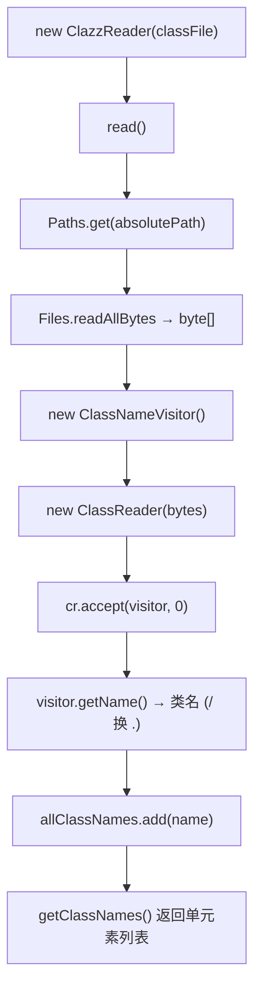

# 🧩 ClazzReader

<Badge type="tip" text="内容读取子系统" /> <Badge type="info" text="策略实现" />

> 单 `.class` 文件读取器：用 ASM ClassReader + ClassNameVisitor 提取类名。

📁 源码：<code>ClassySharkWS/src/com/google/classyshark/silverghost/contentreader/clazz/ClazzReader.java</code> &nbsp; 📦 包：<code>com.google.classyshark.silverghost.contentreader.clazz</code>

## 职责

`ClazzReader` 读取单个 `.class` 字节码文件的类名。`read()` 用 `Files.readAllBytes` 把整个文件读成字节数组，构造 ASM 的 `ClassReader`，配合自定义 `ClassNameVisitor` 调 `accept` 解析，最后从 visitor 取出类名存入列表。它走的是 ASM 字节码解析而非简单字符串处理，为后续更深入的类元数据扩展留空间。`getComponents()` 恒返回空列表。

## 关键方法 / 字段

| 名称 | 类型 | 说明 |
|------|------|------|
| `binaryArchive` | private File | 待读取的 .class 文件 |
| `allClassNames` | private List&lt;String&gt; | 单元素类名列表 |
| `ClazzReader(File)` | ctor | 保存 binaryArchive |
| `read()` | void | 读字节 → ClassReader.accept(ClassNameVisitor) → 取名 |
| `getClassNames()` | List&lt;String&gt; | 返回 allClassNames |
| `getComponents()` | List&lt;Component&gt; | 恒返回 `new ArrayList<>()` |

## 工作流程

## 设计要点

- **ASM 字节码解析** — 用 `ClassReader.accept` 走标准字节码访问流程，而非从文件名推断类名，对内部类、匿名类等也能正确取到真实类名。
- **预留扩展** — 基于字节码访问，未来可扩展 visitor 提取父类、接口、字段、方法等元数据，不只限于类名。
- **零附加成分** — 单 .class 无 manifest/native lib，`getComponents()` 返回新空列表。
- **IO 异常吞栈** — `catch (IOException e)` 只 `e.printStackTrace()`，不传播。

## 协作关系

- 实现 → [[BinaryContentReader]]
- 被 [[ContentReader]] 在兜底分支（非 jar/dex/apk/aar 后缀）实例化
- 依赖 → [[ClassNameVisitor]]（ASM visitor，提取类名）

## 已知问题 / TODO

- `read()` 仅捕获 `IOException`，但 `ClassReader.accept` 可能抛 `RuntimeException`（如坏字节码），未被捕获会直接冒泡到 `ContentReader.load` 的通用 catch，错误信息丢失。

## 相关文档

- [内容读取子系统](/reference/architecture/content-reader)
