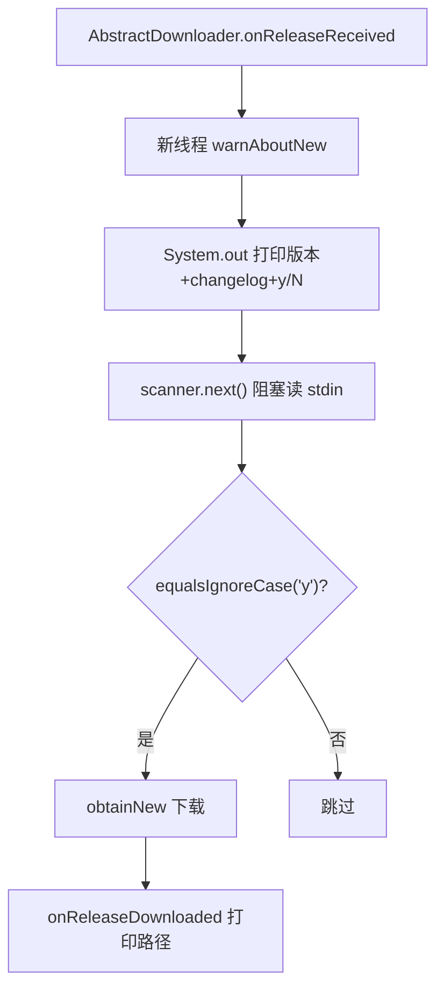

# 🧩 CliDownloader

<Badge type="tip" text="更新子系统" /> <Badge type="info" text="模板方法子类" />

> CLI 下载器：warnAboutNew 用 System.out + Scanner 问 y/N，下载完成打印路径——同步式阻塞读 stdin。

📁 源码：<code>ClassySharkWS/src/com/google/classyshark/updater/networking/CliDownloader.java</code> &nbsp; 📦 包：<code>com.google.classyshark.updater.networking</code>

## 职责

`CliDownloader` 是 `AbstractDownloader` 的命令行实现，单例。`warnAboutNew(Release)` 打印新版本名与 changelog 并用 `Scanner` 读 stdin 询问 `y/N`，返回用户是否同意更新（同步阻塞读 stdin）。`onReleaseDownloaded(File, Release)` 下载完成后打印新版本已下载到本地路径的消息。交互全部走标准输出/输入，适合无图形界面的 CLI 场景。

## 关键方法 / 字段

| 名称 | 类型 | 说明 |
|------|------|------|
| `instance` | private static final AbstractDownloader | 单例 |
| `getInstance()` | static AbstractDownloader | 返回单例 |
| `warnAboutNew(Release)` | boolean | 打印提示 + Scanner 读 y/N |
| `onReleaseDownloaded(File, Release)` | void | 打印下载完成路径 |

## 工作流程

## 设计要点

- 🖥️ **同步阻塞交互** — `Scanner.next()` 阻塞读 stdin，等用户输入 y/N，适合 CLI 交互节奏。
- 🧩 **模板方法子类** — 只实现两个钩子，流程由 `AbstractDownloader` 驱动。
- 🔁 **单例** — `private` 构造 + 静态 instance，经 `getInstance()` 访问。
- 📝 **完整提示文案** — warn 含版本名、changelog、问询；完成含下载路径。

## 协作关系

- 继承：[[AbstractDownloader]]
- 依赖：[[Release]]
- 被调用：[[UpdateManager]]（`getDownloaderFrom(false)`）

## 已知问题 / TODO

- `Scanner` 未关闭（资源泄漏风险，虽然 stdin 通常不需要显式关闭）。
- 用户输入非 y/N 之外的任意词，`scanner.next()` 取首个 token，非 "y" 一律视为否。

## 相关文档

- [更新子系统架构](/reference/architecture/updater)
- [CLI 参考](/cli/index)
