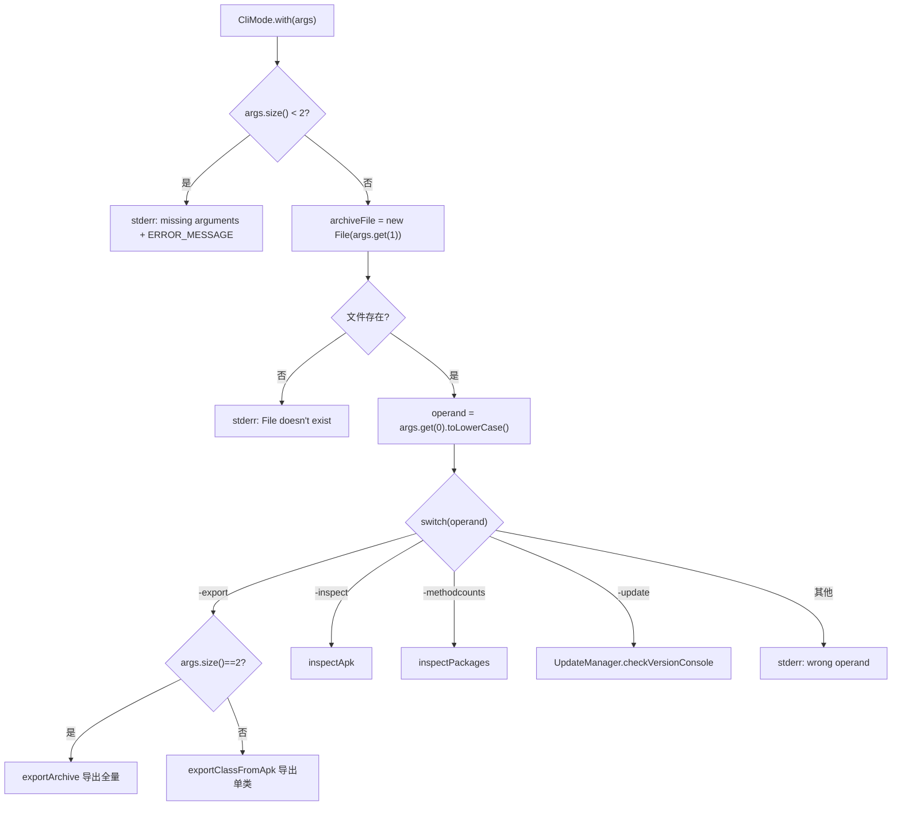

# 🧩 CliMode

<Badge type="tip" text="入口层" /> <Badge type="info" text="命令分发" />

> 命令行模式的入口，解析命令行参数并把控制流分发到对应的导出/检查/方法计数/更新操作。

📁 源码：<code>ClassySharkWS/src/com/google/classyshark/cli/CliMode.java</code> &nbsp; 📦 包：<code>com.google.classyshark.cli</code>

## 职责

`CliMode` 是非 GUI 模式的总入口。当 `Main` 判定首参不是 `-open`（且参数非空）时，调用 `CliMode.with(args)`。它校验参数数量与归档文件是否存在，然后按首参（operand）的 `switch` 分发到 `SilverGhostFacade` 的对应静态方法或 `UpdateManager`。它定义了 `ERROR_MESSAGE` 用法提示，在参数错误时打印到 stderr。

## 关键方法 / 字段

| 名称 | 类型 | 说明 |
|------|------|------|
| `with(List<String> args)` | static void | CLI 入口，校验参数并按 operand 分发 |
| `ERROR_MESSAGE` | static final String | 用法提示文本（含所有支持的选项） |
| `CliMode()` | private | 私有构造，纯静态工具类 |

## 工作流程

## 设计要点

- **operand 不区分大小写** — `args.get(0).toLowerCase()` 后再 switch，所以 `-EXPORT` 也能识别。
- **`-export` 的双重语义** — 2 个参数（`-export app.apk`）导出整个归档；3 个参数（`-export app.apk <class>`）导出单个类的反编译结果，分流到 `SilverGhostFacade.exportArchive` / `exportClassFromApk`。
- **`-update` 的参数占位** — 因 `args.size() < 2` 校验，`-update` 也需要第二个参数（任意路径即可），否则会被当作"缺少参数"。
- **委托 Facade** — 自身无业务逻辑，全部委托 `SilverGhostFacade` 与 `UpdateManager`，保持入口层轻薄。
- **静默返回** — 参数错误时 `return` 而非抛异常，退出码为 0（非 0 仅在 JVM 层面）。

## 协作关系

- 被调用 ← [[Main]]（非 GUI 时分发到此）
- 调用 → [[SilverGhostFacade]]（export/inspect/methodcounts）
- 调用 → [[UpdateManager]]（-update）

## 已知问题 / TODO

- ⚠️ `-update` 需要无意义的第二参数占位（`args.size() < 2` 校验所致），用户体验不佳。
- ⚠️ 参数错误时退出码为 0，不利于脚本判断失败（详见 [退出码](/cli/exit-codes)）。
- `-inspect` 标注为 "experimental"（实验性）。

## 相关文档

- [CLI 参考](/cli/index)
- [-export](/cli/export)
- [-inspect](/cli/inspect)
- [-methodcounts](/cli/methodcounts)
- [-update](/cli/update)
- [入口层架构](/reference/architecture/entry-layer)
