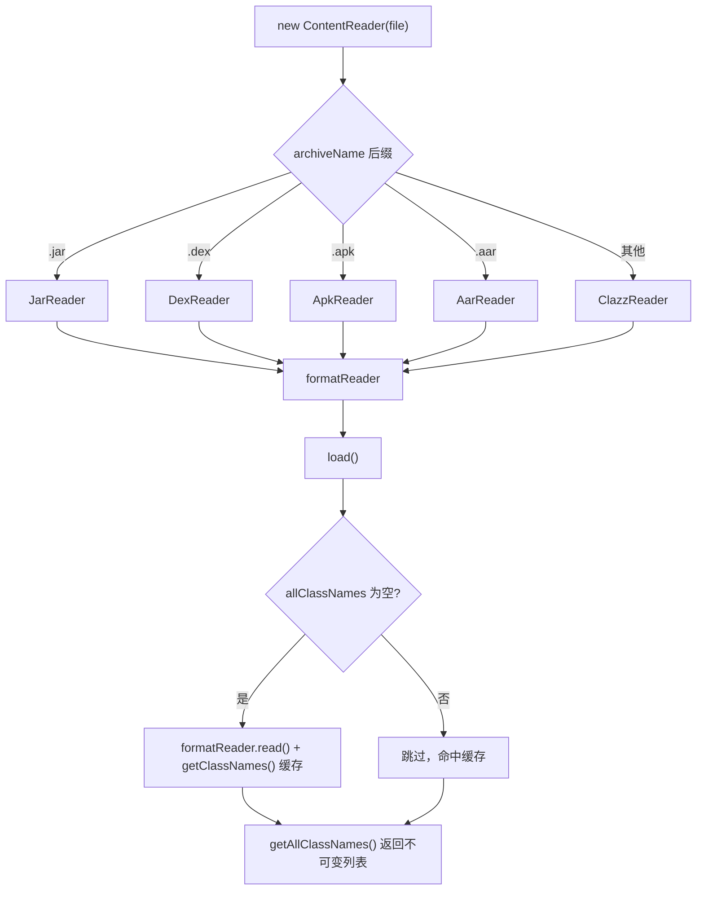

# 🧩 ContentReader

<Badge type="tip" text="内容读取子系统" /> <Badge type="info" text="简单工厂 + 策略" />

> 入口分发器：把二进制文件（jar/dex/apk/aar/class）按扩展名路由到对应的 reader，并缓存读取结果。

📁 源码：<code>ClassySharkWS/src/com/google/classyshark/silverghost/contentreader/ContentReader.java</code> &nbsp; 📦 包：<code>com.google.classyshark.silverghost.contentreader</code>

## 职责

`ContentReader` 是内容读取子系统的对外门面。类注释把它定义为一个函数 `(binary file) --> {contents: classnames, components}`。构造时根据文件名后缀选择具体的 `BinaryContentReader` 实现（jar/dex/apk/aar 走对应 reader，其余一律按 `.class` 处理），调用方只需 `load()` 一次，之后通过 `getAllClassNames()` / `getAllComponents()` 拿到不可变结果。它还定义了 `ARCHIVE_COMPONENT` 枚举与 `Component` 内部类，用于描述归档中除类名之外的特殊成分（AndroidManifest、native library）。

## 关键方法 / 字段

| 名称 | 类型 | 说明 |
|------|------|------|
| `ARCHIVE_COMPONENT` | enum | 归档附加成分类型：`ANDROID_MANIFEST`、`NATIVE_LIBRARY` |
| `Component` | static class | 持有 `name` 与 `ARCHIVE_COMPONENT component`，描述一个附加成分 |
| `formatReader` | private BinaryContentReader | 构造时按后缀选定的具体 reader |
| `allClassNames` | private List&lt;String&gt; | 类名缓存，`load()` 填充 |
| `ContentReader(File binaryArchive)` | ctor | 按文件名后缀（小写）选择 formatReader |
| `load()` | void | 调用一次 `formatReader.read()` 并缓存类名；异常时清空 |
| `getAllClassNames()` | List&lt;String&gt; | 返回不可变视图 `Collections.unmodifiableList` |
| `getAllComponents()` | List&lt;Component&gt; | 透传 `formatReader.getComponents()` |

## 工作流程

## 设计要点

- **简单工厂** — 构造函数里一串 `if/else if` 按后缀（先 `toLowerCase()`）实例化 reader，是典型的简单工厂分发。
- **策略持有** — `formatReader` 字段以 `BinaryContentReader` 接口类型持有具体实现，运行期只调接口方法，策略可替换。
- **一次性加载 + 缓存** — `load()` 用 `allClassNames.isEmpty()` 作幂等守卫，重复调用不会重复读文件；异常时清空为空列表而非抛出。
- **不可变输出** — `getAllClassNames()` 返回 `Collections.unmodifiableList`，防止外部修改内部缓存。
- **兜底为 .class** — 任何不认识的后缀都交给 `ClazzReader`，保证未知格式不致崩溃（尽管语义可能不准）。

## 协作关系

- 依赖 → [[BinaryContentReader]]（策略接口）
- 依赖 → [[JarReader]]、[[DexReader]]、[[ApkReader]]、[[AarReader]]、[[ClazzReader]]（具体策略）

## 已知问题 / TODO

- `getAllClassNames()` 注释自述：`// TODO add wrong state exception if read wasn't called`——若未先调 `load()` 就读取，会拿到空列表而非报错，调用方可能误用。
- `load()` 的 `catch (Exception e)` 吞掉异常并清空缓存，错误难以定位。

## 相关文档

- [内容读取子系统](/reference/architecture/content-reader)
- [快速开始](/guide/quick-start)
