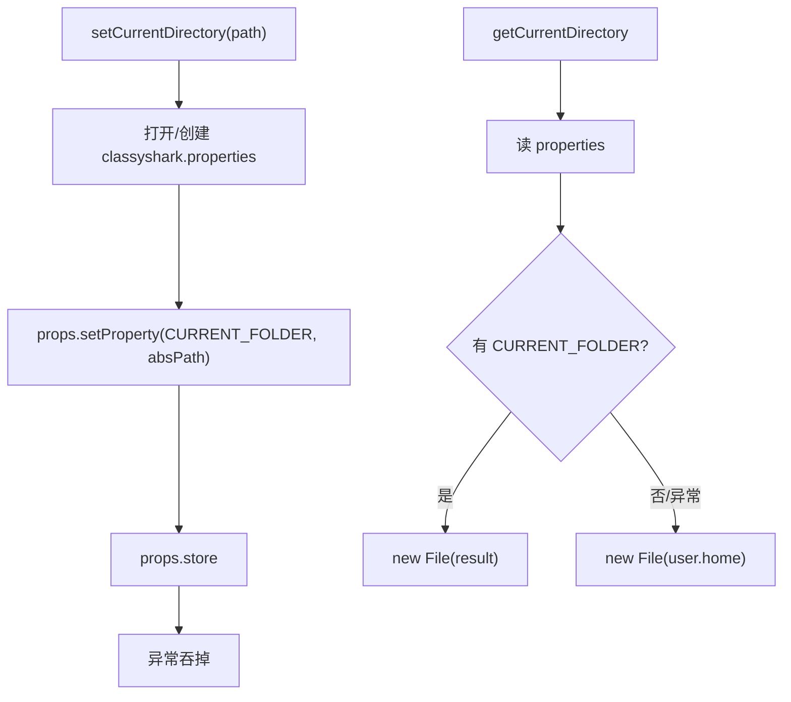

# 🧩 CurrentFolderConfig

<Badge type="tip" text="GUI IO 层" /> <Badge type="info" text="单例枚举" />

> 持久化文件选择器「当前目录」到 classyshark.properties 的单例枚举。

📁 源码：<code>ClassySharkWS/src/com/google/classyshark/gui/panel/io/CurrentFolderConfig.java</code> &nbsp; 📦 包：<code>com.google.classyshark.gui.panel.io</code>

## 职责

`CurrentFolderConfig` 是单例枚举（`INSTANCE`），把文件选择器的「当前目录」以 `CURRENT_FOLDER` 键持久化到工作目录旁的 `classyshark.properties`。`setCurrentDirectory` 写入，`getCurrentDirectory` 读取，失败时回退 `user.home`。所有异常被吞掉（静默回退），配置不可读时 UI 仍能工作。

## 关键方法 / 字段

| 名称 | 类型 | 说明 |
|------|------|------|
| `INSTANCE` | enum 单例 | 全局唯一实例 |
| `CLASSYSHARK_PROPERTIES` | static String | 文件名 `classyshark.properties` |
| `CURRENT_FOLDER` | static String | 属性键 |
| `setCurrentDirectory(File)` | void | 写入当前目录 |
| `getCurrentDirectory()` | File | 读目录，失败回退 user.home |

## 工作流程

## 设计要点

- 🧬 **枚举单例** — `enum INSTANCE` 序列化安全，天然单例。
- 🤫 **静默回退** — 所有异常吞掉，读失败回退 `user.home`，UI 不因配置损坏而崩。
- 📁 **工作目录旁** — `new File(CLASSYSHARK_PROPERTIES)` 相对 CWD，无路径抽象。

## 协作关系

- 被使用 ← [[ClassySharkPanel]]、[[FileTransferHandler]]

## 已知问题 / TODO

- 🐛 配置文件位置依 CWD，从不同目录启动 ClassyShark 会读写不同 properties。
- 🐛 异常全被空 catch 吞掉，无任何日志，配置丢失难以排查。
- 🐛 `setCurrentDirectory` 用 `props.store` 覆盖整个文件，若文件含其他键会被清空。

## 相关文档

- [GUI 架构](/reference/architecture/gui-layer)
- [[RecentArchivesConfig]]
