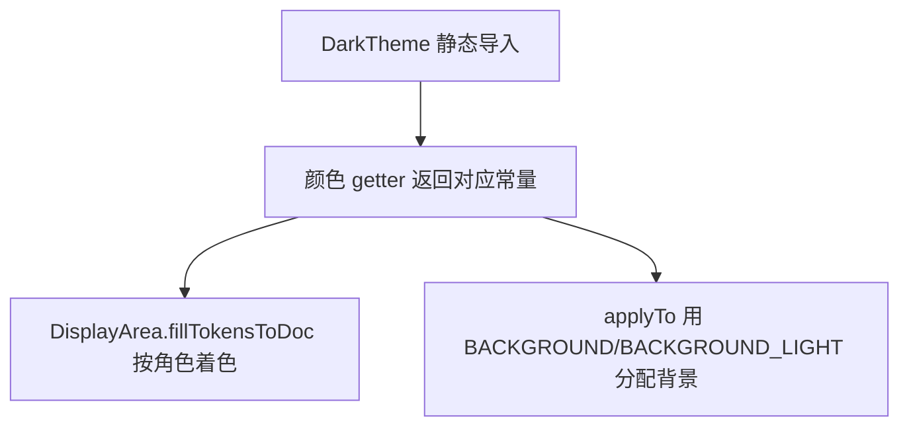

# 🧩 DarkColorScheme

<Badge type="tip" text="主题子系统" /> <Badge type="info" text="调色板常量" />

> 深色调色板：8 个 `Color` 常量（Solarized 风格深色）的纯数据持有者。

📁 源码：<code>ClassySharkWS/src/com/google/classyshark/gui/theme/dark/DarkColorScheme.java</code> &nbsp; 📦 包：<code>com.google.classyshark.gui.theme.dark</code>

## 职责

`DarkColorScheme` 是深色主题的颜色常量仓库，持有 8 个 `static final Color`：默认深背景 `BACKGROUND(32,32,32)`、较亮的 `BACKGROUND_LIGHT(46,48,50)`、标识符黄、默认浅灰、关键字绿、注解紫、选中背景蓝绿、名称棕。它是纯数据类，私有构造，仅供 `DarkTheme` 静态导入使用。调色板呈 Solarized 风格深色系列，定义了 ClassyShark 标志性的深色外观。

## 关键方法 / 字段

| 名称 | 类型 | 说明 |
|------|------|------|
| `BACKGROUND` | static final Color | `(32,32,32)` 默认深背景 |
| `BACKGROUND_LIGHT` | static final Color | `(46,48,50)` 较亮背景（树/输入框/菜单） |
| `IDENTIFIERS` | static final Color | `(0xFF,0xFF,0x80)` 黄，标识符 |
| `DEFAULT` | static final Color | `(0xd8,0xd8,0xd8)` 浅灰，默认文本 |
| `KEYWORDS` | static final Color | `(133,153,0)` 绿，关键字 |
| `ANNOTATIONS` | static final Color | `(108,113,196)` 紫，注解 |
| `SELECTION_BG` | static final Color | `(7,56,66)` 蓝绿，选中文本背景 |
| `NAMES` | static final Color | `(88,110,117)` 棕，名称 |

## 工作流程

## 设计要点

- 🎨 **Solarized 风格深色** — KEYWORDS 绿、ANNOTATIONS 紫、SELECTION_BG 蓝绿，色相系列与浅色版同源，调适深背景。
- 📦 **纯数据类** — 仅常量，私有构造，无逻辑。
- 🔒 **包级可见** — 类无 `public`，仅 dark 包内 `DarkTheme` 静态导入。
- 🆚 **与浅色共用 SELECTION_BG** — `SELECTION_BG(7,56,66)` 在深浅两套调色板中取值相同。

## 协作关系

- 依赖：无（纯常量）
- 被调用：[[DarkTheme]]（静态导入所有常量）

## 已知问题 / TODO

- 无明显已知问题（纯常量数据类）。

## 相关文档

- [主题子系统架构](/reference/architecture/theme)
- [深色主题调色板](/gui/themes)
