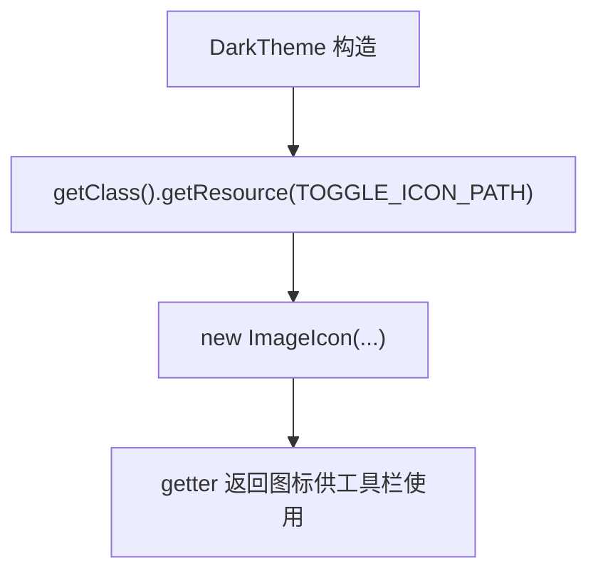

# 🧩 DarkIconScheme

<Badge type="tip" text="主题子系统" /> <Badge type="info" text="图标路径常量" />

> 8 个工具栏图标路径常量：从类路径 `/resources/ic_*.png` 加载，是深色主题的图标扩展点。

📁 源码：<code>ClassySharkWS/src/com/google/classyshark/gui/theme/dark/DarkIconScheme.java</code> &nbsp; 📦 包：<code>com.google.classyshark.gui.theme.dark</code>

## 职责

`DarkIconScheme` 是深色主题的图标路径常量持有者，定义 8 个 `static final String`，分别指向类路径下 `/resources/` 中的 PNG（菜单/历史/后退/前进/打开/导出/映射/设置）。它把图标资源的物理路径与主题代码解耦，使深色主题未来可携带不同的图标资源集而无需改 `DarkTheme` 逻辑。当前与 `LightIconScheme` 路径完全相同——两主题共享同一组 PNG。

## 关键方法 / 字段

| 名称 | 类型 | 说明 |
|------|------|------|
| `ROOT_PATH` | private static final String | `/resources/` |
| `EXTENSION` | private static final String | `.png` |
| `TOGGLE_ICON_PATH` | static final String | `ic_menu.png` |
| `RECENT_ICON_PATH` | static final String | `ic_history.png` |
| `BACK_ICON_PATH` | static final String | `ic_back.png` |
| `NEXT_ICON_PATH` | static final String | `ic_next.png`（前进图标） |
| `OPEN_ICON_PATH` | static final String | `ic_open.png` |
| `EXPORT_ICON_PATH` | static final String | `ic_export.png` |
| `MAPPING_ICON_PATH` | static final String | `ic_mappings.png` |
| `SETTINGS_ICON_PATH` | static final String | `ic_settings.png` |

## 工作流程

## 设计要点

- 🔌 **扩展点** — 框架允许每主题不同图标集；当前两主题共享同 PNG，但替换深色变体图标无需改主题代码。
- 📦 **包级可见** — 类无 `public`，常量仅 dark 包内可见。
- 🧱 **路径拼装** — `ROOT_PATH + "ic_xxx" + EXTENSION`，便于整体迁移资源根目录或扩展名。
- 🔁 **与 LightIconScheme 结构镜像** — 冗余但对称，便于各主题独立演进。

## 协作关系

- 依赖：无（纯路径常量）
- 被调用：[[DarkTheme]]（静态导入路径加载图标）

## 已知问题 / TODO

- 与 [[LightIconScheme]] 路径完全相同，当前无实际差异（冗余但为未来扩展预留）。

## 相关文档

- [主题子系统架构](/reference/architecture/theme)
