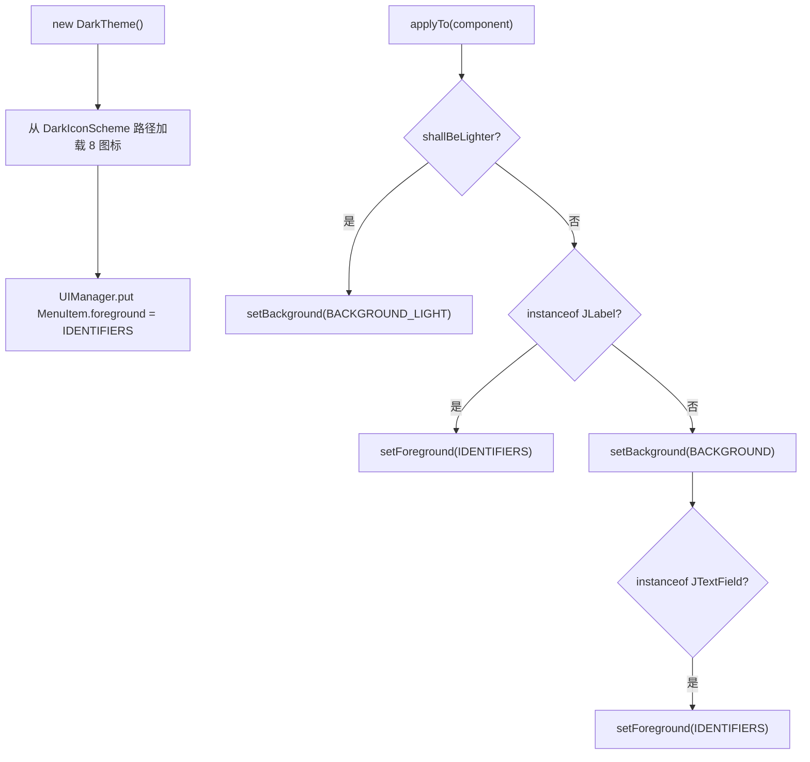

# 🧩 DarkTheme

<Badge type="tip" text="主题子系统" /> <Badge type="info" text="具体主题" />

> 具体深色主题：加载 8 个图标，颜色委托 DarkColorScheme，并在组件级覆盖 Swing 外观（双背景制造层次）。

📁 源码：<code>ClassySharkWS/src/com/google/classyshark/gui/theme/dark/DarkTheme.java</code> &nbsp; 📦 包：<code>com.google.classyshark.gui.theme.dark</code>

## 职责

`DarkTheme` 是 `Theme` 契约的深色实现。构造时从 `DarkIconScheme` 路径加载 8 个工具栏图标，把 `MenuItem.foreground` UI 默认设为标识符色，颜色 getter 全部返回 `DarkColorScheme` 常量，`getBackgroundColor` 返回深背景。它真正实现了 `applyTo(Component)`：对 `JTree`/`JTextField`/`JMenuItem`/`JPopupMenu` 分配较亮的 `BACKGROUND_LIGHT`，其余组件分配默认深背景，并为 `JLabel`/`JTextField` 着前景。两种背景让树/输入框稍亮以制造视觉深度。与 `LightTheme` 的空操作 `applyTo` 形成刻意的非对称——深色覆盖全部外观，浅色让系统 LAF 透出。

## 关键方法 / 字段

| 名称 | 类型 | 说明 |
|------|------|------|
| `toggleIcon` 等 8 个 | private final ImageIcon | 构造时从 DarkIconScheme 路径加载 |
| `DarkTheme()` | 构造器 | 加载图标 + `UIManager.put("MenuItem.foreground", IDENTIFIERS)` |
| `getDefaultColor()` | Color | 返回 `DEFAULT` 浅灰 |
| `getKeyWordsColor()` | Color | 返回 `KEYWORDS` 绿 |
| `getIdentifiersColor()` | Color | 返回 `IDENTIFIERS` 黄 |
| `getBackgroundColor()` | Color | 返回 `BACKGROUND`(32,32,32) |
| `applyTo(Component)` | void | 按组件类型分配 `BACKGROUND_LIGHT`/`BACKGROUND` 或前景 |
| `shallBeLighter(Component)` | private boolean | JTree/JTextField/JMenuItem/JPopupMenu 返 true |

## 工作流程

## 设计要点

- 🌑 **双背景制造深度** — `BACKGROUND`(32,32,32) 为默认，`BACKGROUND_LIGHT`(46,48,50) 给树/输入框/菜单，让交互元素稍亮。
- 🎨 **组件级外观覆盖** — 真正在组件实例上 set background/foreground，而非仅依赖 LAF（浅色主题不做此覆盖）。
- 🧷 **静态导入** — 颜色/图标路径全部 `static import` 自 `DarkColorScheme`/`DarkIconScheme`，代码简洁。
- 🏷️ **MenuItem UI 默认** — 构造时设 `MenuItem.foreground` 为标识符色，影响所有后续菜单项。
- ⚖️ **刻意非对称** — 深色处处同、覆盖系统默认；浅色让平台原生 LAF 透出。

## 协作关系

- 依赖：[[Theme]]（实现）、[[DarkColorScheme]]（颜色常量）、[[DarkIconScheme]]（图标路径）
- 被调用：[[ThemeManager]]（默认回退主题）

## 已知问题 / TODO

- 源码含 `// TODO was default need to change names`，颜色角色命名待整理。
- `applyTo` 对 `JLabel` 分支与后续 `JTextField` 判定并列，逻辑较隐晦（`shallBeLighter` 已含 `JTextField`，故 `else if JLabel` 分支与末尾 `JTextField` 前景色设置叠加）。

## 相关文档

- [主题子系统架构](/reference/architecture/theme)
- [深色主题指南](/gui/themes)
