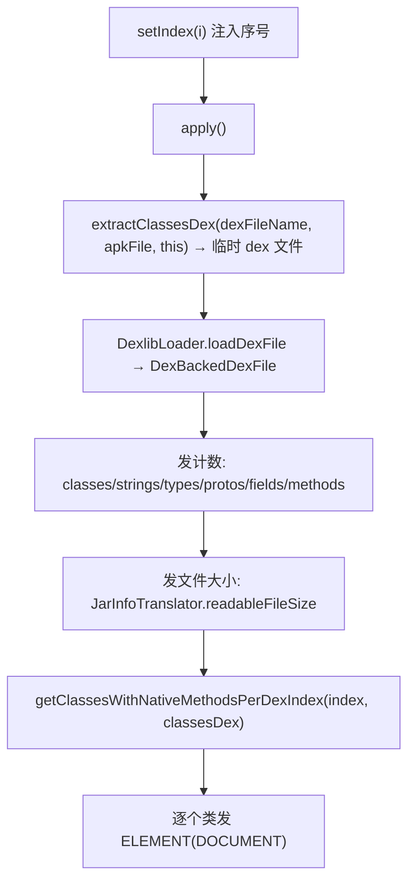

# 🧩 DexInfoTranslator

<Badge type="tip" text="Translator 核心" /> <Badge type="info" text="Translator 实现" />

> 选中 `classes.dex` / `classes2.dex` 时，输出该 dex 的计数摘要与含原生方法的类列表。

📁 源码：<code>ClassySharkWS/src/com/google/classyshark/silverghost/translator/dex/DexInfoTranslator.java</code> &nbsp; 📦 包：<code>com.google.classyshark.silverghost.translator.dex</code>

## 职责

`DexInfoTranslator` 实现 `Translator`，在用户于树中点选某个 `classes*.dex` 条目时触发。`apply` 经 `MultidexReader.extractClassesDex` 把目标 dex 从 APK 抽到临时文件，再经 `DexlibLoader.loadDexFile` 用 dexlib2 加载，发出该 dex 的类/字符串/类型/原型/字段/方法计数与文件大小，最后通过 `ApkDashboard.getClassesWithNativeMethodsPerDexIndex(index, classesDex)` 查出含原生方法调用的类并逐个列出。`index` 由外部 `setIndex` 注入，标识多 dex 中的序号。

## 关键方法 / 字段

| 名称 | 类型 | 说明 |
|------|------|------|
| `apkFile` | File | 宿主 APK 文件 |
| `dexFileName` | String | 目标条目名（如 `classes2.dex`） |
| `index` | int | 多 dex 序号，供 `getClassesWithNativeMethodsPerDexIndex` 使用 |
| `elements` | List&lt;ELEMENT&gt; | 解码结果缓冲 |
| `getClassName()` | String | 返回 `dexFileName` |
| `addMapper(TokensMapper)` | void | 空操作 |
| `apply()` | void | 抽 dex → 加载 → 发计数 + 文件大小 + 原生方法类列表 |
| `getElementsList()` | List&lt;ELEMENT&gt; | 返回 `elements` |
| `getDependencies()` | List&lt;String&gt; | 返回空 `LinkedList` |
| `setIndex(int)` | void | 设置 dex 序号 |

## 工作流程

## 设计要点

- 📊 **计数摘要优先** — 直接调用 dexlib2 的 `getClassCount/getStringCount/getTypeCount/getProtoCount/getFieldCount/getMethodCount`，以最低成本给出 dex 概览。
- 🧩 **复用 jar 体积格式化** — 文件大小经 `JarInfoTranslator.readableFileSize` 转为人类可读形式，避免重复实现。
- 🔗 **跨模块查原生方法** — 静态导入 `ApkDashboard.getClassesWithNativeMethodsPerDexIndex`，按 dex 序号取该 dex 中含 native 调用的类，把「dex 摘要」与「原生方法分布」合并到一个视图。
- ⚙️ **序号外部注入** — `index` 不在构造器给定，由调用方在 `apply` 前 `setIndex`，保留构造与上下文填充的灵活性。
- 🧹 **空操作的 mapper/dependencies** — dex 摘要不需要反混淆映射，也不产出依赖列表，对应方法留空。

## 协作关系

- 依赖：[[Translator]]（实现接口）
- 依赖：[[MultidexReader]]（`extractClassesDex`）
- 依赖：[[DexlibLoader]]（`loadDexFile`）
- 依赖：[[ApkDashboard]]（`getClassesWithNativeMethodsPerDexIndex`）
- 依赖：[[JarInfoTranslator]]（`readableFileSize`）
- 被创建：[[TranslatorFactory]]（`.dex` 分支）
- 被调用：[[DisplayArea]]（消费 `getElementsList()`）

## 已知问题 / TODO

- ⚠️ `apply` 捕获 `Exception` 后仅 `e.printStackTrace()`，不抛出，UI 无法感知加载失败。
- ⚠️ `index` 若未被 `setIndex` 设置即默认为 0，多 dex 场景下可能查到错误序号的原生方法类。

## 相关文档

- [Translator 核心架构](/reference/architecture/translator-core)
- [模块索引](/reference/modules/Main)
