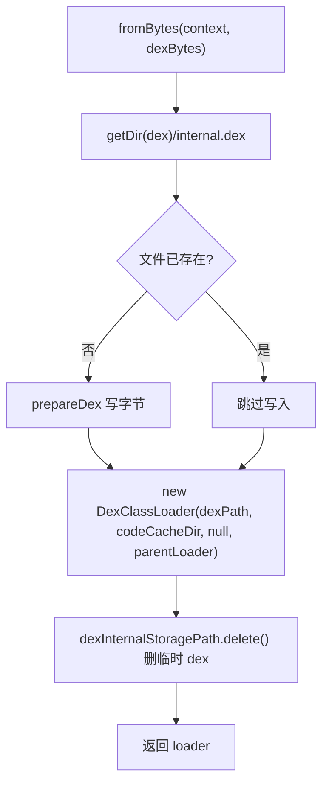

# 🧩 DexLoaderBuilder

<Badge type="tip" text="Android 子系统" /> <Badge type="info" text="工厂" />

> 构建 DexClassLoader 的工厂：把内存中 dex 字节落盘 app 私有目录 `internal.dex` 再加载，加载后立即删临时 dex 释放空间。

📁 源码：<code>ClassySharkAndroid/app/src/main/java/com/google/classysharkandroid/dex/DexLoaderBuilder.java</code> &nbsp; 📦 包：<code>com.google.classysharkandroid.dex</code>

## 职责

`DexLoaderBuilder` 是构造 `DexClassLoader` 的工厂。`fromBytes(Context, byte[])` 把内存中的 dex 字节写入 app 私有目录 `getDir("dex", MODE_PRIVATE)/internal.dex`（经 `prepareDex` 用 8KB 缓冲流写），然后用 `DexClassLoader`（optimizedDexOutputPath 取 `getCodeCacheDir()`，parent classLoader 取 `context.getClassLoader().getParent()`）加载，加载后立即 `delete` 临时 dex 文件释放空间。`fromFile` 先把文件读成字节再委托 `fromBytes`。它绕过 `DexClassLoader` 需文件路径的限制——把字节落盘再加载，加载后删 dex。

## 关键方法 / 字段

| 名称 | 类型 | 说明 |
|------|------|------|
| `BUF_SIZE` | private static final int | `8 * 1024` 缓冲大小 |
| `fromFile(Context, File)` | static DexClassLoader | 文件→字节→fromBytes |
| `fromBytes(Context, byte[])` | static DexClassLoader | 落盘 internal.dex + 加载 + 删除 |
| `prepareDex(byte[], File)` | private static boolean | 缓冲流写字节到文件 |

## 工作流程

## 设计要点

- 💾 **字节落盘再加载** — `DexClassLoader` 需文件路径，故把内存字节写入私有目录再加载，绕过限制。
- 🗑️ **加载后即删** — `dexInternalStoragePath.delete()` 释放空间，dex 已被加载进内存/odex 缓存。
- 🏠 **私有目录** — `getDir("dex", MODE_PRIVATE)` 保证其他应用不可读。
- 📦 **codeCacheDir 作 optimizedDir** — 用系统提供的代码缓存目录存 odex。
- 🔗 **parent 取 context.getClassLoader().getParent()** — 隔离应用自身类加载器链。

## 协作关系

- 依赖：[[IOUtils]]（toByteArray，fromFile 路径）、Android `Context`
- 被调用：[[ClassesListActivity]]（`StartDexLoaderThread` 构造 loader）

## 已知问题 / TODO

- `fromFile` 打开 `FileInputStream` 后未关闭（资源泄漏）。
- `prepareDex` 的 `bis`/`dexWriter` 在异常路径下虽有 close 处理，但正常路径 close 后未置 null。
- `fromBytes` 对 `context == null` 抛 RuntimeException，但 `prepareDex` 返回 false 时未抛错直接继续构造 loader（会失败）。

## 相关文档

- [Android 子系统架构](/reference/architecture/android)
