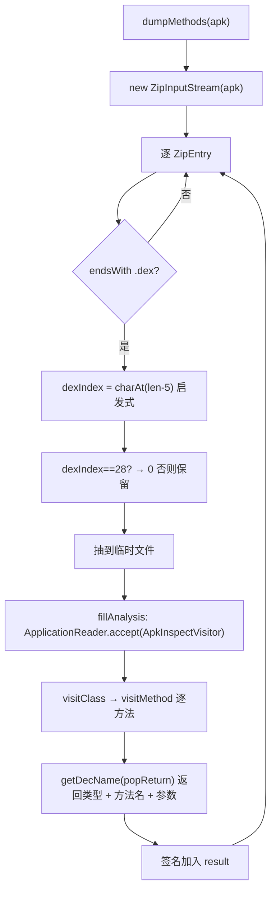

# 🧩 DexMethodsDumper

<Badge type="tip" text="Translator 核心" /> <Badge type="info" text="dex 方法转储器" />

> 遍历 APK 内所有 `.dex` 条目，用 asmdex 把每个方法重建为类 Java 签名并扁平输出。

📁 源码：<code>ClassySharkWS/src/com/google/classyshark/silverghost/translator/dex/DexMethodsDumper.java</code> &nbsp; 📦 包：<code>com.google.classyshark.silverghost.translator.dex</code>

## 职责

`DexMethodsDumper` 是纯工具类（非 `Translator` 实现），负责把整个 APK 中每个 dex 的全部方法签名转储为类 Java 形式的字符串列表。它用 `ZipInputStream` 扫描 APK 中所有 `.dex` 条目，逐个抽到临时文件，再用 `ow2.asmdex` 的 `ApplicationReader` + 自定义 `ApkInspectVisitor` 遍历每个方法，把 dex 描述符（返回在前的 `RXYZ` 格式）重建为 Java 风格签名（`返回 方法名(参数)`）。类型解码经 `DexlibAdapter.primitiveTypes` 处理原语，对象/数组类型自行解析。

## 关键方法 / 字段

| 名称 | 类型 | 说明 |
|------|------|------|
| `dumpMethods(File archiveFile)` | static List&lt;String&gt; | 主入口：遍历 zip 的 .dex 条目，抽临时文件后跑 `fillAnalysis` |
| `fillAnalysis(int dexIndex, File file)` | static List&lt;String&gt; | 用 asmdex `ApplicationReader.accept` 遍历 dex |
| `ApkInspectVisitor` | private static class | `ApplicationVisitor`，逐类返回 `ClassVisitor`，逐方法重建签名 |
| `getDecName(String dexType)` | static | 把 dex 类型描述符解码为 Java 名（数组/对象/原语） |
| `popType(String desc)` / `popReturn(String desc)` | static | 切分 dex 描述符的参数段与返回段 |
| `nextTypePosition(String desc, int pos)` | static | 跳过 `[` 与 `L...;` 定位下一个类型 |

## 工作流程

## 设计要点

- 🔧 **用 ow2.asmdex 而非 objectweb.asm** — asmdex 专门面向 dex 字节码，`ApplicationReader` + `ApplicationVisitor` 模型直接遍历 dex 结构，而 `objectweb.asm.Type` 仅用于参数类型转换（Java 侧）。
- 🔄 **描述符方向翻转** — dex 方法描述符是 `RXYZ`（返回在前），代码用 `popReturn`/`popType` 切分，再用 `Type.getArgumentTypes("(" + popType + ")")` 复用 ASM 的参数解析，重建为 Java 风格 `返回 方法(参数)`。
- 🧩 **类型解码委托 DexlibAdapter** — `getDecName` 对原语查 `DexlibAdapter.primitiveTypes`，对象类型剥 `L...;` 并把 `/` 换 `.`，数组递归追加 `[]`，未知类型兜底 `void`。
- 🗂️ **dex 索引启发式** — 用 `charAt(len-5)` 从条目名推断序号（`classes.dex` 的 `.` 前字符），`==28`（非数字字符的 numeric value）兜底为 0。

## 协作关系

- 依赖：[[DexlibAdapter]]（`primitiveTypes` 原类型表）
- 依赖：ow2.asmdex（`ApplicationReader`/`ApplicationVisitor`/`MethodVisitor`）
- 依赖：objectweb.asm（`Type`，仅参数类型转换）

## 已知问题 / TODO

- ⚠️ **dex 索引启发式脆弱** — `charAt(len-5)` 假设条目名形如 `classesN.dex`，对 `classes.dex`（无数字）得到非数字字符的 numeric value 28，靠 `==28` 兜底为 0；若实际条目名不符合该模式（如 `2.dex`）会误判序号。
- ⚠️ `dumpMethods` 异常仅 `e.printStackTrace()`，静默返回已收集的部分结果。
- ⚠️ `ApkInspectVisitor` 内 `getDecName` 对未知 dex 类型统一返回 `void`，可能掩盖真实类型。
- ⚠️ 临时文件 `file.deleteOnExit()` 仅在 JVM 正常退出时清理，长驻进程可能残留。

## 相关文档

- [Translator 核心架构](/reference/architecture/translator-core)
- [模块索引](/reference/modules/Main)
