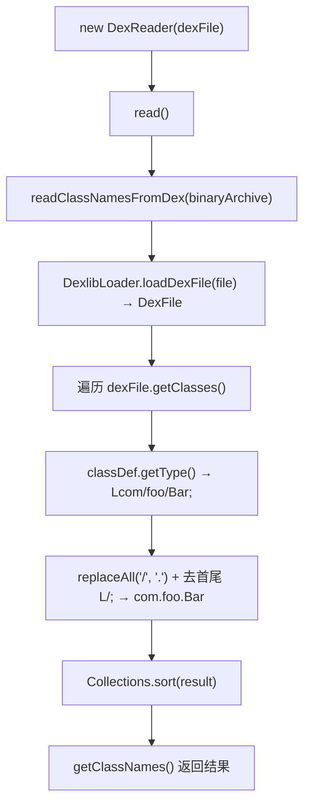

# 🧩 DexReader

<Badge type="tip" text="内容读取子系统" /> <Badge type="info" text="策略实现" />

> 单 dex 读取器：通过 DexlibLoader 加载 dex，遍历 ClassDef 把 VM 类型签名转成点分全限定名。

📁 源码：<code>ClassySharkWS/src/com/google/classyshark/silverghost/contentreader/dex/DexReader.java</code> &nbsp; 📦 包：<code>com.google.classyshark.silverghost.contentreader.dex</code>

## 职责

`DexReader` 负责读取单个 `.dex` 文件的类名。`read()` 调用静态方法 `readClassNamesFromDex`，后者通过 `DexlibLoader.loadDexFile` 拿到 `DexFile`，遍历其 `ClassDef` 集合，把每个类的 VM 类型签名（形如 `Lcom/foo/Bar;`）去掉首尾的 `L` / `;` 并把 `/` 替换为 `.`，得到 `com.foo.Bar`。结果排序后返回，`getComponents()` 恒返回空列表（单 dex 无 manifest/native lib 成分）。

## 关键方法 / 字段

| 名称 | 类型 | 说明 |
|------|------|------|
| `binaryArchive` | private File | 待读取的 .dex 文件 |
| `allClassNames` | private List&lt;String&gt; | 类名结果，排序后填充 |
| `DexReader(File)` | ctor | 保存 binaryArchive |
| `read()` | void | 调 `readClassNamesFromDex`，异常打印栈、结果排序 |
| `getClassNames()` | List&lt;String&gt; | 返回 allClassNames |
| `getComponents()` | List&lt;Component&gt; | 恒返回 `new ArrayList<>()` |
| `readClassNamesFromDex(File)` | static | 遍历 ClassDef，签名转点分名并排序 |
| `main(String[])` | static void | 测试入口，读指定 classes.dex 并打印 |

## 工作流程

## 设计要点

- **VM 签名转换** — `classDef.getType().replaceAll("/", ".").substring(1, length-1)` 把 `Lcom/foo/Bar;` 转成 `com.foo.Bar`，先替换 `/` 再截掉首尾的 `L` 与 `;`。
- **静态方法可复用** — `readClassNamesFromDex` 是 static，供他处（如 multidex 处理）直接调用单 dex 解析。
- **结果排序** — `read()` 与静态方法都做 `Collections.sort`，保证类名输出稳定可比。
- **异常吞栈** — `read()` 的 `catch` 只 `e.printStackTrace()`，仍继续执行 `sort`（此时可能是空列表）。
- **无附加成分** — `getComponents()` 返回新空列表，符合单 dex 语义。

## 协作关系

- 实现 → [[BinaryContentReader]]
- 被 [[ContentReader]] 在 `.dex` 分支实例化
- 依赖 → [[DexlibLoader]]（加载 dex）

## 已知问题 / TODO

- `main` 方法里硬编码了 `//Users//bfarmer//Desktop//classes.dex` 路径，仅作开发自测，发布构建应移除。
- `read()` 捕获异常后仍执行 `sort`，行为依赖 `readClassNamesFromDex` 抛异常时 `allClassNames` 是否被赋值（实际未赋值，保持旧值），逻辑脆弱。

## 相关文档

- [内容读取子系统](/reference/architecture/content-reader)
