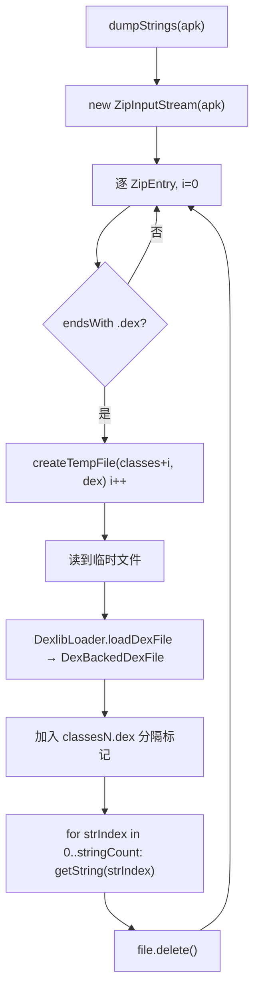

# 🧩 DexStringsDumper

<Badge type="tip" text="Translator 核心" /> <Badge type="info" text="dex 字符串转储器" />

> 遍历 APK 内所有 `classes*.dex`，把每个字符串常量直接从 dexlib2 字符串表抽出。

📁 源码：<code>ClassySharkWS/src/com/google/classyshark/silverghost/translator/dex/DexStringsDumper.java</code> &nbsp; 📦 包：<code>com.google.classyshark.silverghost.translator.dex</code>

## 职责

`DexStringsDumper` 是纯工具类（非 `Translator` 实现），负责把整个 APK 中所有 dex 的字符串常量转储为扁平字符串列表。它用 `ZipInputStream` 扫描 APK，对每个 `.dex` 条目抽到临时文件，经 `DexlibLoader.loadDexFile` 加载为 `DexBackedDexFile`，再用 `getStringCount` 与 `getString(i)` 直接迭代字符串池，把每个 dex 的字符串（含一行 `classesN.dex` 分隔标记）追加到结果列表。比 `DexMethodsDumper` 简单——无需 asmdex 遍历，直接访问 dexlib2 字符串表。

## 关键方法 / 字段

| 名称 | 类型 | 说明 |
|------|------|------|
| `dumpStrings(File apkFile)` | static List&lt;String&gt; | 主入口：遍历 zip 的 .dex，抽临时文件、加载、迭代字符串池 |
| `main(String[])` | static void | 内置自测，对桌面样例 APK 转储字符串 |

## 工作流程

## 设计要点

- 🧩 **直接访问字符串表** — 不走 asmdex 访问者模型，直接用 dexlib2 的 `getStringCount`/`getString(i)` 索引访问，实现极简。
- 📊 **逐 dex 分隔标记** — 每个 dex 的字符串前先加入一行 `classesN.dex\n`，让扁平列表仍可区分来源 dex。
- 🔢 **自增序号** — 用局部 `i` 给临时文件与分隔标记编号，不依赖条目名启发式（对比 `DexMethodsDumper` 的 `charAt` 推断）。
- 🧹 **临时文件及时清理** — 抽取后 `file.delete()` 立即删除（对比 `DexMethodsDumper` 的 `deleteOnExit`）。
- 📦 **复用 DexlibLoader** — 加载逻辑统一委托 `DexlibLoader.loadDexFile`，与 `DexInfoTranslator` 共享同一加载入口。

## 协作关系

- 依赖：[[DexlibLoader]]（`loadDexFile`）
- 依赖：dexlib2（`DexBackedDexFile` / `DexFile`）
- 同包协作：[[DexMethodsDumper]]（同属 dex 转储工具族）

## 已知问题 / TODO

- ⚠️ `dumpStrings` 异常仅 `e.printStackTrace()`，静默返回已收集部分。
- ⚠️ 分隔标记用 `new String("classes" + i + ".dex\n")`，`i` 是 zip 遍历序号而非 dex 内真实序号，与条目名 `classes2.dex` 可能不一致（若 zip 中 .dex 条目顺序与编号不同）。
- ⚠️ 临时文件名 `classesN.dex` 可能与真实条目重名，虽用 `createTempFile` 加随机后缀规避，但命名易混淆。

## 相关文档

- [Translator 核心架构](/reference/architecture/translator-core)
- [模块索引](/reference/modules/Main)
