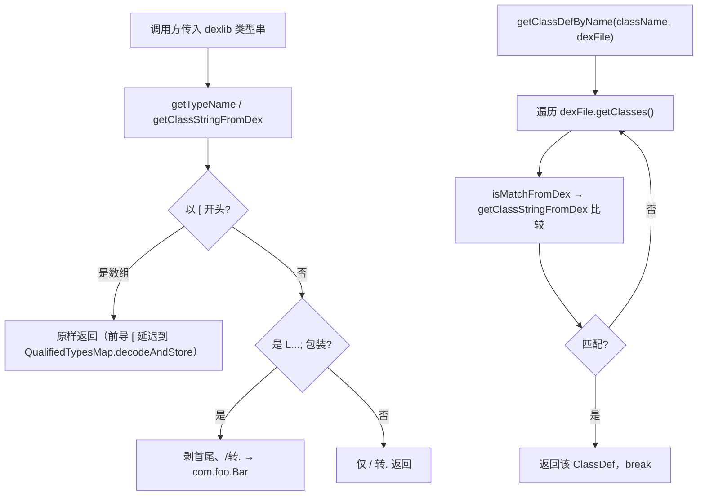

# 🧩 DexlibAdapter

<Badge type="tip" text="Java Translator" /> <Badge type="info" text="适配器 / 单一事实源" />

> 桥接 dexlib2 类型表示到 Java 样式名的静态工具，9 个原语映射的单一事实源。

📁 源码：<code>ClassySharkWS/src/com/google/classyshark/silverghost/translator/java/dex/DexlibAdapter.java</code> &nbsp; 📦 包：<code>com.google.classyshark.silverghost.translator.java.dex</code>

## 职责

`DexlibAdapter` 把 dexlib2 的类型表示（如 `Lcom/foo/Bar;`、`I`、`[Ljava/util/Map;`）翻译成 Java 样式名（`com.foo.Bar`、`int`、保留前导 `[` 待后续解码）。它持有一张 9 个原语单字符到 Java 关键字的静态映射表 `primitiveTypes`，并提供类型名解码、dex 中按名查 `ClassDef`、匹配判定等方法。它是跨子系统的公共类型适配层，被 ASM 侧（`ClassDetailsFiller`）、dex 侧（`MetaObjectDex`）、内容扫描（`DexMethodsDumper`/`SyntheticAccessorsInspector`）和 `StressTest` 等多处复用。

## 关键方法 / 字段

| 名称 | 类型 | 说明 |
|------|------|------|
| `primitiveTypes` | static final Map&lt;String,String&gt; | 9 个原语映射：`I`→`int`、`V`→`void`、`C`→`char`、`D`→`double`、`F`→`float`、`J`→`long`、`S`→`short`、`Z`→`boolean`、`B`→`byte` |
| `getTypeName(String)` | static String | 单字符原语查表，否则走 `getClassStringFromDex` |
| `getClassStringFromDex(String)` | static String | 剥 `L...;` 包装、`/` 转 `.`；数组保留前导 `[` |
| `getClassDefByName(String, DexFile)` | static ClassDef | 线性扫描 dex 的 `getClasses()` 找匹配 `ClassDef` |
| `isMatchFromDex(String, String)` | static boolean | 规范化 dex 名后与给定类名比较 |

## 工作流程

## 设计要点

- **原语单一事实源** — `primitiveTypes` 是 9 个原语映射的唯一来源，`QualifiedTypesMap.decodeAndStore` 在解码数组原语时直接查本表，避免多处重复定义。
- **数组前缀延迟处理** — `getClassStringFromDex` 见到前导 `[` 即原样返回，把数组维度的进一步解码交给 `QualifiedTypesMap.decodeAndStore`，职责分层。
- **线性扫描 dex** — `getClassDefByName` 遍历 `dexFile.getClasses()` 逐一比较，简单但 O(n)；适合按需查单个类的场景。
- **跨子系统复用** — 既是 dex 侧适配器，也被 ASM 侧 `ClassDetailsFiller` 复用（统一类型描述符解码逻辑），减少两路解码差异。

## 协作关系

- 被 [[MetaObjectDex]] 大量调用（类型/超类/接口/字段/方法注解解码）
- 被 [[ClassDetailsFiller]] 复用（ASM 侧类型描述符解码）
- 被 [[QualifiedTypesMap]] 引用（原语映射）
- 被 [[StressTest]] 调用（dex 类型串规范化）
- 被 `DexMethodsDumper`/`SyntheticAccessorsInspector` 等复用

## 已知问题 / TODO

- `getClassDefByName` 线性扫描，对超大 dex（数万类）单次查找较慢；未建索引。
- `getTypeName` 单字符原语查表时若遇到未知字符返回 null（`primitiveTypes.get` 未命中），下游可能拿到 null 类型串。

## 相关文档

- [Java Translator 子系统](/reference/architecture/java-translator)
- [dex 元对象](/reference/modules/MetaObjectDex)
- [类型映射表](/reference/modules/QualifiedTypesMap)
