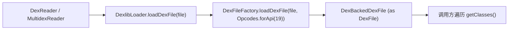

# 🧩 DexlibLoader

<Badge type="tip" text="内容读取子系统" /> <Badge type="info" text="适配器 / 封装" />

> 对 smali/dexlib2 的薄封装：用固定 API level 19 的 opcode 集加载 dex 文件。

📁 源码：<code>ClassySharkWS/src/com/google/classyshark/silverghost/contentreader/dex/DexlibLoader.java</code> &nbsp; 📦 包：<code>com.google.classyshark.silverghost.contentreader.dex</code>

## 职责

`DexlibLoader` 把第三方库 dexlib2（smali 项目）的 dex 加载逻辑收敛到一处，隔离依赖。唯一的静态方法 `loadDexFile` 用 `DexFileFactory.loadDexFile` 读文件，并固定传入 `Opcodes.forApi(19)`（Android 4.4 KitKat 的 opcode 集），返回 `DexFile` 接口实例（实为 `DexBackedDexFile`）。

## 关键方法 / 字段

| 名称 | 类型 | 说明 |
|------|------|------|
| `loadDexFile(File binaryArchiveFile)` | static DexFile | 加载 dex，固定 API 19 opcode，抛 Exception |

## 工作流程

## 设计要点

- **薄封装** — 方法体仅一行实质调用，把 dexlib2 的 API 细节挡在 contentreader 包之外。
- **固定 opcode 集** — `Opcodes.forApi(19)` 锁定 Android 4.4 KitKat 的指令集版本，避免不同 dex 版本解析歧义。
- **返回接口类型** — 声明返回 `DexFile` 接口，实际返回 `DexBackedDexFile`，调用方解耦具体实现。
- **异常上抛** — `throws Exception` 不吞异常，交由调用方（`DexReader.read`）处理。

## 协作关系

- 被 [[DexReader]] 的 `readClassNamesFromDex` 调用
- 间接被 MultidexReader 用于加载 APK 内各 dex

## 已知问题 / TODO

- API level 19 硬编码，对新版 Android 指令（API 21+ 引入的 opcode）可能不全；如需支持新指令应参数化。

## 相关文档

- [内容读取子系统](/reference/architecture/content-reader)
