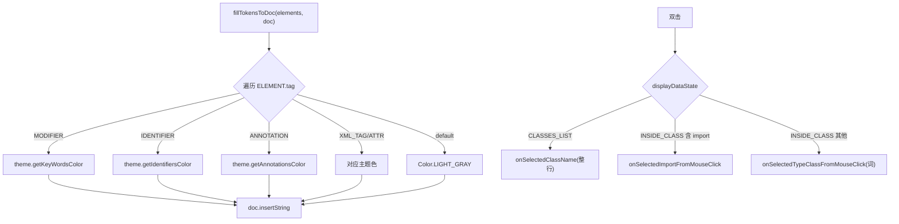

# 🧩 DisplayArea

<Badge type="tip" text="GUI 显示层" /> <Badge type="info" text="视图" />

> 右侧 JTextPane 包装，渲染所有内容：类源、类名列表、搜索结果、鲨鱼涂鸦、错误。

📁 源码：<code>ClassySharkWS/src/com/google/classyshark/gui/panel/displayarea/DisplayArea.java</code> &nbsp; 📦 包：<code>com.google.classyshark.gui.panel.displayarea</code>

## 职责

`DisplayArea` 实现右侧文本显示区，是 GUI 的内容渲染核心。它根据 `Translator.ELEMENT` 标记把不同语法元素映射到主题颜色实现语法高亮，处理双击导航（类列表点击类、类源内点击 import 或类型词）、Ctrl-C 复制（无选择时复制全文），并用 `DisplayDataState` 驱动双击行为。

## 关键方法 / 字段

| 名称 | 类型 | 说明 |
|------|------|------|
| `jTextPane` | JTextPane | 承载渲染的文本窗格 |
| `style` | Style | 当前样式 |
| `theme` | Theme | 缓存主题 |
| `displayDataState` | DisplayDataState | SHARKEY/CLASSES_LIST/INSIDE_CLASS/ERROR |
| `onAddComponentToPane()` | Component | 返回 jTextPane 供宿主布局 |
| `displayClass(List<ELEMENT>, String)` | void | 主类视图，标记→颜色后滚动到搜索键 |
| `displayClass(String)` | void | 单色显示 |
| `displayClassNames(List, String)` | void | 子串高亮，超 50 走 BatchDocument |
| `displayAllClassesNames(List)` | private void | BatchDocument 快速路径 |
| `displaySearchResults(...)` | void | 搜索结果列表 |
| `displaySharkey()` | void | 欢迎涂鸦 |
| `displayError()` | void | 错误提示 |
| `fillTokensToDoc(...)` | private void | 标记→颜色核心 |
| `calcScrollingPosition(String)` | private int | 计算搜索键滚动位置 |

## 工作流程

## 设计要点

- 🎨 **标记→颜色映射** — `fillTokensToDoc` 按 `Translator.ELEMENT.tag` 的 switch 设前景色，是语法高亮的核心。
- 🖱️ **状态驱动双击** — `DisplayDataState` 枚举决定双击语义：列表态选类、类内态选 import 或类型词、涂鸦态忽略。
- ⚡ **BatchDocument 快速路径** — 类名超 50 时走 `BatchDocument` 批量插入，避免逐条 `insertString` 触发独立更新事件致 UI 卡顿。
- 📋 **Ctrl-C 全文兜底** — 无选择时按 Ctrl-C 复制整个文档文本，方便导出。
- 🔡 **子串高亮** — `displayClassNames` 把输入子串用选背景色高亮，驼峰匹配时整行当匹配段。

## 协作关系

- 实现 → [[IDisplayArea]]
- 依赖 → [[ViewerController]]、[[FileTransferHandler]]、[[Doodle]]、[[BatchDocument]]
- 依赖 → [[GuiMode]]（主题）、`Translator`
- 被使用 ← [[ClassySharkPanel]]

## 已知问题 / TODO

- 🐛 源码含两处 `// TODO add here logic fo highlighter / by adding flag to Translator.ELEMENT`，高亮器逻辑未完成。
- 🐛 `calcScrollingPosition` 用 `pos` 实例局部变量且每次从 0 线性扫描，类源很长时性能一般。
- 🐛 `displayClass(String)` 中 `getOneColorFormattedOutput` 仅追加 `\n`，与标记重载语义重叠。

## 相关文档

- [GUI 架构](/reference/architecture/gui-layer)
- [[IDisplayArea]]
- [[BatchDocument]]
