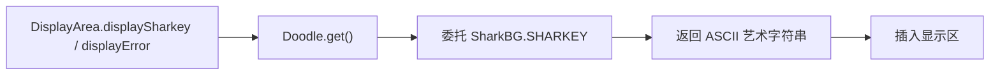

# 🧩 Doodle

<Badge type="tip" text="GUI 涂鸦层" /> <Badge type="info" text="门面模式" />

> 返回欢迎 ASCII 艺术字符串的静态门面。

📁 源码：<code>ClassySharkWS/src/com/google/classyshark/gui/panel/displayarea/doodles/Doodle.java</code> &nbsp; 📦 包：<code>com.google.classyshark.gui.panel.displayarea.doodles</code>

## 职责

`Doodle` 是一个极简静态门面，`get()` 返回当前活动的欢迎 ASCII 艺术字符串。当前硬编码委托 `SharkBG.SHARKEY`。它把「换涂鸦」这件事收敛到一行代码——改 `get()` 的委托目标即可切换欢迎屏艺术（圣诞、金门大桥等）。

## 关键方法 / 字段

| 名称 | 类型 | 说明 |
|------|------|------|
| `get()` | static String | 返回 `SharkBG.SHARKEY`（活动涂鸦） |

## 工作流程

## 设计要点

- 🎭 **门面收敛** — 涂鸦切换的唯一入口，改一行即换欢迎屏。
- 🔌 **可插拔** — 四个涂鸦类（Shark/Christmas/SanFran）形成可插拔内容集，门面决定哪个生效。
- 🐟 **默认鲨鱼** — 当前活动涂鸦是 `SharkBG`，其余为备选。

## 协作关系

- 委派 → [[SharkBG]]
- 被调用 ← [[DisplayArea]]

## 已知问题 / TODO

- 🐛 硬编码委托 `SharkBG.SHARKEY`，未提供运行时切换或配置化机制，换涂鸦需改源码。

## 相关文档

- [GUI 架构](/reference/architecture/gui-layer)
- [[DisplayArea]]
- [[SharkBG]]
